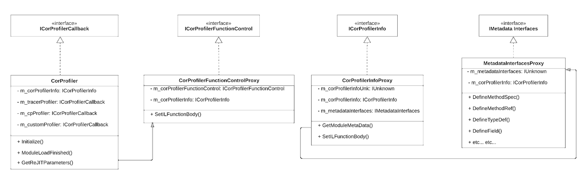

# Instrumentation Verification Library

# Description

The Instrumentation Verification library allows us to generate an assembly on disk which contains all the metadata and bytecode changes that were performed at runtime through the CLR Profiling API, and then run that assembly through various tools that verify the correctness of the instrumented assembly.

The library is meant to be used in several distinct two-cases:

1. As part of CI, the tool can be used:
    1. By the Tracer team, to verify that we produce valid IL for every integration we add
    2. By the Debugger team, to verify that adding probes produces valid IL on a wide range of methods
2. As a diagnostic tool, the InstrumentationVerification tool can be used to quickly triage support cases where the customer is complaining that our CLR Profiler causes a `BadImageFormatException`, `InvalidProgramException`, `TypeLoadException`, etc etc. 

    A primary goal of this tool is to support the scenario where we need to perform a post-mortem diagnosis of a crash that we suspect may have been caused due to faulty instrumentation (for example, a crash due to an ExecutionEngineException or an AccessViolationException). 

3. As part of development of new bytecode instrumentation techniques, enabling breakpoint debugging of instrumented methods via [dnSpy](https://github.com/dnSpy/dnSpy).  

# Usage

To run a verification, simply:

1. Add the environment variable `DD_TRACE_WRITE_INSTRUMENTATION_TO_DISK`, set to “true”.
2. Run or restart the application we are instrumenting. Observe that as we instrument the app, more and more files will appear under [Datadog Logs Folder]/InstrumentationVerification/{ProcessName}_{ProcessID}_{ProcessCreationTime}
3. Via command line, run the command: 

    Datadog.InstrumentedAssemblyVerification.Standalone.exe [Full path of the folder generated in step 2] 

    Once the command has finished executing, you will find new files under the InstrumentationVerification folder:

    1. Logs file of the verification tool for each assembly will appear under a folder named **OUPUT_InstrumentedAssemblies/InstrumentationVerificationLogger_[DATE]_.log**)
    2. The instrumented assemblies will appear under a folder named **OUPUT_InstrumentedAssemblies**

**Note:** When handling a support case, the first two steps must be performed on the customer’s site. However, if the customer is willing to upload and send us the instrumentation output folder (which is conveniently placed inside the Datadog Logs folder), then the 3rd step can be performed offline.

# Approach & High Level Design

The Instrumentation Verification process is divided into three main steps:

1. At runtime, we write the following information to disk:
    1. A copy of every assembly that was loaded 
    2. Several “metadata” files which contains all the metadata changes that were performed via _IMetadataEmit2 / IMetadataAssemblyEmit._ The file format is textual, in order to assist with easy troubleshooting.
    3. A “bytecode” file, which contains all the IL bytecode that was modified via _ICorProfilerInfo::SetILFunctionBody_ or _ICorProfilerFunctionControl::SetILFunctionBody,_ in binary format.

    

    The files in section (i) are written to a folder named **INPUT_OriginalAssemblies** whereas the files in sections (ii) and (iii) are written to a folder named **INPUT_InstrumentationLog.**

    The logic of writing this information to disk resides within the Native Loader and is abstracted away inside proxy classes that implement the raw CLR Profiling API interfaces. As a result, the Tracer, Continuous Profiler, or any other client library that the Native Loader may dispatch calls to in the future does not need to know that IL Verification is taking place.

    

2. The **`InstrumentedAssemblyGenerator`** takes the output generated in step 1 above, and then uses [dnlib](https://github.com/0xd4d/dnlib) to apply the metadata and bytecode changes to the original assemblies, and writes the resulting instrumented assemblies to a folder named **OUTPUT_InstrumentedAssemblies.**
3. The **`InstrumentedAssemblyVerifier`** enumerates the instrumented assemblies in the **OUTPUT_InstrumentedAssemblies** folder and runs them through the following verification tools:
    
    a. Verifications that process the entire assembly:
    
    
      1.  **[PEVerify](https://docs.microsoft.com/en-us/dotnet/framework/tools/peverify-exe-peverify-tool)**
      2. **[ILVerify](https://github.com/dotnet/runtime/blob/57bfe474518ab5b7cfe6bf7424a79ce3af9d6657/src/coreclr/tools/ILVerify/README.md)**
    
    b. Verifications that process the specific methods that were instrumented:
    
      
      1.  **[RuntimeHelpers.PrepareMethod](https://docs.microsoft.com/en-us/dotnet/api/system.runtime.compilerservices.runtimehelpers.preparemethod?view=net-5.0)**
            This forces the .NET CLR to JIT the method. This verification typically only detects fairly rudimentary problems, such as stack imbalance.
      2. **[ILSpy decompilation](https://www.nuget.org/packages/ICSharpCode.Decompiler/)**
            This verification attempts to decompile the method, and verify that the decompilation process did not throw any exceptions, and that the resulting decompiled method does not contain any error annotations (e.g. "Expected O but got I4" or “operand is null”, etc) 

	
    
	Note that some of these verification tools have a frustrating tendency to yield many false-positives. To reduce the amount of noise, we run each tool on both the original assembly and its instrumented counterpart, and report only errors that were not present when we verified the original assembly, thereby making sure the **InstrumentedAssemblyVerifier** is only showing us errors that are actually related to the metadata and bytecode changes that our CLR Profiler performed at runtime.

# Advanced techniques

1. **Debugging instrumented code**

    After running the verification tool, the **OUPUT_InstrumentedAssemblies** folder will contain a copy of every single assembly that was loaded by the application, including all the instrumented bytecode and metadata changes that were performed at runtime. We can then debug our instrumented methods using any debugger that supports stepping through decompiled code on the fly, such as [dnSpy](https://github.com/dnSpy/dnSpy) or JetBrains Rider (Visual Studio 2019 Update 5 or later can also be used but is not recommended).

    **Caveats:**

    * This will obviously not work if the application we are trying to debug makes any assumptions about what folder it’s running from, or if we fail to recreate any environment variables it depends on.
    * The **OUPUT_InstrumentedAssemblies** folder will only contain assemblies that were actually loaded at runtime while the CLR Profiler was attached. If we run the application through a slightly different code path that attempts to load an assembly that was not loaded originally, we will get a `FileNotFoundException`.
    * If our bytecode instrumentation modified assemblies that were loaded from the GAC, we will not be able to debug them, as the .NET runtime will [insist on loading](https://docs.microsoft.com/en-us/dotnet/framework/deployment/how-the-runtime-locates-assemblies) it from the GAC rather than loading the instrumented version from our **OUPUT_InstrumentedAssemblies.** This limitation can be addressed in a future PR by modifying the identity of the GAC’d assembly and updating all references accordingly.
2. **“Round-tripping” decompiled code to debug instrumentation errors**

    Diagnosing why bytecode instrumentation is faulty can be an incredibly time-consuming and frustrating ordeal, as subtle mistakes in the IL bytecode can be quite elusive.

    When the going gets tough, we can employ the following technique:
    
    * **(A)** Create a minimal reproduction scenario for the faulty instrumentation and run it through the verification tool as described in the `Usage` section of this document.
    * **(B)** Open the instrumented assembly in JetBrains dotPeek and use the [Export to Project](https://www.jetbrains.com/help/decompiler/Exporting_Assembly_to_Project.html) feature to create a .csproj for the instrumented assembly.
    * **(C)** Compile the .csproj that was generated in step B using the same version of the C# compiler as the one used in step A.
    * **(D)** Perform a diff of the IL bytecode or the decompiled C# output of your instrumented method between the instrumented assembly you generated in step A and the “round tripped” assembly you generated in step C. Any differences you find might be vital clues for understanding why the instrumentation is failing.

    **Caveats:**
    * Some of the differences you find in step D may not be related to faulty instrumentation but rather caused by subtleties in the way the ILSpy decompiler or Roslyn compiler work.
    * Naturally, you should expect all the tokens in the “round tripped” assembly to be different from the ones in the instrumented assembly. To make `diff`ing easier, consider creating an annotated version of the “round-tripped” IL by mapping the new tokens to the old. 

# Current Limitations

1. While the library could theoretically run on any OS, it has so far only been tested on Windows.
2. The InstrumentedAssemblyGenerator has a few limitations, as it currently doesn’t support some metadata changes (e.g. multidimensional array). It should be noted that these are cases that we have not encountered so far while implementing verifications for the Tracer (and basic support for the Debugger).
