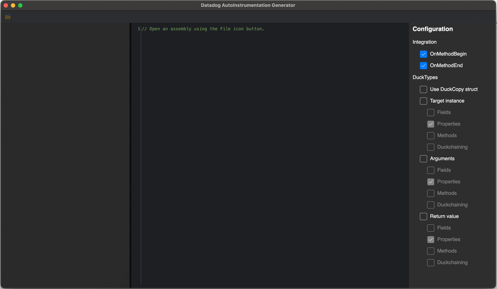

## Automatic Instrumentation <!-- omit in toc -->

The _ClrProfiler_ folder contains the majority of code required for automatic instrumentation of target methods. Since v2.0.0, we exclusively use "Call Target" modification, in which we rewrite the target method to add our instrumentation.

- [Creating a new automatic instrumentation implementation](#creating-a-new-automatic-instrumentation-implementation)
- [Instrumentation classes](#instrumentation-classes)
  - [`OnMethodEnd` and `OnMethodBegin` parameters](#onmethodend-and-onmethodbegin-parameters)
    - [`OnMethodBegin`](#onmethodbegin)
    - [`OnMethodEnd`](#onmethodend)
- [Duck-typing, instrumentation classes, and constraints](#duck-typing-instrumentation-classes-and-constraints)
- [Instrumentation attributes](#instrumentation-attributes)
- [Instrumentable methods](#instrumentable-methods)
  - [Inheritance](#inheritance)
  - [Properties](#properties)
- [Interfaces](#interfaces)
- [Current Limitations](#current-limitations)
- [Testing](#testing)
  - [General approach](#general-approach)
  - [Developing the integration test](#developing-the-integration-test)
    - [Creating the Sample project](#creating-the-sample-project)
    - [Configuring the API versions](#configuring-the-api-versions)
    - [Creating the integration test](#creating-the-integration-test)
    - [Add required docker services](#add-required-docker-services)
  - [Local testing using Nuke](#local-testing-using-nuke)
  - [Testing in CI](#testing-in-ci)
- [Rollout](#rollout)

### Creating a new automatic instrumentation implementation

> Note that you can use the [AutoInstrumentation Generator](#autoinstrumentation-generator) tool to help you with this process.

Creating a new instrumentation implementation typically uses the following process:

1. Identify the operation of interest that we want to measure. Also gather the tags, resource names that we will need to set. Don't forget to check what has been implemented by other tracers.
2. Find an appropriate instrumentation point in the target library. You may need to use multiple instrumentation points, and you may need to use different targets for different _versions_ of the library
   1. Ensure that the type/method is not within the [Current Limitations](#current-limitations) of the `CallTarget` rewriting
3. Create an instrumentation class using one of the standard "shapes" (described below), and place it in the [ClrProfiler/AutoInstrumentation folder](../../tracer/src/Datadog.Trace/ClrProfiler/AutoInstrumentation). If the methods you need to instrument have different prototypes (especially the number of parameters), you will need multiple class to instrument them.
4. Add an `[InstrumentMethod]` attribute to the instrumentation class, as described below. Alternatively, add an assembly-level `[AdoNetClientInstrumentMethods]` attribute
5. (Optional) Create duck-typing unit tests in _Datadog.Trace.Tests_ to confirm any duck types are valid. This can make the feedback cycle much faster than relying on integration tests
6. Create integration tests for your instrumentation. For more details, see [Testing](#testing).
   1. Create (or reuse) a sample application that uses the target library, which ideally exercises all the code paths in your new instrumentation. Use an `$(ApiVersion)` MSBuild variables to allow testing against multiple package versions in CI. 
   2. Add a new entry in the SpanMetadataRules files (see the /tracer/test/Datadog.Trace.TestHelpers/SpanMetadata*Rules.cs files) that define the expected Name, Type, and Tags for the new integration spans, and run build target `GenerateSpanDocumentation` to generate the updated Markdown file. For new instrumentation, you should add the definitions for all existing schema versions.
   3. Add an entry in [tracer/build/PackageVersionsGeneratorDefinitions.json](../../tracer/build/PackageVersionsGeneratorDefinitions.json) defining the range of all supported versions. See the existing definitions for examples. You may need to add an entry in the [tracer/build/Honeypot/IntegrationGroups.cs](../../tracer/build//Honeypot/IntegrationGroups.cs) to specify the Nuget Package instrumented by the integration. 
   4. Run `./tracer/build.ps1 GeneratePackageVersions`. This generates the xunit test data for package versions in the `TestData` that you can use as `[MemberData]` for your `[Theory]` tests. 
   5. If needed, add a docker image in the docker-compose.yml to allow the CI to test against it. Locally, you can use docker-compose as well and start only the dependencies you need.
   6. Use the `MockTracerAgent` and the newly defined `SpanMetadataRules` method in your integration test to confirm your instrumentation is working as expected.
7. After testing locally, push to GitHub, and do a manual run in Azure Devops for your branch. For more details, see [Testing in CI](#testing-in-ci).
   1. Navigate to the [consolidated-pipeline](https://dev.azure.com/datadoghq/dd-trace-dotnet/_build?definitionId=54)
   2. Click `Run Pipeline`
   3. Select your branch from the drop down
   4. Click `Variables`, set `perform_comprehensive_testing` and `run_all_test_frameworks` to `true`. (This is false for PRs by default for speed, but ensures your new code is tested against all the specified packages initially). Set the `TEST_FILTER` and `TEST_SAMPLE_NAME` variables to the name of your test and sample respectively.
   5. Select `Stages To Run`, and select only the `build*`, `package*`, `unit_test*` and `integration_test*` stages. This avoids using excessive resources, and will complete your build faster
   6. Add the instrumentation to the list of integrations in the [dotnet-core tracing documentation](https://docs.datadoghq.com/tracing/setup_overview/compatibility_requirements/dotnet-core/#integrations) and/or [dotnet-framework tracing documentation](https://docs.datadoghq.com/tracing/setup_overview/compatibility_requirements/dotnet-framework/#integrations) as appropiate.
   7. Once your test branch works, create a PR for both the `dd-trace-dotnet` and `documentation` repositories and have them reference each other!

### Instrumentation classes

When implementing instrumentation classes, you can run code both _before_ the target method is entered, and _after_ it is entered. Your `OnMethodBegin` method will always look the same, but the shape of the `OnMethodEnd` depends on whether the method is async, and whether it returns void:

```csharp
public class ClientQueryIteratorsIntegrations
{
    // The parameters here should match the method signature of the target method
    // Use generic parameters for non-BCL types that you can't directly reference 
    internal static CallTargetState OnMethodBegin<TTarget, TOther>(TTarget instance, TOther otherParam)
    {
        // Run your "method start" code here
    }
    
    // Include ONE of the following:
    
    // 👇 Async method, with different behavior based on the return type
    //   - Task<TReturn>: returnValue is set to the Result
    //   - Task: TReturn is set to typeof(object) and returnValue is set to null
    internal static TReturn OnAsyncMethodEnd<TTarget, TReturn>(TTarget instance, TReturn returnValue, Exception exception, in CallTargetState state)
    {
        state.Scope?.DisposeWithException(exception);
        return returnValue;
    }
    
    // 👇 Method with return type TReturn
    internal static CallTargetReturn<TReturn> OnMethodEnd<TTarget, TReturn>(TTarget instance, TReturn returnValue, Exception exception, in CallTargetState state)
    {
        // Run your "method end" code here
    }
    
    // 👇 Void method
    internal static CallTargetReturn OnMethodEnd<TTarget>(TTarget instance, Exception exception, in CallTargetState state)
    {
        // Run your "method end" code here
    }
}
```

> Note that both `OnMethodBegin` and `OnMethodEnd` are optional. If you only need one of the integration points, you can omit the others

#### `OnMethodEnd` and `OnMethodBegin` parameters
 
The first parameter passed to the method is the instance on which the method is called (for `static` methods, this parameter should be omitted), and should be a _generic parameter_ type.  

For parameters that are well-known types like `string`, `object`, or `Exception`, you can use the type directly in the `OnMethodBegin` or `OnMethodEnd` methods. For other types that can't be directly referenced, such as types in the target-library, you should use generic parameters. If you need to manipulate the generic parameters, for example to access values, use the duck-typing approach described below.


##### `OnMethodBegin`

OnMethodBegin signatures with 1 or more parameters with 1 or more generics:
```csharp
      CallTargetState OnMethodBegin<TTarget>(TTarget instance);
      CallTargetState OnMethodBegin<TTarget, TArg1>(TTarget instance, ref TArg1 arg1);
      CallTargetState OnMethodBegin<TTarget, TArg1, TArg2>(TTarget instance, ref TArg1 arg1, ref TArg2);
      CallTargetState OnMethodBegin<TTarget, TArg1, TArg2, ...>(TTarget instance, ref TArg1 arg1, ref TArg2, ...);
      CallTargetState OnMethodBegin<TTarget>();
      CallTargetState OnMethodBegin<TTarget, TArg1>(ref TArg1 arg1);
      CallTargetState OnMethodBegin<TTarget, TArg1, TArg2>(ref TArg1 arg1, ref TArg2);
      CallTargetState OnMethodBegin<TTarget, TArg1, TArg2, ...>(ref TArg1 arg1, ref TArg2, ...)
```
The last four signatures are for static classes.
> For performance reasons, it is recommended to use the `ref` or `in` (if there's no need to edit the argument) keyword in front of the arguments after the instance one. Note that you cannot use `in` or `ref` if you are using duck-typing constraints on the parameters ([which you should be, where possible](../DuckTyping.md#best-practices)).


##### `OnMethodEnd`

The penultimate parameter passed must be of type `System.Exception`: it's the potential exception that could have been thrown in the instrumented body's method.
 
Here are the patterns which can be matched:

OnMethodEnd signatures with 2 or 3 parameters with 1 generics:
```csharp
      CallTargetReturn OnMethodEnd<TTarget>(TTarget instance, Exception exception, CallTargetState state);
      CallTargetReturn OnMethodEnd<TTarget>(Exception exception, CallTargetState state);
      CallTargetReturn OnMethodEnd<TTarget>(TTarget instance, Exception exception, in CallTargetState state);
      CallTargetReturn OnMethodEnd<TTarget>(Exception exception, in CallTargetState state);
```

 OnMethodEnd signatures with 3 or 4 parameters with 1 or 2 generics:
```csharp
      CallTargetReturn<TReturn> OnMethodEnd<TTarget, TReturn>(TTarget instance, TReturn returnValue, Exception exception, CallTargetState state);
      CallTargetReturn<TReturn> OnMethodEnd<TTarget, TReturn>(TReturn returnValue, Exception exception, CallTargetState state);
      CallTargetReturn<[Type]> OnMethodEnd<TTarget>([Type] returnValue, Exception exception, CallTargetState state);
      CallTargetReturn<TReturn> OnMethodEnd<TTarget, TReturn>(TTarget instance, TReturn returnValue, Exception exception, in CallTargetState state);
      CallTargetReturn<TReturn> OnMethodEnd<TTarget, TReturn>(TReturn returnValue, Exception exception, in CallTargetState state);
      CallTargetReturn<[Type]> OnMethodEnd<TTarget>([Type] returnValue, Exception exception, in CallTargetState state);
```

OnAsyncMethodEnd signatures with 3 or 4 parameters with 1 or 2 generics:
```csharp
      TReturn OnAsyncMethodEnd<TTarget, TReturn>(TTarget instance, TReturn returnValue, Exception exception, CallTargetState state);
      TReturn OnAsyncMethodEnd<TTarget, TReturn>(TReturn returnValue, Exception exception, CallTargetState state);
      [Type] OnAsyncMethodEnd<TTarget>([Type] returnValue, Exception exception, CallTargetState state);
      TReturn OnAsyncMethodEnd<TTarget, TReturn>(TTarget instance, TReturn returnValue, Exception exception, in CallTargetState state);
      TReturn OnAsyncMethodEnd<TTarget, TReturn>(TReturn returnValue, Exception exception, in CallTargetState state);
      [Type] OnAsyncMethodEnd<TTarget>([Type] returnValue, Exception exception, in CallTargetState state);
```
In case the continuation is for a `Task` or `ValueTask`, the returnValue type will be an object and the value `null`.
In case the continuation is for a `Task<T>` or `ValueTask<T>`, the returnValue type will be `T` with the instance value after the task completes.

> For performance reasons, it is recommended to use the `in` keyword in front of the `CallTargetState state` parameter.


### Duck-typing, instrumentation classes, and constraints

When creating instrumentation classes you often need to work with `Type`s in the target library that you can't reference directly. Rather than using reflection directly to manipulate these types, the .NET Tracer has an optimised solution for working with them called _Duck Typing_.

> See [the Duck Typing document](./DuckTyping.md) for a detailed description of duck-typing, use cases, best practices,  and benchmarks.
 
You can use duck-typing imperatively at runtime to "cast" any object to a type you can manipulate directly, but if you know at call time that you need to work with one of the generic parameters passed to an `OnMethodBegin` or `OnMethodEnd`, you can use a more performant approach leveraging _constraints_. 

Add a constraint to your method that the generic type implements your duck type. The value passed to your method will then be pre-duck-typed, and will have better performance than using duck-typing manually at a later point. For example, the integration below [(A GraphQL integration)](../../tracer/src/Datadog.Trace/ClrProfiler/AutoInstrumentation/GraphQL/ExecuteAsyncIntegration.cs) takes a single parameter which is duck-typed using constraints to implement the type IExecutionContext

```csharp
public class ExecuteAsyncIntegration
{
    internal static CallTargetState OnMethodBegin<TTarget, TContext>(TTarget instance, TContext context)
        where TContext : IExecutionContext
    {
        // ...
    }
```

> ⚠ Note that pre duck-typed parameters that use constraints will never be `null`. If you need to check the parameter for `null`, add the `IDuckType` constraint too, and check the value of `IDuckType.Instance`. 

For more information on duck-typing, see [the documentation](./DuckTyping.md).

### Instrumentation attributes

A source generator is used to automatically "find" all custom instrumentation classes in the app and generate a list of them to pass to the native CLR profiler. We do this by using one of two attributes:

- [`[InstrumentMethod]`](../../tracer/src/Datadog.Trace/ClrProfiler/InstrumentMethodAttribute.cs)
- [`[AdoNetClientInstrumentMethods]`](../../tracer/src/Datadog.Trace/ClrProfiler/AutoInstrumentation/AdoNet/AdoNetClientInstrumentMethodsAttribute.cs)

> Alternatively, you can _manually_ call `NativeMethods.InitializeProfiler()`, passing in `NativeCallTargetDefinition[]`. This is not the "normal" approach, but may be necessary when you need to dynamically generate definitions, for example in serverless scenarios

In most cases, you will want `[InstrumentMethod]`. You apply this to your instrumentation class, describing the target assembly, method, instrumentation name etc. For example:

```csharp
 [InstrumentMethod(
    AssemblyName = "System.Net.Http",
    TypeName = "System.Net.Http.HttpClientHandler",
    MethodName = "SendAsync",
    ReturnTypeName = ClrNames.HttpResponseMessageTask,
    ParameterTypeNames = new[] { ClrNames.HttpRequestMessage, ClrNames.CancellationToken },
    MinimumVersion = "4.0.0",
    MaximumVersion = "6.*.*",
    IntegrationName = IntegrationName)]
public class HttpClientHandlerIntegration
{
    // ...
}
```

We also have a special case for ADO.NET method instrumentation, as this is generally more convoluted, and requires a lot of duplication. All new ADO.NET implementations will likely reuse existing instrumentation classes, such as [`CommandExecuteReaderIntegration`](../../tracer/src/Datadog.Trace/ClrProfiler/AutoInstrumentation/AdoNet/CommandExecuteReaderIntegration.cs) for example. To save having to specify many `[InstrumentMethod]` attributes, you can instead use the  `[AdoNetClientInstrumentMethods]` _assembly_ attribute, to define some standard types, as well as which of the standard ADO.NET signatures to implement. For example:

```csharp
[assembly: AdoNetClientInstrumentMethods(
    AssemblyName = "MySql.Data",
    TypeName = "MySql.Data.MySqlClient.MySqlCommand",
    MinimumVersion = "6.7.0",
    MaximumVersion = "6.*.*",
    IntegrationName = nameof(IntegrationId.MySql),
    DataReaderType = "MySql.Data.MySqlClient.MySqlDataReader",
    DataReaderTaskType = "System.Threading.Tasks.Task`1<MySql.Data.MySqlClient.MySqlDataReader>",
    TargetMethodAttributes = new[]
    {
        // int MySql.Data.MySqlClient.MySqlCommand.ExecuteNonQuery()
        typeof(CommandExecuteNonQueryAttribute),
        // MySqlDataReader MySql.Data.MySqlClient.MySqlCommand.ExecuteReader()
        typeof(CommandExecuteReaderAttribute),
        // MySqlDataReader MySql.Data.MySqlClient.MySqlCommand.ExecuteReader(CommandBehavior)
        typeof(CommandExecuteReaderWithBehaviorAttribute),
        // DbDataReader MySql.Data.MySqlClient.MySqlCommand.ExecuteDbDataReader(CommandBehavior)
        typeof(CommandExecuteDbDataReaderWithBehaviorAttribute),
        // object MySql.Data.MySqlClient.MySqlCommand.ExecuteScalar()
        typeof(CommandExecuteScalarAttribute),
    })]
```

The above attribute shows how to select which signatures to implement, via the  `TargetMethodAttributes` property. These attributes are nested types defined inside [`AdoNetClientInstrumentMethodsAttribute`](../../tracer/src/Datadog.Trace/ClrProfiler/AutoInstrumentation/AdoNet/AdoNetClientInstrumentMethodsAttribute.cs), each of which are associated with a given signature + instrumentation class (via the `[AdoNetClientInstrumentMethodsAttribute.AdoNetTargetSignature]` attribute)

> Note that there are separate target method attributes if you are using the new abstract/interface instrumentation feature.
 
### Instrumentable methods 

#### Inheritance

> ⚠️ Warning: This requires much more overhead because all of the types in a module must be inspected to determine if a module requires instrumentation. Carefully consider when to introduce this type of instrumentation.

Virtual or normal methods in abstract classes can be instrumented, as long as they are not overridden. But if a class inherits and overrides those methods, then the original instrumentation won't be called. To make sure the child classes methods are instrumented, another property needs to be added specifying `Datadog.Trace.ClrProfiler.IntegrationType` as `IntegrationType.Derived`, but the same integration can be used since the methods will have the same signature. Example:

```csharp
    [InstrumentMethod(AssemblyName = "AssemblyName", TypeName = "AbstractType", MethodName = "MethodName" ...)]
    [InstrumentMethod(AssemblyName = "AssemblyName", TypeName = "AbstractType", MethodName = "MethodName", CallTargetIntegrationType = IntegrationType.Derived  ...)]
    public class My_Integration
    {
```
Note that only one level of depth is currently supported, i.e a child class of a child class of an abstract class won't be instrumented. 

#### Properties

Properties can be instrumented the same way as methods, but because of the way the compiler works and generates IL, the method name needs to be prefixed with `get_` or `set_`. E.g, for a string property called `Name`, those methods signatures are:

```csharp
string get_Name();
void set_Name(string value);
```

### Interfaces

> ⚠️ Warning: This requires much more overhead because all of the types in a module must be inspected to determine if a module requires instrumentation. Carefully consider when to introduce this type of instrumentation.

Interface methods can be instrumented by setting the `TypeName` to the name of the interface and setting `Datadog.Trace.ClrProfiler.IntegrationType` to `IntegrationType.Interface`. Instrumentation will occur on types that directly implement the specified interface. But if a class inherits and overrides those methods, then the original instrumentation won't be called. To make sure the child classes methods are instrumented, another property needs to be added that sets the `TypeName` to the base class and sets the `Datadog.Trace.ClrProfiler.IntegrationType` to `IntegrationType.Derived`. Example:

```csharp
    [InstrumentMethod(AssemblyName = "AssemblyName", TypeName = "InterfaceA", MethodName = "MethodName", CallTargetIntegrationType = IntegrationType.Interface ...)]
    [InstrumentMethod(AssemblyName = "AssemblyName", TypeName = "TypeThatImplementsInterfaceA", MethodName = "MethodName", CallTargetIntegrationType = IntegrationType.Derived  ...)]
    public class My_Integration
    {
```

### Current Limitations

There are some current limitations with what types/methods with our `CallTarget` approach (refer to [method_rewriter.cpp](https://github.com/DataDog/dd-trace-dotnet/blob/master/tracer/src/Datadog.Tracer.Native/method_rewriter.cpp#L69) for more information):

1. Static methods in a ValueType (struct) cannot be instrumented.
2. Generic ValueTypes (struct) cannot be instrumented.
3. Nested ValueTypes (struct) inside a Generic parent type will not expose the type instance (the instance willbe always null).
4. Nested types (reference types) inside a Generic parent type will not expose the type instance (the instance will be casted as an `object` type).
5. Methods in a Generic type will not expose the Generic type instance (the instance will be casted as a nongeneric base type or `object` type).

Additional information regarding the specific limitations with these can be found in the `method_rewriter.cpp` class [here](https://github.com/DataDog/dd-trace-dotnet/blob/master/tracer/src/Datadog.Tracer.Native/method_rewriter.cpp#L239) and [here](https://github.com/DataDog/dd-trace-dotnet/blob/master/tracer/src/Datadog.Tracer.Native/method_rewriter.cpp#L203).

### AutoInstrumentation Generator

There's a tool to help developers in the process of creating all the boilerplate code for new instrumentations.

To run the tool use: `./tracer/build.ps1 RunInstrumentationGenerator`

#### Nuke command:


#### Main window:



#### Creating a new Instrumentation class with the DuckType proxies:


### Testing

When adding a new integration or making changes, you must make sure to include _integration_ tests, in addition to any unit tests that you deem useful. Integration tests run real sample application that use the target libraries, are instrumented using automatic instrumentation, and create traces that are sent to a mock agent. They are one of the best ways of knowing for sure that your integration is _actually_ working as you expect!

#### General approach

This section describes how we typically build integration tests in the dd-trace-dotnet repo, and how they execute.

Integration testing requires three main components:

- A sample application, typically placed in the [tracer/test/test-applications/integrations](https://github.com/DataDog/dd-trace-dotnet/blob/master/tracer/test/test-applications/integrations) folder, prefixed with `Samples.`, which makes use of your application
- An integration test typically placed in the [Datadog.Trace.ClrProfiler.IntegrationTests](https://github.com/DataDog/dd-trace-dotnet/tree/master/tracer/test/Datadog.Trace.ClrProfiler.IntegrationTests) project. The test typically inherits from `TracingIntegrationTest`, runs the sample and a mock agent, and makes assertions about the traces and telemetry it receives.
- Depending on the integration, you may need to run a service in docker (e.g. a database/message queue)
- Update the package version generator

An important aspect of the integration testing is testing against _multiple_ versions of your integration library. For some libraries, this can mean a lot of versions, so we have infrastructure for generating this automatically.

#### Developing the integration test

Often, the simplest way to get started is to duplicate an existing sample project and test.

##### Creating the Sample project

In your sample project file, ensure you have a property group that looks similar to the following:

```xml
<Project Sdk="Microsoft.NET.Sdk">
  <PropertyGroup>
    <!-- The Version number specified here        👇 is the "default" version. This is used  -->
    <ApiVersion Condition="'$(ApiVersion)' == ''">1.4.3</ApiVersion>
    
    <!-- 👇Required to build multiple projects with the same Configuration|Platform -->
    <GenerateAssemblyInfo>false</GenerateAssemblyInfo>
    <GenerateTargetFrameworkAttribute>false</GenerateTargetFrameworkAttribute>

    <!-- If you need to run a docker service (like a database, or message queue) then add this attribute.  -->
    <RequiresDockerDependency>true</RequiresDockerDependency>

  </PropertyGroup>
  
  <ItemGroup>
    <!-- Use the ApiVersion variable in the library ref 👇 -->
    <PackageReference Include="Some.Library" Version="$(ApiVersion)" />
  </ItemGroup>

  <!-- ... other configuration -->
</Project>
```

The `$(ApiVersion)` creates an MSBuild variable. This is set to the defaul value you provide on Windows or when running from an IDE. During development it's often easiest to change this value and recompile your sample to test different versions (see the later section on running the tests locally).

In CI, or when do "multi-version" testing, the project will be built multiple times, with different versions, substituting `$(ApiVersion)` for each of the supported package versions.

##### Configuring the API versions

We use a [Nuke](https://nuke.build/) target to automatically generate all the required boilerplate to test against multiple package versions. To add support for a new library you must:

- Update [tracer/build/PackageVersionsGeneratorDefinitions.json](https://github.com/DataDog/dd-trace-dotnet/blob/master/tracer/build/PackageVersionsGeneratorDefinitions.json) to describe which versions to test.
- If you're instrumenting a new NuGet package/assembly, add an entry into [the `IntegrationMap` dictionary](https://github.com/DataDog/dd-trace-dotnet/blob/master/tracer/build/_build/Honeypot/IntegrationGroups.cs) which maps from an assembly name to a NuGet package name.
- Using `./tracer/build.ps1` (or appropriate script for your platform) run `./tracer/build.ps1 GeneratePackageVersions` to generate all the boilerplate.

The JSON format has various mechanisms for only testing specific framework versions (if required), as well as which _specific_ versions to test on every PR (you can use `*` for "floating" versions which are automatically updated to new versions as packages are released.)

Note that running `GeneratePackageVersions` updates _all_ the packages in the solution. This can lead to lots of unrelated changes (\*\*Cough, AWS SDK, Cough\*\*). It's best to revert the changes that don't apply strictly to your integration to avoid noise.

##### Creating the integration test

As for the sample, copying an existing test is often the simplest approach, but the important points are:

- The Test should inherit from the abstract `TracingIntegrationTest` class.
  - You will need to implement the `ValidateIntegrationSpan` method, which is used to validate spans have the required tags.
- Pass your sample name in the base constructor
- Start a mock agent in your integration tests
- Use snapshot testing to assert that subsequent changes are correctly represented in traces

##### Add required docker services

If you need to run a database/message queue/other service to support your integration, you will need to update [the docker-compose.yml file](https://github.com/DataDog/dd-trace-dotnet/blob/master/docker-compose.yml)

- Add the docker-compose service to the file.
- Consider if you need a different service running on ARM64.
- Make sure to "connect" the `IntegrationTests` and `IntegrationTests.Arm64` test services to your database service using `depends_on`.
- Make sure to "connect" the `StartDependencies` (and `StartDependencies.Arm64`) services to your database service using `depends_on`, and update the `command` to make sure for your database service is listening on the correct port.
- Use environment variables to pass the host information to the sample running in the integration tests container.

Once all these steps are complete, you're ready to test

#### Local testing using Nuke

How you test your changes locally depends on several factors:

- Do you need to do multi-api-version testing (normal for integrations)?
- Do you need to run a docker service?
- Are you on Windows/Linux/macOS

If you need a docker service (i.e. you updated docker-compose.yml), its typically easiest to _not_ use docker-compose, and instead run a "standalone" version of the service. This is due to the way docker networking works. 

For example, to run a MongoDB service locally, you can use something like this:

```bash
docker run --rm -p 27017:27017 mongo:4.0.9
```

Which exposes `localhost:27017` on your host. This is one the easiest ways to test on Windows. Things are trickier on macOS (Someone who uses it should update this!)

##### On Windows

On Windows, we _don't_ typically run multi-api-version tests. There is experimental support locally for this, but you may run into issues. To run against a _single_ version (the default version lised in the sample) you can use:

```bash
# Build the tracer with your changes
# You need to run this every time you change your integration
# But not if you're just changing a test/sample
./tracer/build.ps1 BuildTracerHome -buildConfiguration Debug

# Build and run the integration tests, building only
# your sample, and running only your new tests
# You can choose whichever framework is appropriate
./tracer/build.ps1 BuildAndRunWindowsIntegrationTests -buildConfiguration Debug -framework net462 -Filter MyNewIntegrationTests -SampleName Samples.MyNewSample
```

##### On macOs

On MacOs, you won't be able to run all tests as some images aren't arm compatible (e.g. Kafka), some tests are meant to run on Windows only (using VM fixes that though). That said the process is quite the same as  for Windows:

```bash
# Build the tracer with your changes
# You need to run this every time you change your integration
# But not if you're just changing a test/sample
./tracer/build.sh BuildTracerHome -buildConfiguration Debug

# Build and run the integration tests, building only
# your sample, and running only your new tests
# You can choose whichever framework is appropriate
./tracer/build.sh BuildAndRunOSxIntegrationTests -buildConfiguration Debug -framework net6.0 -Filter MyNewIntegrationTests -SampleName Samples.MyNewSample
```

#### Testing in CI

In CI, for PRs, the Windows build runs against a single API version (the default version listed in your sample's _.csproj_ file). On Linux, we test against all of the "specific" versions you listed in the _PackageVersionsGeneratorDefinitions.json_ file.

When creating a new integration, or when making significant changes to an integration, you should _also_ do a dedicated run that tests all the supported minor versions for your package. 

You can do this [by going to Azure DevOps](https://dev.azure.com/datadoghq/dd-trace-dotnet/_build?definitionId=54):

- Click **Run Pipeline**
- Under **branch/tag** set the name of your branch. Note that you _can't_ use the `pr/xyz` pseudo-branch here, it has to be your _real_ branch.
- Under **Stages**, _optionally_ limit to only the stages you need. For example, to run Linux x64 and Linux arm64 integration tests, select the following stages, then click **Use selected stages**. (Check there are no missing "dependent" stages, as new stages may hae been added subsequently)
  - `merge_commit_id`
  - `generate_variables`
  - `build_linux_tracer`
  - `build_linux_profiler`
  - `package_linux`
  - `integration_tests_linux`
- Under **Variables** set the following values, then click the **Back arrow**
  - `perform_comprehensive_testing`= `true` - to test against all package versions
  - `run_all_test_frameworks` = `true` - to test against all supported framework versions 
  - `TEST_FILTER` = `MyNewIntegrationTests` - the test class to run
  - `TEST_SAMPLE_NAME` = `Samples.MyNewSample` - the sample to build
- Click **Run**

### Rollout

Before rolling out, make sure you have updated the block list of telemetry configuration in the telemetry repository. Indeed, we do not keep track of all configuration and that will avoid useless alerts after the release.