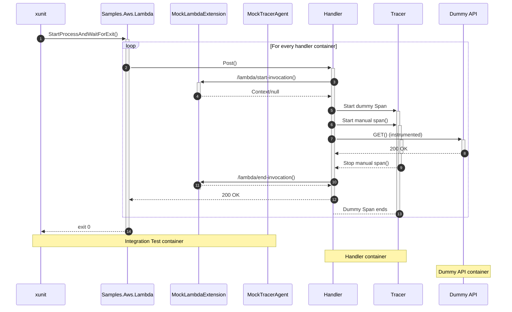

# AWS Lambda integration tests

AWS Lambda instrumentation is a somewhat complex topic. The AWS lambda tests in the repository emulate the design of the .NET Tracer integration, without fully testing it. This documentation provides an explainer for what the tests are doing, and what we're testing.

## The AWS Lambda integration test setup

There are lots of moving parts in the Aws Lambda integration tests, which are configured in the [docker-compose.serverless.yml](../../docker-compose.serverless.yml) file, and [in `AwsLambdaTests`](../../tracer/test/Datadog.Trace.ClrProfiler.IntegrationTests/AWS/AwsLambdaTests.cs) :

- **Integration Test**. This is the running xunit test project. The test project starts:
  - The `MockTracerAgent`, where is where spans are sent, simulating the agent running in the Lambda extension.
  - The `MockLambdaExtension`, which is where the Tracer sends requests for the "context", i.e. any ambient request. There are two instances of this extension running:
    - **No context** - replies, but does not include a `TraceId` header
    - **With context** - replies, and includes a `TraceId` and `SamplingPriority`
  - **Samples.AWS.Lambda**. The xunit test starts an instance of the `Samples.AWS.Lambda` project, executing `Program.Main()`, and waiting for its exit.
- **Dummy API container**. This is a simple ok API which always returns 200 OK, whatever the path.
- **AWS Lambda container** (1 per handler). A container which contains the same `Samples.AWS.Lambda` code, but configured as an AWS function. It therefore executes a _single_ handler method in response to requests. There is one container for each handler function. Most of the handlers make an API call to the Dummy API container (to generate an automatic span).

The interaction between all these parts in a request is a bit confusing, so I've tried to show it in the sequence diagram below. The inner section is repeated for each handler container

Note there are some "failing" tests too, in which the handler makes an API call to and endpoint that doesn't exist.

> **Warning** The `*WithContext` handler methods receive a trace ID from the MockLambdaExtension, and use that as the trace ID  for all subsequent spans, but no span with that ID is _actually_ sent to the mock tracer agent.

In the integration tests, we do the same thing as the real lambda extension  and "synthesize" a span fom the `/lambda/end-invocation` request. As far as I can see, there's no way to definitively correlate the start and end invocations in our tests, so we don't try