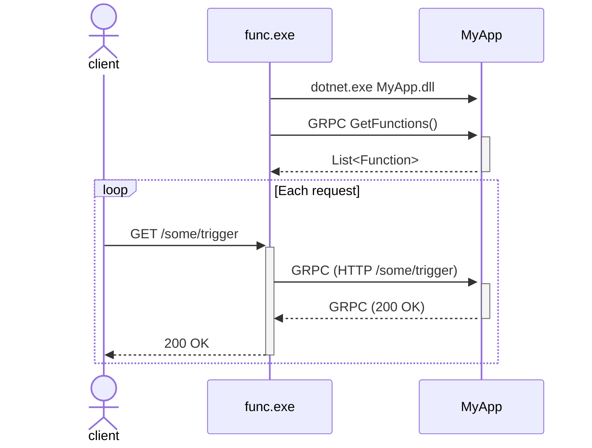

# Azure Functions Integration

Azure functions operates in one of two ways:

- In-process
- Isolated (out of process)

## In-process Azure Functions integration

In-process Azure functions were the default approach in early versions of the framework. We currently support v3 and v4 in-process Azure functions. In this model, the "host" process loads the customer's app as a class library.

The Azure Functions host is a normal ASP.NET Core app, but we disable the default diagnostic observer so as to not generate invalid spans. Instead, we instrument the `FunctionInvocationMiddleware` in the host, which provides access to the incoming `HttpContext` for HTTP spans. We use this to create an "outer" span, but at this point we dont have any details about the function that will be executed.

We also instrument the `FunctionExecutor`. This provides all the details about the actual function being executed. We want those details to be applied to the "top-level" span, so for HTTP spans we apply the azure function tags to the initial aspnetcore span too. For non-http triggers (e.g. timer triggers), there will only be a single span created (no top-level HTTP span).

## Isolated Azure Functions integration

Isolated functions are the only supported model for Azure Functions going forward. In this model, instead of the customer's app being a class library, its a real ASP.NET Core application. The host `func.exe` starts the customer app as a sub process, and sets up a GRPC channel between the two apps. The `func.exe` host acts as a proxy for requests to the customer's app.

`func.exe` sets up an in-process Azure Function for every function in the customer's app. Each of the functions in `func.exe` are simple calls that proxy the request to the customer app, and then return the response.

When an HTTP request is received by `func.exe`, it runs the in-process function as normal. As part of the in-process function execution, it creates a GRPC message (by serializing the incoming HTTP requests to a GRPC message), and forwards the request over GRPC to the customer app. The customer's app runs the _real_ Azure function, and returns the response back over GRPC, where it is deserialized and turned into an HTTP response.



To correctly flow and parent the state across each request, our integration does the following:

- In-process instrumentation of `FunctionInvocationMiddleware` in `func.exe`.
  - This is the same integration we use for normal in-process functions. We need to keep the span generated here as it represents the "real" latencies seen by customers calling the function. This is only created for HTTP requests.
- In-process instrumentation of `FunctionExecutor` in `func.exe`.
  - This is the same integration point as for in-process functions, but it serves a slightly different purpose. We don't want to create a span here (this function invocation doesn't represent anything useful), but we _do_ want to enrich the top-level HTTP span with more details about the function invocation.
  - The "function" being executed here is the "fake" in-process function which mirrors the "real" out-of-process function. Consequently, we don't have real type names, and the function name is prefixed with `Functions.`, e.g. `Functions.MyAppTrigger` instead of `MyAppTrigger`
- Instrumentation of `GrpcMessageConversionExtensions.ToRpcHttp()` in `func.exe`.
  - This is a new integration, which hooks into the method that converts the incoming HTTP request into a GRPC message.
  - We instrument this so that we can inject the context of the new HTTP span created in `FunctionInvocationMiddleware`, so that spans created in the customer app are correctly parented.
  - Note that there may _already_ be a distributed context in the incoming HTTP request. This integration _overwrites_ it to ensure correct parentage.
- `Instrumentation` of `FunctionExecutionMiddleware` in the customer's app.
  - This is the actual function execution in the customer's app, so we can retrieve all the pertinent details about the Azure Function here.
  - One complexity is extracting the distributed HTTP context from the incoming message. We have to do some gnarly DuckType diving through the context variables in order to grab these.
  - Note that the span generated by this integration is directly equivalent to the span generated by `FunctionExecutor` for in-process functions. However, as we've crossed a process boundary (unlike in the in-process case), the span here is a top-level span, and therefore will be decorated with all the extra Azure Function tags.

For an HTTP trigger function, the result is something like this:


For a timer trigger, there's a single span


### Isolated Azure Functions with ASP.NET Core Integration

Isolated Azure Functions also supports an [ASP.NET Core Integration](https://learn.microsoft.com/en-us/azure/azure-functions/dotnet-isolated-process-guide?tabs=hostbuilder%2Cwindows#aspnet-core-integration) that operates differently.

When operating in this mode the `func.exe` will *proxy* the HTTP Triggers with an HTTP Request instead of sending it as a gRPC message.
This means that we basically have two separate modes of operation here as typically the context is stored in the gRPC message, but the message is empty when proxying.

Our workaround to support this at the moment is to create our own gRPC type that is empty and inject the context in there.
We could in the future udpate this to extract the context out of the HTTP headers that we do get from this as well.

Whether a Functions app uses this new mode is subtle:

`ConfigureFunctionsWebApplication()` is `ConfigureFunctionsWorkerDefaults()`

and the project will have a reference to [Microsoft.Azure.Functions.Worker.Extensions.Http.AspNetCore](https://www.nuget.org/packages/Microsoft.Azure.Functions.Worker.Extensions.Http.AspNetCore/) package.

## Local Development

### Building the Datadog.AzureFunctions NuGet Package

For rapid iteration when testing changes to `Datadog.Trace` in Azure Functions projects, use the `Build-AzureFunctionsNuget.ps1` helper script:

```powershell
# Build using existing bundle
.\tracer\tools\Build-AzureFunctionsNuget.ps1

# Download bundle from a specific Azure DevOps build first
.\tracer\tools\Build-AzureFunctionsNuget.ps1 -BuildId 12345

# Build and copy package to a specific location
.\tracer\tools\Build-AzureFunctionsNuget.ps1 -CopyTo 'D:\temp\nuget'

# Use -Verbose for detailed progress
.\tracer\tools\Build-AzureFunctionsNuget.ps1 -Verbose
```

This script:
1. Cleans up previous builds
2. Removes the `Datadog.AzureFunctions` package from the local NuGet cache
3. Optionally downloads `Datadog.Trace.Bundle` from a specific build
4. Builds `Datadog.Trace` and publishes to the bundle folder (`net6.0` and `net461` targets)
5. Builds the `Datadog.AzureFunctions` NuGet package
6. Optionally copies the package to a specified path

See `Get-Help .\tracer\tools\Build-AzureFunctionsNuget.ps1 -Full` for complete documentation.

## Debugging

To debug Azure Functions locally ensure that you have the following:

- https://github.com/Azure/azure-functions-core-tools
- https://learn.microsoft.com/en-us/azure/azure-functions/functions-run-local?tabs=windows%2Cisolated-process%2Cnode-v4%2Cpython-v2%2Chttp-trigger%2Ccontainer-apps&pivots=programming-language-csharp
- https://learn.microsoft.com/en-us/azure/storage/common/storage-use-azurite?tabs=visual-studio%2Cblob-storage
- Disable `ExitApp` run on startup: ` public void ExitApp([TimerTrigger(AtMidnightOnFirstJan, RunOnStartup = true)] TimerInfo myTimer)` in the sample application if you want to make requests.
- Run `azurite` (may need to run as admin)
- Build and run the function app sample
- You can hit the endpoint like normal
