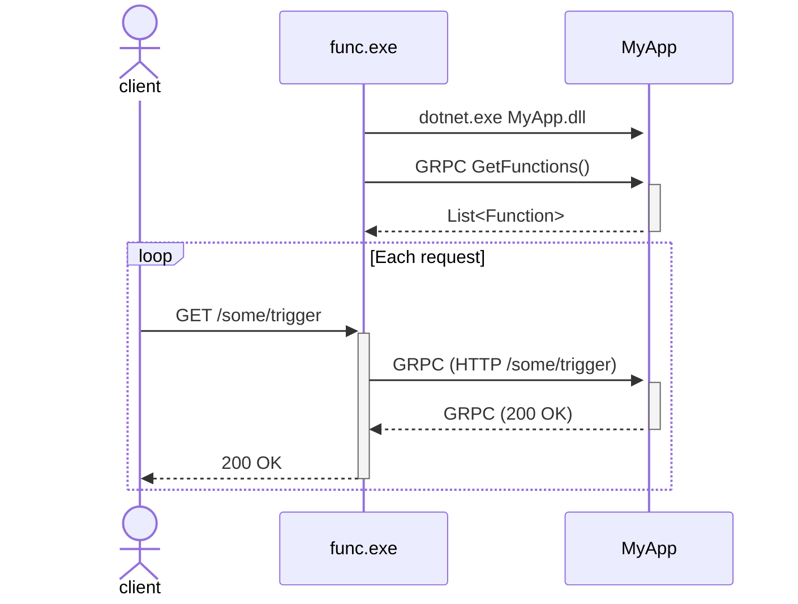

# Azure Functions Integration

This document describes how dd-trace-dotnet integrates with Azure Functions for distributed tracing.

**Related Documentation:**
- [Azure Functions Architecture Deep Dive](for-ai/AzureFunctions-Architecture.md) - Detailed architectural information about Azure Functions Host and .NET Worker

Azure functions operates in one of two ways:

- In-process
- Isolated (out of process)

## NuGet Package Architecture

### Datadog.AzureFunctions Package

The `Datadog.AzureFunctions` NuGet package is the primary instrumentation package for Azure Functions. It contains:

- **Datadog.Trace.dll** - The full managed tracer component with all auto-instrumentation code
- **Native binaries** - Platform-specific native libraries (e.g., `Datadog.Trace.ClrProfiler.Native.so` for Linux)
- **Monitoring home directory structure** - Deployed to `/home/site/wwwroot/datadog/` (Linux) or equivalent on Windows

When instrumentation is enabled globally (via `CORECLR_ENABLE_PROFILING=1`), the native profiler loads `Datadog.Trace.dll` into **both the host process (`func.exe` or `Microsoft.Azure.WebJobs.Script.WebHost`) and the worker process**. This allows instrumentation code to run in both processes, which is essential for:
- Instrumenting host process methods (e.g., `GrpcMessageConversionExtensions.ToRpcHttp()`)
- Instrumenting worker process methods (e.g., `FunctionExecutionMiddleware`)
- Ensuring correct trace context propagation across the process boundary

### Datadog.Trace Package

The `Datadog.Trace` NuGet package is different from `Datadog.AzureFunctions`:

- **Contains only** `Datadog.Trace.Manual.dll` - The manual instrumentation API
- **Does NOT contain** auto-instrumentation code or native profiler binaries
- Used by application code for manual instrumentation (e.g., `Tracer.Instance.StartActive()`)

In Azure Functions scenarios, applications typically only need to reference `Datadog.AzureFunctions`, which provides both auto-instrumentation and pulls in `Datadog.Trace` as a transitive dependency for manual instrumentation APIs. If an application explicitly references `Datadog.Trace` (e.g., for version pinning), the version doesn't need to match `Datadog.AzureFunctions` exactly, as the auto-instrumentation comes entirely from `Datadog.Trace.dll` bundled in `Datadog.AzureFunctions`.

## In-process Azure Functions integration

In-process Azure functions were the default approach in early versions of the framework. We currently support v3 and v4 in-process Azure functions. In this model, the "host" process loads the customer's app as a class library.

The Azure Functions host is a normal ASP.NET Core app, but we disable the default diagnostic observer so as to not generate invalid spans. Instead, we instrument the `FunctionInvocationMiddleware` in the host, which provides access to the incoming `HttpContext` for HTTP spans. We use this to create an "outer" span, but at this point we dont have any details about the function that will be executed.

We also instrument the `FunctionExecutor`. This provides all the details about the actual function being executed. We want those details to be applied to the "top-level" span, so for HTTP spans we apply the azure function tags to the initial aspnetcore span too. For non-http triggers (e.g. timer triggers), there will only be a single span created (no top-level HTTP span).

## Isolated Azure Functions integration

Isolated functions are the only supported model for Azure Functions going forward. In this model, instead of the customer's app being a class library, its a real ASP.NET Core application. The host `func.exe` starts the customer app as a sub process, and sets up a GRPC channel between the two apps. The `func.exe` host acts as a proxy for requests to the customer's app.

For detailed information about the isolated worker architecture, gRPC protocol, and middleware model, see [Azure Functions Architecture Deep Dive](for-ai/AzureFunctions-Architecture.md).

`func.exe` sets up an in-process Azure Function for every function in the customer's app. Each of the functions in `func.exe` are simple calls that proxy the request to the customer app, and then return the response.

When an HTTP request is received by `func.exe`, it runs the in-process function as normal. As part of the in-process function execution, it creates a GRPC message (by serializing the incoming HTTP requests to a GRPC message), and forwards the request over GRPC to the customer app. The customer's app runs the _real_ Azure function, and returns the response back over GRPC, where it is deserialized and turned into an HTTP response.



To correctly flow and parent the state across each request, our integration does the following:

- In-process instrumentation of `FunctionInvocationMiddleware` in `func.exe`.
  - This is the same integration we use for normal in-process functions. We need to keep the span generated here as it represents the "real" latencies seen by customers calling the function. This is only created for HTTP requests.
- In-process instrumentation of `FunctionExecutor` in `func.exe`.
  - This is the same integration point as for in-process functions, but it serves a slightly different purpose. We don't want to create a span here (this function invocation doesn't represent anything useful), but we _do_ want to enrich the top-level HTTP span with more details about the function invocation.
  - The "function" being executed here is the "fake" in-process function which mirrors the "real" out-of-process function. Consequently, we don't have real type names, and the function name is prefixed with `Functions.`, e.g. `Functions.MyAppTrigger` instead of `MyAppTrigger`
- Instrumentation of `GrpcMessageConversionExtensions.ToRpcHttp()` in `func.exe`.
  - This is a new integration, which hooks into the method that converts the incoming HTTP request into a GRPC message.
  - We instrument this so that we can inject the context of the new HTTP span created in `FunctionInvocationMiddleware`, so that spans created in the customer app are correctly parented.
  - Note that there may _already_ be a distributed context in the incoming HTTP request. This integration _overwrites_ it to ensure correct parentage.
- `Instrumentation` of `FunctionExecutionMiddleware` in the customer's app.
  - This is the actual function execution in the customer's app, so we can retrieve all the pertinent details about the Azure Function here.
  - One complexity is extracting the distributed HTTP context from the incoming message. We have to do some gnarly DuckType diving through the context variables in order to grab these.
  - Note that the span generated by this integration is directly equivalent to the span generated by `FunctionExecutor` for in-process functions. However, as we've crossed a process boundary (unlike in the in-process case), the span here is a top-level span, and therefore will be decorated with all the extra Azure Function tags.

For an HTTP trigger function, the result is something like this:


For a timer trigger, there's a single span


### Isolated Azure Functions with ASP.NET Core Integration

Isolated Azure Functions also supports an [ASP.NET Core Integration](https://learn.microsoft.com/en-us/azure/azure-functions/dotnet-isolated-process-guide?tabs=hostbuilder%2Cwindows#aspnet-core-integration) mode where the host uses HTTP proxying instead of sending all request details over gRPC.

**For architectural details** about HTTP proxying, YARP, and detection, see [Azure Functions Architecture Deep Dive](for-ai/AzureFunctions-Architecture.md).

When ASP.NET Core integration is enabled, the `func.exe` host uses **HTTP proxying** instead of sending all request details over gRPC:

1. **Request Reception**: `func.exe` receives the incoming HTTP request
2. **Capability Detection**: Host checks if worker advertised the `HttpUri` capability
3. **Minimal gRPC Message**: `GrpcMessageConversionExtensions.ToRpcHttp()` returns an **empty** or minimal gRPC message (see [GrpcMessageConversionExtensions.cs:123-125](https://github.com/Azure/azure-functions-host/blob/de87f37cec3cf02b3e29716764d4ceb6c2856fa8/src/WebJobs.Script.Grpc/MessageExtensions/GrpcMessageConversionExtensions.cs#L123-L125))
4. **HTTP Forwarding**: Host uses [YARP (Yet Another Reverse Proxy)](https://microsoft.github.io/reverse-proxy/) to forward the original HTTP request to the worker process via `DefaultHttpProxyService.StartForwarding()` ([source](https://github.com/Azure/azure-functions-host/blob/de87f37cec3cf02b3e29716764d4ceb6c2856fa8/src/WebJobs.Script/Http/DefaultHttpProxyService.cs#L82-L108))
5. **Worker Processing**: Worker receives the HTTP request and processes the function
6. **Response Proxying**: Worker's HTTP response is proxied back through the host to the client

**Key Components:**
- `DefaultHttpProxyService` - Uses YARP's `IHttpForwarder` with `SocketsHttpHandler` for HTTP proxying
- `RetryProxyHandler` - Wraps `SocketsHttpHandler` to add retry logic
- `ScriptInvocationRequestTransformer` - YARP transformer to add correlation headers (e.g., invocation ID)

**Code Flow:**
```
Client → func.exe (host) → DefaultHttpProxyService → SocketsHttpHandler → HTTP → Worker ASP.NET Core app
```

#### Detection

Whether a Functions app uses ASP.NET Core integration:

- Project uses `ConfigureFunctionsWebApplication()` instead of `ConfigureFunctionsWorkerDefaults()`
- Project references [Microsoft.Azure.Functions.Worker.Extensions.Http.AspNetCore](https://www.nuget.org/packages/Microsoft.Azure.Functions.Worker.Extensions.Http.AspNetCore/) package
- Worker advertises `HttpUri` capability to the host during initialization

#### Trace Context Propagation

In ASP.NET Core integration mode:
- The gRPC message is **empty** (or contains only route parameters if `RequiresRouteParameters` capability is set)
- Trace context flows via **HTTP headers** from host to worker
- Our HTTP client instrumentation (intercepting `SocketsHttpHandler`):
  - Creates a span for the host→worker HTTP call
  - Injects trace context headers (`x-datadog-*`) into the proxied HTTP request
- Worker's ASP.NET Core instrumentation extracts context from HTTP headers

#### Distributed Tracing Architecture

**Important**: Host and worker processes send spans **independently** to the Datadog Agent:

1. **Host process** (PID 27) serializes and sends its own spans
2. **Worker process** (PID 56) serializes and sends its own spans
3. **Datadog backend** stitches them into a distributed trace using trace IDs and parent span IDs

Each process tags its spans with `aas.function.process: host` or `aas.function.process: worker` during serialization (see `SpanMessagePackFormatter.cs:742-754`). This tag is determined by `EnvironmentHelpers.IsRunningInAzureFunctionsHost()`, which checks the command line for `--workerId` or `--functions-worker-id` flags:
- **No flags** → Host process → `aas.function.process: host`
- **Has flags** → Worker process → `aas.function.process: worker`

**Example distributed trace structure**:

```
Trace ID: 68e948220000000047fef7bad8bb854e

Host spans (serialized by PID 27, tagged as "host"):
├─ aspnet_core.request (s_id: 8ec7..., p_id: null)           [ROOT]
├─ azure_functions.invoke (s_id: 10c8..., p_id: 8ec7...)     [Child of root]
└─ http.request (s_id: 2ac3..., p_id: 10c8...)               [HTTP call to worker]

Worker spans (serialized by PID 56, tagged as "worker"):
└─ aspnet_core.request (s_id: 9ddf..., p_id: 2ac3...)        [Child of host's http.request]
   └─ azure_functions.invoke (s_id: 114d..., p_id: 9ddf...)  [Child of worker's aspnet_core]
      └─ ... (additional spans)
```

<!-- TODO: Update this section if/when span parenting is fixed to properly connect host and worker spans -->

**Key insight**: When troubleshooting traces in Datadog, a single distributed trace will contain spans from both processes with different `aas.function.process` tag values. This is expected behavior.

## Local Development

### Building the Datadog.AzureFunctions NuGet Package

For rapid iteration when testing changes to `Datadog.Trace` in Azure Functions projects, use the `Build-AzureFunctionsNuget.ps1` helper script:

```powershell
# Build using existing bundle
.\tracer\tools\Build-AzureFunctionsNuget.ps1

# Download bundle from a specific Azure DevOps build first
.\tracer\tools\Build-AzureFunctionsNuget.ps1 -BuildId 12345

# Build and copy package to a specific location
.\tracer\tools\Build-AzureFunctionsNuget.ps1 -CopyTo 'D:\temp\nuget'

# Use -Verbose for detailed progress
.\tracer\tools\Build-AzureFunctionsNuget.ps1 -Verbose
```

This script:
1. Cleans up previous builds
2. Removes the `Datadog.AzureFunctions` package from the local NuGet cache
3. Optionally downloads `Datadog.Trace.Bundle` from a specific build
4. Builds `Datadog.Trace` and publishes to the bundle folder (`net6.0` and `net461` targets)
5. Builds the `Datadog.AzureFunctions` NuGet package
6. Optionally copies the package to a specified path

See `Get-Help .\tracer\tools\Build-AzureFunctionsNuget.ps1 -Full` for complete documentation.

### Accessing Tracer Logs

When troubleshooting Azure Functions instrumentation, you may need to access tracer logs from both the host and worker processes. There are two methods to access these logs:

#### Method 1: Datadog Logs API

Query logs that have been sent to Datadog via direct log submission:

```bash
curl -s -X POST "https://api.datadoghq.com/api/v2/logs/events/search" \
  -H "DD-API-KEY: <your-api-key>" \
  -H "DD-APPLICATION-KEY: <your-app-key>" \
  -H "Content-Type: application/json" \
  -d '{
    "filter": {
      "query": "service:<function-app-name> env:<env-name> DD-TRACE-DOTNET",
      "from": "now-15m",
      "to": "now"
    },
    "sort": "timestamp",
    "page": {
      "limit": 100
    }
  }' | jq -r '.data[] | .attributes | "\(.timestamp) - \(.message[:200])"'
```

**Limitations:**
- Requires `DD_LOGS_DIRECT_SUBMISSION_INTEGRATIONS=ILogger` for worker process logs
- Requires `DD_LOGS_DIRECT_SUBMISSION_AZURE_FUNCTIONS_HOST_ENABLED=true` for host process logs
- Host process logs may not be sent to Datadog if direct submission for the host is not enabled or configured correctly
- Log ingestion may be delayed by several seconds

#### Method 2: Download Logs from Azure (Recommended for Debugging)

For more complete and immediate access to tracer logs, download logs directly from Azure:

```bash
# Download logs to a local zip file
az webapp log download --name <function-app-name> --resource-group <resource-group> --log-file D:/temp/azure-functions-logs.zip

# Extract the logs
cd D:/temp
unzip -q -o azure-functions-logs.zip

# View tracer logs
ls -la LogFiles/datadog/
```

**Tracer log file naming convention:**
- **Worker process**: `dotnet-tracer-managed-dotnet-<PID>.log`
  - Example: `dotnet-tracer-managed-dotnet-57.log`
- **Host process**: `dotnet-tracer-managed-Microsoft.Azure.WebJobs.Script.WebHost-<PID>.log`
  - Example: `dotnet-tracer-managed-Microsoft.Azure.WebJobs.Script.WebHost-27.log`
  - Log files may be numbered (e.g., `*_001.log`, `*_002.log`) when they reach a certain size

**Viewing logs:**
```bash
# View end of host log
tail -100 LogFiles/datadog/dotnet-tracer-managed-Microsoft.Azure.WebJobs.Script.WebHost-27.log

# Search for specific integration activity
grep -i "ToRpcHttp\|FunctionInvocationMiddleware\|HttpTest" LogFiles/datadog/dotnet-tracer-managed-Microsoft.Azure.WebJobs.Script.WebHost-27.log

# View spans being created
grep "Span started\|Span closed" LogFiles/datadog/dotnet-tracer-managed-Microsoft.Azure.WebJobs.Script.WebHost-27.log
```

**Advantages of Azure logs:**
- Contains logs from both host and worker processes, even if direct log submission is not configured
- No delay - logs are immediately available
- More complete - includes all debug logs written to file
- Shows detailed span information including trace IDs, span IDs, parent IDs, and tags

## Known Issues

See the `docs/development/investigations/` directory for detailed documentation of specific issues and ongoing investigations:

- **[APMSVLS-58: AsyncLocal Context Flow Issue](investigations/APMSVLS-58-AsyncLocal-Context-Flow.md)** - Span parenting issue with ASP.NET Core integration in isolated Azure Functions

## Troubleshooting with Azure Logs

When troubleshooting Azure Functions instrumentation issues, understanding how to effectively use tracer logs is critical. This section covers best practices for working with logs from deployed Azure Functions.

### Understanding Log File Behavior

#### Log File Persistence

**Critical**: Azure Functions log files are **append-only** and **not cleared on deployment**:

- Existing log files continue to grow indefinitely
- New log entries are appended to the end
- Old log entries from previous versions remain at the beginning
- A single log file may contain entries spanning days or weeks

**Implication**: You **cannot** rely on file position (head/tail) to find recent logs. **Always filter by timestamp**.

#### Host vs Worker Processes

Azure Functions in **isolated mode** consists of two separate processes:

1. **Host Process** (`Microsoft.Azure.WebJobs.Script.WebHost` or `func.exe`)
   - Manages function triggers, scaling, and HTTP proxying
   - Log file pattern: `dotnet-tracer-managed-Microsoft.Azure.WebJobs.Script.WebHost-{pid}.log`
   - May have numbered files when size limit reached: `*_001.log`, `*_002.log`, etc.

2. **Worker Process** (`dotnet`)
   - Executes your function code
   - Log file pattern: `dotnet-tracer-managed-dotnet-{pid}.log`
   - Multiple worker processes may exist simultaneously (different PIDs)

#### Worker Process Lifecycle

**Important**: Worker processes restart on deployment, but they may **reuse the same PID** (likely due to running in Linux containers):

- The log file PID doesn't change, but the process restarts
- Log entries from multiple process lifetimes appear in the same file
- Old entries (from before restart) remain at the beginning of the file
- New entries (from after restart) are appended to the end
- A single log file may contain entries spanning multiple deployments

**Verifying when the worker last initialized**:
```bash
# Find ALL initialization timestamps (shows multiple restarts)
grep "Assembly metadata" worker.log

# Find the MOST RECENT initialization (current worker process)
grep "Assembly metadata" worker.log | tail -1

# Check the version in recent log entries
grep "TracerVersion" worker.log | tail -10
```

Example output showing multiple initializations in the same file:
```
2025-10-03 10:15:23.456 +00:00 [INF] Assembly metadata: { AssemblyVersion: "3.27.0.0", ...}  ← Old deployment
2025-10-10 14:32:18.123 +00:00 [INF] Assembly metadata: { AssemblyVersion: "3.28.0.0", ...}  ← After restart
2025-10-10 17:45:02.789 +00:00 [INF] Assembly metadata: { AssemblyVersion: "3.29.0.0", ...}  ← Current (most recent)
```

**Why this matters**: When filtering logs by timestamp, you must ensure you're looking at entries from the **current process lifetime** (after the most recent initialization), not from previous deployments that remain in the same file.

### Downloading Logs from Azure

Use the Azure CLI to download all log files at once:

```bash
# Download logs to a local zip file
az webapp log download \
  --name lucasp-premium-linux-isolated \
  --resource-group lucasp \
  --log-file D:/temp/azure-logs.zip

# Extract the logs
unzip D:/temp/azure-logs.zip -d D:/temp/LogFiles

# List tracer logs
ls -lh D:/temp/LogFiles/datadog/
```

**Tip**: Download logs regularly when troubleshooting to capture different test executions.

### Finding Relevant Log Entries

#### Step 1: Identify the Execution Timestamp

Before analyzing logs, determine when your test execution occurred:

**Option A - Note the time when triggering**:
```bash
# Trigger and note UTC time
curl https://<function-app>.azurewebsites.net/api/HttpTest
# Timestamp: 2025-10-10 17:53:39 UTC
```

**Option B - Search host logs for the trigger**:
```bash
grep "Executing 'Functions" D:/temp/LogFiles/datadog/dotnet-tracer-managed-Microsoft.Azure.WebJobs.Script.WebHost-*.log
```

Example output:
```
2025-10-10 17:53:39.123 [INF] Executing 'Functions.HttpTest'
```

#### Step 2: Extract Trace ID from Host Logs

Find the trace ID created by the host process:

```bash
grep "2025-10-10 17:53:39" D:/temp/LogFiles/datadog/dotnet-tracer-managed-Microsoft.Azure.WebJobs.Script.WebHost-*.log | grep "Span started"
```

Example output:
```
2025-10-10 17:53:39.123 +00:00 [DBG] Span started: [s_id: abc123def456, p_id: null, t_id: 68e948220000000047fef7bad8bb854e]
```

The trace ID is `68e948220000000047fef7bad8bb854e`.

#### Step 3: Identify Active Worker Process

List worker log files and check which ones have recent activity:

```bash
# List all worker logs with sizes
ls -lh D:/temp/LogFiles/datadog/dotnet-tracer-managed-dotnet-*.log

# Find which PID was active at your timestamp
grep "2025-10-10 17:53:" D:/temp/LogFiles/datadog/dotnet-tracer-managed-dotnet-*.log | head -1
```

Example output showing PID 56 was active:
```
D:/temp/LogFiles/datadog/dotnet-tracer-managed-dotnet-56.log:2025-10-10 17:53:38.194 ...
```

#### Step 4: Filter Worker Logs by Timestamp

**Always filter by timestamp** - never use head/tail on downloaded log files:

```bash
# Get all logs in the minute of interest
grep "2025-10-10 17:53:" D:/temp/LogFiles/datadog/dotnet-tracer-managed-dotnet-56.log

# Get logs in a specific second range (17:53:38-39)
grep "2025-10-10 17:53:3[89]" D:/temp/LogFiles/datadog/dotnet-tracer-managed-dotnet-56.log

# Search for specific messages in that timeframe
grep "2025-10-10 17:53:3[89]" D:/temp/LogFiles/datadog/dotnet-tracer-managed-dotnet-56.log | grep "Azure Functions span creation"
```

**Why timestamp filtering is essential**:
- ❌ `tail -100 worker.log` may show logs from weeks ago
- ❌ `head -100 worker.log` definitely shows old initialization logs
- ✅ `grep "2025-10-10 17:53:" worker.log` shows only relevant entries

#### Step 5: Verify Tracer Version

Always verify the worker loaded the expected tracer version before investigating behavior:

```bash
# Check when worker initialized and which version
grep "Assembly metadata" D:/temp/LogFiles/datadog/dotnet-tracer-managed-dotnet-56.log | head -1

# Verify version in recent log entries
grep "2025-10-10 17:53:" D:/temp/LogFiles/datadog/dotnet-tracer-managed-dotnet-56.log | grep "TracerVersion" | head -1
```

If the version is outdated, restart the Function App and re-test.

### Common Troubleshooting Scenarios

#### Scenario 1: Separate Traces (Parenting Issue)

**Symptom**: Host and worker create spans in different traces instead of a single unified trace.

**Investigation**:

1. Get the trace ID from host logs at the execution timestamp (see Step 2 above)
2. Search worker logs for the same trace ID:
   ```bash
   grep "68e948220000000047fef7bad8bb854e" D:/temp/LogFiles/datadog/dotnet-tracer-managed-dotnet-56.log
   ```
3. If not found, the worker created a separate trace
4. Look for worker spans with `p_id: null` (root spans) instead of parent IDs matching host spans

**Understanding span relationships**:

When analyzing span logs, look for these fields in "Span started" messages:
- **s_id** (span ID): Unique identifier for this span
- **p_id** (parent ID): Span ID of the parent span (`null` = root span)
- **t_id** (trace ID): Trace this span belongs to

**Healthy trace structure** (host + worker in same trace):
```
Host:
  [s_id: A, p_id: null, t_id: 68e9...]  ← Root span (host)

Worker:
  [s_id: B, p_id: A, t_id: 68e9...]     ← Child of A (same trace)
  [s_id: C, p_id: B, t_id: 68e9...]     ← Child of B (same trace)
```

**Broken trace structure** (separate traces):
```
Host:
  [s_id: A, p_id: null, t_id: 68e9...]  ← Host trace

Worker:
  [s_id: X, p_id: null, t_id: 68e0...]  ← Separate worker trace! (different t_id)
```

**Example investigation**:
```bash
# Find all spans created during execution
grep "2025-10-10 17:53:3[89]" host.log | grep "Span started"
grep "2025-10-10 17:53:3[89]" worker.log | grep "Span started"

# Compare trace IDs - they should match
```

#### Scenario 2: Missing Debug Logs

**Symptom**: Added debug logging but it doesn't appear in logs.

**Possible causes and solutions**:

1. **Deployment hasn't completed yet** - Worker restarted but still loading old version
   ```bash
   # Check most recent worker initialization
   grep "Assembly metadata" worker.log | tail -1
   # Wait a minute and check again after deployment completes
   ```

2. **Wrong log level** - Debug logs are filtered out
   ```bash
   # Check log level configuration
   grep "DD_TRACE_LOG_LEVEL" host.log worker.log
   # Should see: DD_TRACE_LOG_LEVEL=Debug
   ```

3. **Looking at wrong timeframe** - Logs exist but searching wrong time
   ```bash
   # Use broader time range
   grep "2025-10-10 17:5[0-9]:" worker.log | grep "your debug message"
   ```

4. **Downloaded logs before execution** - Re-download after triggering
   ```bash
   # Trigger function first
   curl https://<app>.azurewebsites.net/api/HttpTest
   # Wait a few seconds, then download
   az webapp log download --name <app> --resource-group <rg> --log-file logs.zip
   ```

#### Scenario 3: Wrong Tracer Version After Deployment

**Symptom**: Deployed new code but behavior hasn't changed, or seeing old tracer version.

**Investigation**:

```bash
# Check ALL worker initializations (shows restart history)
grep "Assembly metadata" worker.log

# Check the MOST RECENT initialization (current process)
grep "Assembly metadata" worker.log | tail -1

# Example output showing worker restarted but loaded old version
2025-10-10 17:45:02.789 +00:00 [INF] Assembly metadata: { AssemblyVersion: "3.27.0.0", ...}
```

If the most recent initialization shows an older version than expected, the deployment may not have completed properly.

**Verification**:
```bash
# Check version in recent logs
grep "2025-10-10 17:53:" worker.log | grep "TracerVersion" | head -1

# Expected: TracerVersion: "3.29.0.0" (your new version)
# Actual: TracerVersion: "3.27.0.0" (old version still loaded)
```

**Possible causes**:
1. Deployment is still in progress - wait a few minutes and check again
2. Deployment failed - check Azure Portal deployment logs
3. Build artifact didn't include updated tracer - verify build output
4. NuGet cache issue - clear local NuGet cache and rebuild

**Solutions**:
```bash
# 1. Wait and verify deployment completed
az functionapp deployment list --name <app> --resource-group <rg> --query "[0]"

# 2. Manually restart the Function App
az functionapp restart --name <app> --resource-group <rg>

# 3. Clear local NuGet cache and rebuild
dotnet nuget locals all --clear
dotnet clean
dotnet build
```

### Best Practices

#### 1. Always Use Timestamp Filtering

❌ **Don't do this**:
```bash
tail -100 worker.log  # May show old logs from weeks ago
head -100 worker.log  # Definitely shows old initialization logs
```

✅ **Do this**:
```bash
grep "2025-10-10 17:53:" worker.log                    # Specific minute
grep "2025-10-10 17:53:3[89]" worker.log               # Specific seconds
grep "2025-10-10 17:5[0-9]:" worker.log                # Entire hour
```

#### 2. Correlate Host and Worker Logs by Trace ID

Trace IDs are the key to understanding distributed traces:

1. Get trace ID from host logs
2. Search worker logs for the same trace ID
3. Verify spans have correct parent-child relationships (matching `p_id` and `s_id`)

#### 3. Verify Tracer Version Before Troubleshooting

Before investigating unexpected behavior:

1. Check worker log initialization timestamp
2. Verify `TracerVersion` in recent log entries matches expected version
3. If version is old, restart Function App and re-test

#### 4. Use Context in Grep

When searching for specific log messages, include context lines:

```bash
# Show 2 lines before and after matches
grep -B 2 -A 2 "Azure Functions span creation" worker.log

# Show 5 lines after to see span details
grep -A 5 "Span started" worker.log
```

#### 5. Track Multiple Executions Separately

When testing repeatedly, save logs for each execution:

```bash
# Execution 1 at 17:48
grep "2025-10-10 17:48:" worker.log > exec1.log

# Execution 2 at 17:53
grep "2025-10-10 17:53:" worker.log > exec2.log

# Compare behavior
diff exec1.log exec2.log
```

#### 6. Download Logs After Each Test

After triggering a function for testing:

```bash
# 1. Trigger the function
curl https://<app>.azurewebsites.net/api/HttpTest

# 2. Wait a few seconds for logs to be written
sleep 5

# 3. Download logs with timestamp in filename
az webapp log download \
  --name <app> \
  --resource-group <rg> \
  --log-file "D:/temp/logs-$(date +%H%M%S).zip"
```

This creates a snapshot of logs for each test execution.

### Complete Investigation Workflow Example

Here's an end-to-end workflow for investigating a span parenting issue:

```bash
# === Step 1: Trigger and capture timestamp ===
echo "Triggering at $(date -u +%Y-%m-%d\ %H:%M:%S) UTC"
curl https://lucasp-premium-linux-isolated.azurewebsites.net/api/HttpTest
# Output: Triggering at 2025-10-10 17:53:39 UTC

sleep 5  # Wait for logs to be written

# === Step 2: Download logs ===
az webapp log download \
  --name lucasp-premium-linux-isolated \
  --resource-group lucasp \
  --log-file D:/temp/logs-175339.zip

unzip -q D:/temp/logs-175339.zip -d D:/temp/LogFiles

# === Step 3: Find host trace ID ===
grep "2025-10-10 17:53:39" \
  D:/temp/LogFiles/datadog/dotnet-tracer-managed-Microsoft.Azure.WebJobs.Script.WebHost-*.log \
  | grep "Span started" \
  | grep "azure_functions.invoke"

# Output: t_id: 68e948220000000047fef7bad8bb854e

# === Step 4: Identify active worker ===
grep "2025-10-10 17:53:" \
  D:/temp/LogFiles/datadog/dotnet-tracer-managed-dotnet-*.log \
  | head -1

# Output: dotnet-56.log has activity

# === Step 5: Verify worker tracer version ===
grep "TracerVersion" \
  D:/temp/LogFiles/datadog/dotnet-tracer-managed-dotnet-56.log \
  | tail -1

# Output: TracerVersion: "3.29.0.0" ✓ Correct version

# === Step 6: Check if worker spans are in same trace ===
grep "68e948220000000047fef7bad8bb854e" \
  D:/temp/LogFiles/datadog/dotnet-tracer-managed-dotnet-56.log

# If no results, worker created separate trace - investigate further

# === Step 7: Find all worker spans at this timestamp ===
grep "2025-10-10 17:53:3[89]" \
  D:/temp/LogFiles/datadog/dotnet-tracer-managed-dotnet-56.log \
  | grep "Span started"

# Look for spans with p_id: null (root spans in separate traces)

# === Step 8: Look for debug messages ===
grep "2025-10-10 17:53:3[89]" \
  D:/temp/LogFiles/datadog/dotnet-tracer-managed-dotnet-56.log \
  | grep "Azure Functions span creation"

# Check ActiveScope and InternalActiveScope values

# === Step 9: Examine all span relationships ===
grep "2025-10-10 17:53:3[89]" \
  D:/temp/LogFiles/datadog/dotnet-tracer-managed-dotnet-56.log \
  | grep -E "Span (started|closed)" \
  | awk -F'[\\[\\]]' '{print $2}'  # Extract s_id, p_id, t_id

# Verify parent-child relationships form a proper tree
```

### Advanced: Parsing Span Relationships

To visualize span relationships from logs:

```bash
# Extract span info from host and worker logs
grep "2025-10-10 17:53:3[89]" host.log worker.log \
  | grep "Span started" \
  | sed -E 's/.*\[s_id: ([^,]+), p_id: ([^,]+), t_id: ([^\]]+)\].*/\3 | \1 | \2/' \
  | sort

# Output format: trace_id | span_id | parent_id
# Use this to build a mental model of the trace tree
```

Example output:
```
68e9482200... | abc123... | null           ← Root (host)
68e9482200... | def456... | abc123...      ← Child of root (host)
68e0012345... | xyz789... | null           ← Separate root (worker) ❌
```

This clearly shows the worker created a separate trace.

## Debugging

To debug Azure Functions locally ensure that you have the following:

- https://github.com/Azure/azure-functions-core-tools
- https://learn.microsoft.com/en-us/azure/azure-functions/functions-run-local?tabs=windows%2Cisolated-process%2Cnode-v4%2Cpython-v2%2Chttp-trigger%2Ccontainer-apps&pivots=programming-language-csharp
- https://learn.microsoft.com/en-us/azure/storage/common/storage-use-azurite?tabs=visual-studio%2Cblob-storage
- Disable `ExitApp` run on startup: ` public void ExitApp([TimerTrigger(AtMidnightOnFirstJan, RunOnStartup = true)] TimerInfo myTimer)` in the sample application if you want to make requests.
- Run `azurite` (may need to run as admin)
- Build and run the function app sample
- You can hit the endpoint like normal
