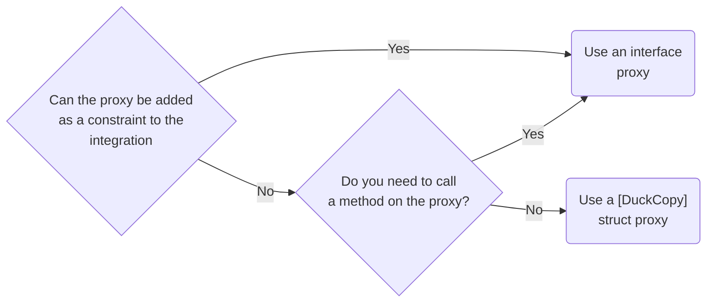

# Datadog.Trace.DuckTyping

The duck typing library allows us to get and set data from fields and properties and call methods from an object without having the type definition at compile time. This is done by creating a proxy type to an object instance using a proxy definition at runtime.

The goal of the library is to have an unify code to access unknown types as fastest and with the minimum allocations as possible.

> [!NOTE]  
> Please ensure you check the [Best Practices](#best-practices) section for details on how to choose the type of proxy.

### Example
Given the following scenario, where we want to access the data from an anonymous class instance in another method, a code example to do that would be:

```csharp
public class Program
{
	public static void Main()
	{
		// We create an anonymous object
		var anonymousObject = new { Name = ".NET Core", Version = "3.1" };
		
		Process(anonymousObject);
	}
	
	public static void Process(object obj) 
	{
                // First, we create a proxy instance using IDuckAnonymous type
                // as a proxy definition and the obj instance as the target.
		// Now the proxyInstance implements IDuckAnonymous type and all
                // getters to access the anonymous object internals were generated
                // automatically for us.

                // We use the `DuckCast` extension method to call the duck typing proxy creator.
		var proxyInstance = obj.DuckCast<IDuckAnonymous>();

		// Here we can access the internal properties
		Console.WriteLine($"Name: {proxyInstance.Name}");
		Console.WriteLine($"Version: {proxyInstance.Version}");
	}
	
	public interface IDuckAnonymous 
	{
		string Name { get; }
		string Version { get; }
	}		
}
```

For this particular case the generated proxy type by the Duck Type library will look like this:

```csharp
public readonly struct IDuckAnonymous___<>f__AnonymousType0`2[System.String,System.String] : IDuckAnonymous, IDuckType
{
    private readonly <>f__AnonymousType0`2[System.String,System.String] _currentInstance;

    // *** IDuckType implementation
    public object Instance => _currentInstance;
    public Type Type => typeof(<>f__AnonymousType0`2[System.String,System.String]);

    // *** IDuckAnonymous implementation
    public string Name => _currentInstance.Name;
    public string Version => _currentInstance.Version;
}
```

## Proxy types
Depending on the proxy definition type, the library will create different proxy types as shown in the following table:

|    Proxy Definition Type   |               Resulting Proxy Type               |
|----------------------------|--------------------------------------------------|
| Interface                  | Struct implementing the interface                |
| Abstract class             | Class inherits and overriding the abstract class |
| Class with virtual members | Class inherits and overriding the virtual class  |

Also, all resulting proxy types implements the `IDuckType` interface to expose the target instance and type. The interface has the following definition:

```csharp
public interface IDuckType
{
    /// <summary>
    /// Gets instance
    /// </summary>
    object Instance { get; }

    /// <summary>
    /// Gets instance Type
    /// </summary>
    Type Type { get; }
}
```

## Controlling bindings

To control the bindings between the proxy definition and the target type, we can make use of the `DuckAttribute` attribute type defined as:

```csharp
/// <summary>
/// Duck attribute
/// </summary>
[AttributeUsage(AttributeTargets.Property | AttributeTargets.Method, AllowMultiple = false)]
public class DuckAttribute : Attribute
{
    /// <summary>
    /// Gets or sets the underlying type member name
    /// </summary>
    public string Name { get; set; }

    /// <summary>
    /// Gets or sets duck kind
    /// </summary>
    public DuckKind Kind { get; set; } = DuckKind.Property;

    /// <summary>
    /// Gets or sets the generic parameter type names definition for a generic method call (required when calling generic methods and instance type is non public)
    /// </summary>
    public string[] GenericParameterTypeNames { get; set; }

    /// <summary>
    /// Gets or sets the parameter type names of the target method (optional / used to disambiguation)
    /// </summary>
    public string[] ParameterTypeNames { get; set; }
}

/// <summary>
/// Duck attribute where the underlying member is a field
/// </summary>
public class DuckFieldAttribute : DuckAttribute
{
    /// <summary>
    /// Initializes a new instance of the <see cref="DuckFieldAttribute"/> class.
    /// </summary>
    public DuckFieldAttribute()
    {
        Kind = DuckKind.Field;
    }
}

/// <summary>
/// Duck kind
/// </summary>
public enum DuckKind
{
    /// <summary>
    /// Property
    /// </summary>
    Property,

    /// <summary>
    /// Field
    /// </summary>
    Field
}
```

This attribute can be used in `Properties` or `Methods` in the proxy definition and is used by the library to select the members we want to access.

### Example

The following example shows multiple uses of the `DuckAttribute`:

```csharp
public interface IMyProxy
{
    // ***
    // *** Field binding
    // ***

    [DuckField(Name = "_sampleStaticField")]
    string MyStaticField { get; }

    [DuckField(Name = "_normalField")]
    int NormalFieldWithGetterAndSetter { get; set; }


    // ***
    // *** Property binding (by default the Kind is Property so we can ignore it)
    // ***

    [Duck(Name = "Instance")]
    string MyStaticInstanceProperty { get; }

    // If we don´t use the duck attribute it will try to find a property with the same name in the target type
    string MyProperty { get; set; }

    // If the original property returns a type that we don´t have at compile time,
    // we can pass a proxy definition and that original value will be wrapped with the proxy
    // as well (DuckType chaining).
    IObscureObject CustomData { get; }

    // Indexers are supported as well
    string this[string index] { get; set; }


    // ***
    // *** Method binding
    // ***

    // support overloads of a method
    void Add(string name, int obj);
    void Add(string name, string obj = "none");

    // In order to resolve an ambiguity of a call we can specify the parameters we want to match.
    [Duck(ParameterTypeNames = new string[] { "System.String", "MyNamespace.MyType, MyAssembly" })]
    void Add(string name, object obj);

    // We can also use the name to map to another method name.
    [Duck(Name = "InternalGetReference")]
    void GetReference(ref int value);

    // The Proxy definition can support generics only if the instance type
    // is *Public* 
    Tuple<T1, T2> Wrap<T1, T2>(T1 a, T2 b);

    // If we need to call a generic method from a non public type
    // we can use the DuckAttribute as well:
    [Duck(Name = "Wrap", GenericParameterTypeNames = new[] { "System.Int32", "System.String" })]
    Tuple<int, string> WrapIntString(int a, string b);


    // If the original call returns or uses a parameter that we don´t have at compile time,
    // we can pass a proxy definition and that original value will be wrapped with the proxy
    // as well (DuckType chaining).
    bool TryGetPrivateObscure(out IObscureObject obj);
}
```


## Accessor modifiers (AM)

In order to support all accessor modifiers for: instance types, parameters and return value types, the Duck Type library applies some `tricks` to avoid the visibility checks. This is done automatically when the library is creating the proxy type. In summary the following logic is applied depending on each case:

|        Target Type AM        | Target Member Type |       Target Member AM       | Access Method                                 |
|------------------------------|--------------------|------------------------------|-----------------------------------------------|
| Public                       | Field              | Public                       | Direct                                        |
| Public                       | Field              | Private, Protected, Internal | through DynamicMethod                         |
| Public                       | Property           | Public                       | Direct                                        |
| Public                       | Property           | Private, Protected, Internal | Direct using function pointers (Calli opcode) |
| Public                       | Method             | Public                       | Direct                                        |
| Public                       | Method             | Private, Protected, Internal | Direct using function pointers (Calli opcode) |
| Private, Protected, Internal | Field              | Public                       | through DynamicMethod delegate                |
| Private, Protected, Internal | Field              | Private, Protected, Internal | through DynamicMethod delegate                |
| Private, Protected, Internal | Property           | Public                       | through DynamicMethod delegate                |
| Private, Protected, Internal | Property           | Private, Protected, Internal | through DynamicMethod delegate                |
| Private, Protected, Internal | Method             | Public                       | through DynamicMethod delegate                |
| Private, Protected, Internal | Method             | Private, Protected, Internal | through DynamicMethod delegate                |

## Generics methods

Calling generics methods are supported by the library, but due the use of `DynamicMethod`in some scenarios we can´t define it as a normal generic method (Please note if we know that the target type is Public, then we can declare a normal generic method).

For those scenarios were we can´t use the generic definition, the alternative is to specify the generic parameters to be match in the duck attribute of the proxy definition.


### Example with public type

Consider this public target type:

```csharp
public class PublicType
{
    public Tuple<T1, T2> Wrap<T1, T2>(T1 a, T2 b) 
    {
        return Tuple.Create<T1, T2>(default, default);
    }
}
```

Because the type is public we can define a Generic proxy method:

```csharp
public interface IMyProxy
{
    Tuple<T1, T2> Wrap<T1, T2>(T1 a, T2 b);
}
```

### Example with non public type

Consider this private target type:

```csharp
private class PrivateType
{
    public Tuple<T1, T2> Wrap<T1, T2>(T1 a, T2 b) 
    {
        return Tuple.Create<T1, T2>(default, default);
    }
}
```

Because the type is non public we have to define each generic arguments we want to use in different calls.

```csharp
public interface IMyProxy
{
    // We have to define all kind of call we want to make to the target instance

    [Duck(Name = "Wrap", GenericParameterTypeNames = new[] { "System.Int32", "System.String" })]
    Tuple<int, string> WrapIntString(int a, string b);

    [Duck(Name = "Wrap", GenericParameterTypeNames = new[] { "System.Int32", "System.Int32" })]
    Tuple<int, int> WrapIntInt(int a, int b);
}
```

## Duck typing static types

If you want to duck-type a `static` type so that you can call a method on it, then there _is_ no object you can call `DuckCast<>` on! In that case, you need to use a slightly lower-level API. 

For example, if you have defined a duck type interface `proxyTargetType`, and a reference to the target `Type` you want to duck-type `staticType`, you would call

```csharp
DuckType.CreateTypeResult proxyResult = DuckType.GetOrCreateProxyType(proxyTargetType, staticType);
if (proxyResult.Success)
{
    // Pass in null, as there's no "instance" to duck type here
    return proxyResult.CreateInstance(null);
}
else
{
    // duck typing failed, throw exception etc
}
```

For example, consider this target type:

```csharp
public static class ObjectFactory
{
    public static object CreateObject() => new();
}
```

And you want to call `CreateObject`, so you create an interface

```csharp
public interface IObjectFactoryProxy
{
    object CreateObject();
}
```

You could create a duck type proxy using:

```csharp
// You need a reference to the target `Type`. Ideally, you can get this
// from calling typeof(T) on an integration's generic parameter or something similar
// but the below will also work
Type staticType = Type.GetType("Namespace.ObjectFactory, SomeAssembly");
Type proxyType = typeof(IObjectFactoryProxy); // The type of our proxy

// Try to create the proxy result
DuckType.CreateTypeResult proxyResult = DuckType.GetOrCreateProxyType(proxyType, staticType);
if (proxyResult.Success)
{
    // Pass in null, as there's no "instance" to duck type here, to create an instance of our proxy
    var proxy = (IObjectFactoryProxy)proxyResult.CreateInstance(null);
    
    // invoke methods on the proxy
    object obj = proxy.CreateObject();
}
else
{
    // duck typing failed, throw exception etc
}
```


## Duck chaining

Duck chaining enables the possibility to interact with properties or methods returning or using non public type parameters to be wrapped with a new duck type proxy, so we can access the internals of those objects.

### Example

Consider the following types:

```csharp
public class MyHandler 
{
    public string Name { get; set; }

    internal MyHandlerConfiguration Configuration { get; }
}

internal class MyHandlerConfiguration 
{
    public int MaxConnections { get; set; }
}
```

We can write the following proxy definitions to get access to all the data:

```csharp
public interface IProxyMyHandler
{
    string Name { get; set; }

    IProxyMyHandlerConfiguration Configuration { get; }
}
public interface IProxyMyHandlerConfiguration
{
    int MaxConnections { get; set; }
}
```

In this example the non public instance of `MyHandlerConfiguration` when calling the `Configuration` property is going to be wrapped with a `IProxyMyHandlerConfiguration` instance automatically. That allow us to access the internal data of that non public type.

## Best practices

This section includes some details on choosing between the different duck-type proxies, as well as how to handle nullability of both the target types and the proxies.

### Choosing a proxy implementation

Where possible, duck-type proxies should be implemented as an interface, e.g. `ISomeObject` _as long as they can be used in a constraint_. In these cases, the value passed to the method will be a struct which implements both `ISomeObject` and `IDuckType`. 

> Note that the value passed to the integration will _never_ be `null` as it's a `struct`. If you need to check the original proxy value, you must add the `IDuckType` constraint also, and check `IDuckType.Instance` for `null`. You can read more about this in the [Handling nullability](#handling-nullability) section.

In some cases it will not be possible to use the _constraint_ approach. In these cases, you should use a `[DuckCopy]` `struct` where possible. If you need to call _methods_ on the proxy, then you can't use a `struct` proxy, and instead should use an `interface` proxy.

In summary:



<details>
<summary>Best practices benchmarks</summary>
        
[Benchmark Code](../../tracer/test/benchmarks/Benchmarks.Trace/DuckTyping/DuckTypeMethodCallComparisonBenchmark.cs)
        
``` ini
BenchmarkDotNet=v0.12.1, OS=Windows 10.0.22000
AMD Ryzen 9 5950X, 1 CPU, 32 logical and 16 physical cores
.NET Core SDK=6.0.100
  [Host]     : .NET Core 3.1.22 (CoreCLR 4.700.21.56803, CoreFX 4.700.21.57101), X64 RyuJIT
  Job-XOEXKA : .NET Framework 4.8 (4.8.4420.0), X64 RyuJIT
  Job-DWHYKL : .NET Core 3.1.22 (CoreCLR 4.700.21.56803, CoreFX 4.700.21.57101), X64 RyuJIT
```

|                              Method |        Job |       Runtime |     Toolchain |                Categories |  value |      Mean |     Error |    StdDev | Ratio | RatioSD |  Gen 0 | Gen 1 | Gen 2 | Allocated |
|------------------------------------ |----------- |-------------- |-------------- |-------------------------- |------- |----------:|----------:|----------:|------:|--------:|-------:|------:|------:|----------:|
|                 VoidMethodInterface | Job-XOEXKA |    .NET 4.7.2 |        net472 | proxy.Add("key", "value") | Public | 21.965 ns | 0.1259 ns | 0.1178 ns |  1.00 |    0.00 | 0.0038 |     - |     - |      24 B |
|                 VoidMethodInterface | Job-DWHYKL | .NET Core 3.1 | netcoreapp3.1 | proxy.Add("key", "value") | Public | 27.999 ns | 0.4826 ns | 0.4278 ns |  1.27 |    0.02 | 0.0000 |     - |     - |      24 B |
|                                     |            |               |               |                           |        |           |           |           |       |         |        |       |       |           |
|                     VoidMethodClass | Job-XOEXKA |    .NET 4.7.2 |        net472 | proxy.Add("key", "value") | Public | 21.299 ns | 0.0960 ns | 0.0898 ns |  1.00 |    0.00 | 0.0038 |     - |     - |      24 B |
|                     VoidMethodClass | Job-DWHYKL | .NET Core 3.1 | netcoreapp3.1 | proxy.Add("key", "value") | Public | 27.927 ns | 0.5618 ns | 0.6470 ns |  1.31 |    0.03 | 0.0000 |     - |     - |      24 B |
|                                     |            |               |               |                           |        |           |           |           |       |         |        |       |       |           |
|                  VoidMethodAbstract | Job-XOEXKA |    .NET 4.7.2 |        net472 | proxy.Add("key", "value") | Public | 21.265 ns | 0.1010 ns | 0.0945 ns |  1.00 |    0.00 | 0.0038 |     - |     - |      24 B |
|                  VoidMethodAbstract | Job-DWHYKL | .NET Core 3.1 | netcoreapp3.1 | proxy.Add("key", "value") | Public | 27.961 ns | 0.3440 ns | 0.3218 ns |  1.31 |    0.02 | 0.0000 |     - |     - |      24 B |
|                                     |            |               |               |                           |        |           |           |           |       |         |        |       |       |           |
|               VoidMethodConstraints | Job-XOEXKA |    .NET 4.7.2 |        net472 | proxy.Add("key", "value") | Public |  2.956 ns | 0.0107 ns | 0.0100 ns |  1.00 |    0.00 |      - |     - |     - |         - |
|               VoidMethodConstraints | Job-DWHYKL | .NET Core 3.1 | netcoreapp3.1 | proxy.Add("key", "value") | Public |  2.003 ns | 0.0154 ns | 0.0144 ns |  0.68 |    0.01 |      - |     - |     - |         - |
|                                     |            |               |               |                           |        |           |           |           |       |         |        |       |       |           |
|      VoidMethodIDuckTypeConstraints | Job-XOEXKA |    .NET 4.7.2 |        net472 | proxy.Add("key", "value") | Public |  4.215 ns | 0.0091 ns | 0.0081 ns |  1.00 |    0.00 |      - |     - |     - |         - |
|      VoidMethodIDuckTypeConstraints | Job-DWHYKL | .NET Core 3.1 | netcoreapp3.1 | proxy.Add("key", "value") | Public |  2.992 ns | 0.0062 ns | 0.0055 ns |  0.71 |    0.00 |      - |     - |     - |         - |
|                                     |            |               |               |                           |        |           |           |           |       |         |        |       |       |           |
|               ReturnMethodInterface | Job-XOEXKA |    .NET 4.7.2 |        net472 |          proxy.Get("key") | Public | 21.371 ns | 0.0885 ns | 0.0827 ns |  1.00 |    0.00 | 0.0038 |     - |     - |      24 B |
|               ReturnMethodInterface | Job-DWHYKL | .NET Core 3.1 | netcoreapp3.1 |          proxy.Get("key") | Public | 26.583 ns | 0.5755 ns | 0.6158 ns |  1.25 |    0.02 | 0.0000 |     - |     - |      24 B |
|                                     |            |               |               |                           |        |           |           |           |       |         |        |       |       |           |
|                   ReturnMethodClass | Job-XOEXKA |    .NET 4.7.2 |        net472 |          proxy.Get("key") | Public | 21.076 ns | 0.1167 ns | 0.1091 ns |  1.00 |    0.00 | 0.0038 |     - |     - |      24 B |
|                   ReturnMethodClass | Job-DWHYKL | .NET Core 3.1 | netcoreapp3.1 |          proxy.Get("key") | Public | 26.920 ns | 0.3754 ns | 0.3512 ns |  1.28 |    0.02 | 0.0000 |     - |     - |      24 B |
|                                     |            |               |               |                           |        |           |           |           |       |         |        |       |       |           |
|                ReturnMethodAbstract | Job-XOEXKA |    .NET 4.7.2 |        net472 |          proxy.Get("key") | Public | 20.746 ns | 0.1036 ns | 0.0969 ns |  1.00 |    0.00 | 0.0038 |     - |     - |      24 B |
|                ReturnMethodAbstract | Job-DWHYKL | .NET Core 3.1 | netcoreapp3.1 |          proxy.Get("key") | Public | 26.939 ns | 0.2940 ns | 0.2750 ns |  1.30 |    0.01 | 0.0000 |     - |     - |      24 B |
|                                     |            |               |               |                           |        |           |           |           |       |         |        |       |       |           |
|             ReturnMethodConstraints | Job-XOEXKA |    .NET 4.7.2 |        net472 |          proxy.Get("key") | Public |  2.957 ns | 0.0130 ns | 0.0121 ns |  1.00 |    0.00 |      - |     - |     - |         - |
|             ReturnMethodConstraints | Job-DWHYKL | .NET Core 3.1 | netcoreapp3.1 |          proxy.Get("key") | Public |  2.088 ns | 0.0112 ns | 0.0094 ns |  0.71 |    0.00 |      - |     - |     - |         - |
|                                     |            |               |               |                           |        |           |           |           |       |         |        |       |       |           |
|    ReturnMethodIDuckTypeConstraints | Job-XOEXKA |    .NET 4.7.2 |        net472 |          proxy.Get("key") | Public |  4.224 ns | 0.0116 ns | 0.0109 ns |  1.00 |    0.00 |      - |     - |     - |         - |
|    ReturnMethodIDuckTypeConstraints | Job-DWHYKL | .NET Core 3.1 | netcoreapp3.1 |          proxy.Get("key") | Public |  3.006 ns | 0.0076 ns | 0.0071 ns |  0.71 |    0.00 |      - |     - |     - |         - |
|                                     |            |               |               |                           |        |           |           |           |       |         |        |       |       |           |
|           GetPropertiesByInterfaces | Job-XOEXKA |    .NET 4.7.2 |        net472 |             GetProperties | Public | 27.164 ns | 0.1120 ns | 0.1047 ns |  1.00 |    0.00 | 0.0038 |     - |     - |      24 B |
|           GetPropertiesByInterfaces | Job-DWHYKL | .NET Core 3.1 | netcoreapp3.1 |             GetProperties | Public | 27.618 ns | 0.0790 ns | 0.0739 ns |  1.02 |    0.00 |      - |     - |     - |      24 B |
|                                     |            |               |               |                           |        |           |           |           |       |         |        |       |       |           |
|              GetPropertiesByClasses | Job-XOEXKA |    .NET 4.7.2 |        net472 |             GetProperties | Public | 24.848 ns | 0.0480 ns | 0.0425 ns |  1.00 |    0.00 | 0.0038 |     - |     - |      24 B |
|              GetPropertiesByClasses | Job-DWHYKL | .NET Core 3.1 | netcoreapp3.1 |             GetProperties | Public | 26.692 ns | 0.1757 ns | 0.1643 ns |  1.07 |    0.00 |      - |     - |     - |      24 B |
|                                     |            |               |               |                           |        |           |           |           |       |         |        |       |       |           |
|      GetPropertiesByAbstractClasses | Job-XOEXKA |    .NET 4.7.2 |        net472 |             GetProperties | Public | 25.006 ns | 0.0821 ns | 0.0768 ns |  1.00 |    0.00 | 0.0038 |     - |     - |      24 B |
|      GetPropertiesByAbstractClasses | Job-DWHYKL | .NET Core 3.1 | netcoreapp3.1 |             GetProperties | Public | 27.677 ns | 0.5717 ns | 0.9393 ns |  1.09 |    0.05 | 0.0000 |     - |     - |      24 B |
|                                     |            |               |               |                           |        |           |           |           |       |         |        |       |       |           |
|       GetPropertiesByDuckCopyStruct | Job-XOEXKA |    .NET 4.7.2 |        net472 |             GetProperties | Public | 22.068 ns | 0.0404 ns | 0.0359 ns |  1.00 |    0.00 |      - |     - |     - |         - |
|       GetPropertiesByDuckCopyStruct | Job-DWHYKL | .NET Core 3.1 | netcoreapp3.1 |             GetProperties | Public | 20.569 ns | 0.0463 ns | 0.0433 ns |  0.93 |    0.00 |      - |     - |     - |         - |
|                                     |            |               |               |                           |        |           |           |           |       |         |        |       |       |           |
|          GetPropertiesByConstraints | Job-XOEXKA |    .NET 4.7.2 |        net472 |             GetProperties | Public |  6.307 ns | 0.0236 ns | 0.0220 ns |  1.00 |    0.00 |      - |     - |     - |         - |
|          GetPropertiesByConstraints | Job-DWHYKL | .NET Core 3.1 | netcoreapp3.1 |             GetProperties | Public |  4.904 ns | 0.0084 ns | 0.0070 ns |  0.78 |    0.00 |      - |     - |     - |         - |
|                                     |            |               |               |                           |        |           |           |           |       |         |        |       |       |           |
| GetPropertiesByIDuckTypeConstraints | Job-XOEXKA |    .NET 4.7.2 |        net472 |             GetProperties | Public |  7.559 ns | 0.0263 ns | 0.0246 ns |  1.00 |    0.00 |      - |     - |     - |         - |
| GetPropertiesByIDuckTypeConstraints | Job-DWHYKL | .NET Core 3.1 | netcoreapp3.1 |             GetProperties | Public |  6.394 ns | 0.0159 ns | 0.0141 ns |  0.85 |    0.00 |      - |     - |     - |         - |
</details>

### Understanding invalid duck-type proxies

Creating a duck-type proxy can be tricky. It often requires looking at both private and public members to find the data we need, and then checking that those members haven't changed across different target library versions. On top of that, you need to account for cases we can't duck-type (generic dictionaries), as well as choosing between proxy implementations, handling differences in nullability (see below) etc.

All that means: errors happen. Ideally we only expect to see these during development, but that means it's important to understand _when_ errors manifest. There are essentially three distinct duck-typing scenarios to account for:

1. Direct duck-proxy creation in integrations (via generics)
2. Imperative duck-proxy creation using `DuckCast<T>`, `TryDuckCast<T>` etc
3. Implicit duck-proxy creation using [duck-chaining](#duck-chaining)

#### 1. Direct duck-proxy creation in integrations (via generics)
If you use an interface duck type _directly_ in an integration (using the generics approach, as suggested in [Choosing a proxy implementation](#choosing-a-proxy-implementation)), then an error in the duck type properties will occur as soon as that method is used (at runtime). This will throw a `DuckTypeException`, which is caught by the tracing infrastructure. The integration will be disabled, and you'll see an error in the managed logs, describing the problem.

#### 2. Imperative duck-proxy creation using `DuckCast<T>`
Similarly, if you need to do a `DuckCast<T>` (or other helper method) directly in code and the proxy is not valid, you will get a `DuckTypeException`. If this bubbles up out of the integration code, it will similarly be caught by the infrastructure, and will disable the integration. _This is generally a good thing_ as it reduces the impact of our integrations on customer apps in the case of errors.

> If you know that your proxy is correct and that it will _sometimes_ fail (due to the nature of the integration) you should use `TryDuckCast<T>` or `DuckAs<T>` to safely try the proxying and to handle failure. If you don't expect the proxying to fail (i.e. you're not accounting for explicitly known scenarios) then favour `DuckCast<T>`.

#### 3. Implicit duck-proxy creation using duck-chaining
As a reminder, [Duck-chaining](#duck-chaining) is where your duck-type proxy uses another duck-type proxy as one of its properties. For example:

```csharp
public interface IProxyMyHandler // The "root" proxy
{
    string Name { get; set; }
    IProxyMyHandlerConfiguration Configuration { get; } // 👈 Uses duck-chaining
}

public interface IProxyMyHandlerConfiguration // The "duck chained" proxy 
{
    int MaxConnections { get; set; }
}
```

In the previous duck-typing scenarios described above, you will get an exception at the point the proxy is _created_, whether that is done manually in code using `DuckCast<T>`, or as part of the integration creation. _Duck chaining works differently_: 

> [!WARNING]  
> Duck-chained proxies throw exceptions when the property they are used on is accessed, _not_ when the "root" proxy is created.

To make this concrete, consider the duck-chain hierarchy shown above. Lets say you need to access the `MaxConnections` value, and you need to use an explicit `DuckCast<T>`. Your code might look like this:

```csharp
public int GetMaxConnections(object someObject)
{
    // If someObject has the same "shape" as IProxyMyHandler, this will succeed
    // The shape of IProxyMyHandlerConfiguration is NOT checked here
    var proxy = someObject.DuckType<IProxyMyHandler>();
 
    // ⚠ If the IProxyMyHandlerConfiguration proxy is invalid, the exception
    // is thrown here! 👇
    var config = proxy.Configuration;
    
    return config.MaxConnections
}
```

The above behaviour is often unexpected. It means you need to be particularly careful when accessing duck-chained properties for the first time. Be particularly careful when these are used in code paths that are not _always_ executed, as it's easy to miss these during manual testing and implementation.
 
### Handling nullability

We have already discussed several different _types_ of duck-typing proxies, each of which can be used for different scenarios to give the best performance. Generally speaking, the following are the most common scenarios:

1. Using _interface_ proxies in generics in integrations (This is the preferred approach where possible).
2. Using _interface_ proxies in `DuckCast<T>` or in duck chained properties.
3. Using `[DuckCopy]` `struct` proxies in `DuckCast<T>` or in duck chained properties.

In this section, we take each of these scenarios in turn, and describe how the proxy behaves when the type you're trying to proxy is `null`, e.g.:

```csharp
object myObject = null;
var proxy = myObject.DuckCast<IMyProxy>() // 👈 what happens here?
```

> **tl;dr;** see [Recommend rules for duck type nullability](#recommend-rules-for-duck-type-nullability) to skip the explanations and jump to the advice.

#### 1. Interface proxies as generic constraints in integrations

Consider the following integration:

```csharp
internal static CallTargetState OnMethodBegin<TTarget, TMyProxy>(TTarget instance, TMyProxy proxy)
    where TMyProxy : IMyProxy
{
}
```

This is using the recommended approach to duck-typing integration arguments. But what happens if the object that `proxy` is duck typing is `null`?

The duck-type created for `proxy` is created as a `struct`. Therefore _it can never be `null`_. To know whether the underlying instance is `null` or not (and so whether it is safe to access the properties), you need to use the `IDuckType` interface, and check the value of `Instance`. e.g.

```csharp
internal static CallTargetState OnMethodBegin<TTarget, TMyProxy>(TTarget instance, TMyProxy proxy)
    where TMyProxy : IMyProxy
{
                                   // 👇 access via the IDuckType
    var isUnderlyingInstanceNull = ((IDuckType)proxy).Instance is null;
}
```

`IDuckType` is automatically added to all interface proxies, but you can also be explicit and define it _either_ on the interface or in the generic constraints:

```charp
public interface IMyProxy : IDuckType // defined at the proxy level
{
}
```
or 
```csharp
internal static CallTargetState OnMethodBegin<TTarget, TMyProxy>(TTarget instance, TMyProxy proxy)
    where TMyProxy : IMyProxy, IDuckType // 👈 defined via a constraint
{
    var isUnderlyingInstanceNull = proxy.Instance is null;
}
```

#### 2. Using interface proxies in `DuckCast<T>` or in duck chained properties

In this scenario, you're creating a proxy by calling `DuckCast<T>` or by accessing a duck-chained property. Taking the following example:

```csharp
public interface IProxyMyHandler // The "root" proxy
{
    string Name { get; set; }
    IProxyMyHandlerConfiguration Configuration { get; } // 👈 Uses duck-chaining
}

public interface IProxyMyHandlerConfiguration // The "duck chained" proxy 
{
    int MaxConnections { get; set; }
}
```

And using it like this:

```csharp
object originalObject;
var proxy = originalObject.DuckCast<IProxyMyHandler>();
var chainedProxy = proxy.Configuration
```

In this situation, you have access to the original `object`, so you can check whether it's `null` directly. Also in the above example, if `originalObject` is null, `DuckCast<T>`() will also return `null`.

By implication this _also_ means that `proxy.Instance` will _never_ be `null` in this case, because we only create a proxy if the instance is non-null.

> Yup, that's right, this is _the exact opposite_ to the rules for generic constraint proxies 😅 

The `chainedProxy` behaves similarly. If the underlying property `originalObject` is `null`, then `proxy.Configuration` will _also_ be `null`. And similarly, if `chainedProxy` is _not_ `null`, then `chainedProxy.Instance` will _also_ not be `null` by definition.


#### 3. Using `[DuckCopy]` `struct` proxies in `DuckCast<T>` or in duck chained properties

The final scenario is similar to the above, but it uses `[DuckCopy]` `struct` instead of interface. 

> A `[DuckCopy]` `struct`, as the name implies, creates a `struct` and _copies_ the values from the source object into the struct. Their features are limited because of this (e.g. you can't call methods or access the original object) but they are generally faster and lower allocation.  

As an example, lets create the interface proxies as `[DuckCopy]` `struct` instead:

```csharp
[DuckCopy] // Add the attributes
public struct ProxyMyHandlerStruct
{
    public string Name; // Note these must be FIELDS not properties
    public ProxyMyHandlerConfiguration Configuration; // duck chaining struct
}

[DuckCopy]
public struct ProxyMyHandlerConfiguration 
{
    public int MaxConnections;
}
```

and lets use it in the same way

And using it like this:

```csharp
object originalObject;
var proxy = originalObject.DuckCast<ProxyMyHandlerStruct>();
var chainedProxy = proxy.Configuration
```

As before, if `originalObject` is `null` you can test that directly, and similarly `proxy` will be `null` (because `DuckCast<T>` returns `T?`, i.e. a nullable). Where things are different is with a duck-chained `[DuckCopy]` struct.

In the above example, the `ProxyMyHandlerStruct.Configuration` field is of type `ProxyMyHandlerConfiguration`, which is a `struct`. Therefore _it can never be `null`_. If the underlying `originalObject.Configuration` property was null, `proxy.Configuration` will be the `default` value, so `proxy.Configuration.MaxConnections == 0`! 

What's more, the `[DuckCopy]` `struct` does _not_ implement `IDuckType`. So with the above duck-types, there's no way to detect when `originalObject.Configuration` is `null`! This is a problem, as it could mean accidentally using the `default` value for `MaxConnections` (i.e. `0`) when in practice the `Configuration` property was `null`. 

The solution to this problem is to always define duck-chained `[DuckCopy]` `struct`s as nullable:

```csharp
[DuckCopy]
public struct ProxyMyHandlerStruct
{
    public string Name;
    public ProxyMyHandlerConfiguration? Configuration;
                                    //☝ Make this nullable
}
```

When the duck-chained type is nullable, you get the exact behavior you would expect: if the source property is `null`, the proxy property is `null`; if the source property is non-`null`, the proxy property is non-`null`. 

#### Recommend rules for duck type nullability

If you're confused by reading the above, then don't feel bad, it _is_ confusing. Our current code base is evidence that we didn't understand all these, and there are (embarrassingly) cases where we could well be hitting null-reference exceptions because of it.

> If you see something in the code base that doesn't make sense based on the above rules, _assume the code is wrong_. Please raise it with team members, and we'll work to understand and hopefully address it! 

In this section we provide some rules to apply. If you apply these consistently (and listen to the nullability warnings provided by the IDE and compiler) then you should hopefully avoid null reference exceptions in your integrations.

This section assumes you're following the advice in [Choosing a proxy implementation](#choosing-a-proxy-implementation) and so always using either interface proxies or `[DuckCopy]` proxies 

1. If you're using an interface proxy, derive the interface from `IDuckType`. This avoids the need for casting to check nullability.
2. When duck chaining interface proxies, _always_ add `#nullable enable` to the file, and mark the interface property as nullable (using nullable reference types). e.g.
```csharp
#nullable enable // 👈 Always add this (to all new files)
public interface IProxyMyHandler // The "root" proxy
{
    string Name { get; set; }
    IProxyMyHandlerConfiguration? Configuration { get; } // duck-chained proxy
                             // ☝ Marked nullable
}
```
3. When duck chaining `[DuckCopy]` `struct`, _always_ mark the struct property as nullable. e.g.
```csharp
public interface IProxyMyHandler // The "root" proxy, doesn' matter what type it is
{
    string Name { get; set; }
    ProxyMyHandlerConfiguration? Configuration { get; } // duck-chained [DuckCopy] struct proxy
                             // ☝ Marked nullable
}
```
4. _Before_ using _any_ ducktype proxy (from an integration or a duck-chained property), check it for null using the following helper methods:

```csharp
public class DuckType
{
    internal static bool IsNull<T>(T proxy);
    internal static bool HasValue<T>(T proxy);
}
```

For example:


```csharp
internal static CallTargetState OnMethodBegin<TTarget, TMyProxy>(TTarget instance, TMyProxy proxy)
    where TMyProxy : IMyProxy, IDuckType
{
    if(DuckType.HasValue(proxy))
    {
        // safe to use proxy - underlying type is not null
        if(DuckType.HasValue(proxy.Configuration))
        {
            // safe to use duck-chained property - underlying type is not null
        }
    }
}
```

Yes, this may be a bit annoying, but the consistency will make it easier to be confident about the nullability of the type, it helps the compiler with its nullability flow analysis, and it makes it easier to review. Note that it's important you also follow the other recommended steps, however. 

> Note, the above method has not yet been added. Added to the documentation for now to get feedback, and will implement and test in a subsequent PR if people agree. I intend to implement it as the following: 

```csharp
public class DuckType
{
    [MethodImpl(MethodImplOptions.AggressiveInlining)]
    internal static bool IsNull<T>([NotNullWhen(false)] T proxy)
        => proxy is null || proxy is IDuckType { Instance: null };

    [MethodImpl(MethodImplOptions.AggressiveInlining)]
    internal static bool HasValue<T>(T proxy) => !IsNull(proxy);
}
```


## Benchmarks

Several benchmark tests were run for multiple cases to keep track of the time execution and heap allocations of the library, these are the results:

<details>
<summary>Fields Getter and Setter</summary>

The `proxy` column indicates the target type access modifier.

Tests with `blank` proxy are the direct access of the value through an interface without creating any ducktype proxy.

``` ini
BenchmarkDotNet=v0.12.1, OS=Windows 10.0.19041.508 (2004/?/20H1)
Intel Core i7-1068NG7 CPU 2.30GHz, 1 CPU, 2 logical and 2 physical cores
.NET Core SDK=3.1.402
  [Host]     : .NET Core 3.1.8 (CoreCLR 4.700.20.41105, CoreFX 4.700.20.41903), X64 RyuJIT
  Job-LJAVIR : .NET Framework 4.8 (4.8.4220.0), X64 RyuJIT
  Job-OHOUFK : .NET Core 3.1.8 (CoreCLR 4.700.20.41105, CoreFX 4.700.20.41903), X64 RyuJIT
```
|                  Method |       Runtime |    Categories |    proxy |     Mean |     Error |    StdDev | Ratio | RatioSD | Gen 0 | Gen 1 | Gen 2 | Allocated |
|------------------------ |-------------- |-------------- |--------- |---------:|----------:|----------:|------:|--------:|------:|------:|------:|----------:|
|    GetPublicStaticField |    .NET 4.7.2 | Static Getter | Internal | 3.207 ns | 0.0623 ns | 0.0553 ns |  1.00 |    0.00 |     - |     - |     - |         - |
|    GetPublicStaticField | .NET Core 3.1 | Static Getter | Internal | 4.052 ns | 0.0748 ns | 0.0700 ns |  1.27 |    0.03 |     - |     - |     - |         - |
|                         |               |               |          |          |           |           |       |         |       |       |       |           |
|  GetInternalStaticField |    .NET 4.7.2 | Static Getter | Internal | 3.233 ns | 0.0774 ns | 0.0724 ns |  1.00 |    0.00 |     - |     - |     - |         - |
|  GetInternalStaticField | .NET Core 3.1 | Static Getter | Internal | 3.987 ns | 0.0723 ns | 0.0677 ns |  1.23 |    0.04 |     - |     - |     - |         - |
|                         |               |               |          |          |           |           |       |         |       |       |       |           |
| GetProtectedStaticField |    .NET 4.7.2 | Static Getter | Internal | 3.229 ns | 0.0607 ns | 0.0567 ns |  1.00 |    0.00 |     - |     - |     - |         - |
| GetProtectedStaticField | .NET Core 3.1 | Static Getter | Internal | 4.004 ns | 0.1010 ns | 0.0895 ns |  1.24 |    0.04 |     - |     - |     - |         - |
|                         |               |               |          |          |           |           |       |         |       |       |       |           |
|   GetPrivateStaticField |    .NET 4.7.2 | Static Getter | Internal | 3.209 ns | 0.0288 ns | 0.0255 ns |  1.00 |    0.00 |     - |     - |     - |         - |
|   GetPrivateStaticField | .NET Core 3.1 | Static Getter | Internal | 4.274 ns | 0.0539 ns | 0.0421 ns |  1.33 |    0.02 |     - |     - |     - |         - |
|                         |               |               |          |          |           |           |       |         |       |       |       |           |
|    SetPublicStaticField |    .NET 4.7.2 | Static Setter | Internal | 2.941 ns | 0.0507 ns | 0.0423 ns |  1.00 |    0.00 |     - |     - |     - |         - |
|    SetPublicStaticField | .NET Core 3.1 | Static Setter | Internal | 3.966 ns | 0.0788 ns | 0.0737 ns |  1.34 |    0.03 |     - |     - |     - |         - |
|                         |               |               |          |          |           |           |       |         |       |       |       |           |
|  SetInternalStaticField |    .NET 4.7.2 | Static Setter | Internal | 2.952 ns | 0.0671 ns | 0.0627 ns |  1.00 |    0.00 |     - |     - |     - |         - |
|  SetInternalStaticField | .NET Core 3.1 | Static Setter | Internal | 3.973 ns | 0.0804 ns | 0.0752 ns |  1.35 |    0.04 |     - |     - |     - |         - |
|                         |               |               |          |          |           |           |       |         |       |       |       |           |
| SetProtectedStaticField |    .NET 4.7.2 | Static Setter | Internal | 2.880 ns | 0.0472 ns | 0.0394 ns |  1.00 |    0.00 |     - |     - |     - |         - |
| SetProtectedStaticField | .NET Core 3.1 | Static Setter | Internal | 3.872 ns | 0.0359 ns | 0.0300 ns |  1.34 |    0.02 |     - |     - |     - |         - |
|                         |               |               |          |          |           |           |       |         |       |       |       |           |
|   SetPrivateStaticField |    .NET 4.7.2 | Static Setter | Internal | 2.945 ns | 0.0625 ns | 0.0585 ns |  1.00 |    0.00 |     - |     - |     - |         - |
|   SetPrivateStaticField | .NET Core 3.1 | Static Setter | Internal | 3.966 ns | 0.0846 ns | 0.0791 ns |  1.35 |    0.04 |     - |     - |     - |         - |
|                         |               |               |          |          |           |           |       |         |       |       |       |           |
|          GetPublicField |    .NET 4.7.2 |        Getter | Internal | 3.405 ns | 0.0599 ns | 0.0531 ns |  1.00 |    0.00 |     - |     - |     - |         - |
|          GetPublicField | .NET Core 3.1 |        Getter | Internal | 3.229 ns | 0.0571 ns | 0.0477 ns |  0.95 |    0.02 |     - |     - |     - |         - |
|                         |               |               |          |          |           |           |       |         |       |       |       |           |
|        GetInternalField |    .NET 4.7.2 |        Getter | Internal | 3.400 ns | 0.0465 ns | 0.0389 ns |  1.00 |    0.00 |     - |     - |     - |         - |
|        GetInternalField | .NET Core 3.1 |        Getter | Internal | 3.549 ns | 0.0657 ns | 0.0615 ns |  1.05 |    0.02 |     - |     - |     - |         - |
|                         |               |               |          |          |           |           |       |         |       |       |       |           |
|       GetProtectedField |    .NET 4.7.2 |        Getter | Internal | 3.384 ns | 0.0459 ns | 0.0383 ns |  1.00 |    0.00 |     - |     - |     - |         - |
|       GetProtectedField | .NET Core 3.1 |        Getter | Internal | 3.278 ns | 0.0503 ns | 0.0392 ns |  0.97 |    0.02 |     - |     - |     - |         - |
|                         |               |               |          |          |           |           |       |         |       |       |       |           |
|         GetPrivateField |    .NET 4.7.2 |        Getter | Internal | 3.425 ns | 0.0545 ns | 0.0510 ns |  1.00 |    0.00 |     - |     - |     - |         - |
|         GetPrivateField | .NET Core 3.1 |        Getter | Internal | 3.282 ns | 0.0761 ns | 0.0675 ns |  0.96 |    0.02 |     - |     - |     - |         - |
|                         |               |               |          |          |           |           |       |         |       |       |       |           |
|          SetPublicField |    .NET 4.7.2 |        Setter | Internal | 3.392 ns | 0.0649 ns | 0.0575 ns |  1.00 |    0.00 |     - |     - |     - |         - |
|          SetPublicField | .NET Core 3.1 |        Setter | Internal | 3.164 ns | 0.0509 ns | 0.0451 ns |  0.93 |    0.02 |     - |     - |     - |         - |
|                         |               |               |          |          |           |           |       |         |       |       |       |           |
|        SetInternalField |    .NET 4.7.2 |        Setter | Internal | 3.422 ns | 0.0727 ns | 0.0680 ns |  1.00 |    0.00 |     - |     - |     - |         - |
|        SetInternalField | .NET Core 3.1 |        Setter | Internal | 3.166 ns | 0.0430 ns | 0.0359 ns |  0.92 |    0.02 |     - |     - |     - |         - |
|                         |               |               |          |          |           |           |       |         |       |       |       |           |
|       SetProtectedField |    .NET 4.7.2 |        Setter | Internal | 3.384 ns | 0.0392 ns | 0.0306 ns |  1.00 |    0.00 |     - |     - |     - |         - |
|       SetProtectedField | .NET Core 3.1 |        Setter | Internal | 3.180 ns | 0.0520 ns | 0.0486 ns |  0.94 |    0.02 |     - |     - |     - |         - |
|                         |               |               |          |          |           |           |       |         |       |       |       |           |
|         SetPrivateField |    .NET 4.7.2 |        Setter | Internal | 3.392 ns | 0.0548 ns | 0.0485 ns |  1.00 |    0.00 |     - |     - |     - |         - |
|         SetPrivateField | .NET Core 3.1 |        Setter | Internal | 3.155 ns | 0.0300 ns | 0.0234 ns |  0.93 |    0.02 |     - |     - |     - |         - |
|                         |               |               |          |          |           |           |       |         |       |       |       |           |
|    GetPublicStaticField |    .NET 4.7.2 | Static Getter |  Private | 3.163 ns | 0.0390 ns | 0.0326 ns |  1.00 |    0.00 |     - |     - |     - |         - |
|    GetPublicStaticField | .NET Core 3.1 | Static Getter |  Private | 4.310 ns | 0.0717 ns | 0.0671 ns |  1.36 |    0.03 |     - |     - |     - |         - |
|                         |               |               |          |          |           |           |       |         |       |       |       |           |
|  GetInternalStaticField |    .NET 4.7.2 | Static Getter |  Private | 3.220 ns | 0.0737 ns | 0.0689 ns |  1.00 |    0.00 |     - |     - |     - |         - |
|  GetInternalStaticField | .NET Core 3.1 | Static Getter |  Private | 3.999 ns | 0.0327 ns | 0.0255 ns |  1.24 |    0.03 |     - |     - |     - |         - |
|                         |               |               |          |          |           |           |       |         |       |       |       |           |
| GetProtectedStaticField |    .NET 4.7.2 | Static Getter |  Private | 3.198 ns | 0.0458 ns | 0.0383 ns |  1.00 |    0.00 |     - |     - |     - |         - |
| GetProtectedStaticField | .NET Core 3.1 | Static Getter |  Private | 4.082 ns | 0.0989 ns | 0.0925 ns |  1.27 |    0.02 |     - |     - |     - |         - |
|                         |               |               |          |          |           |           |       |         |       |       |       |           |
|   GetPrivateStaticField |    .NET 4.7.2 | Static Getter |  Private | 3.185 ns | 0.0336 ns | 0.0280 ns |  1.00 |    0.00 |     - |     - |     - |         - |
|   GetPrivateStaticField | .NET Core 3.1 | Static Getter |  Private | 3.993 ns | 0.0543 ns | 0.0453 ns |  1.25 |    0.02 |     - |     - |     - |         - |
|                         |               |               |          |          |           |           |       |         |       |       |       |           |
|    SetPublicStaticField |    .NET 4.7.2 | Static Setter |  Private | 2.928 ns | 0.0462 ns | 0.0386 ns |  1.00 |    0.00 |     - |     - |     - |         - |
|    SetPublicStaticField | .NET Core 3.1 | Static Setter |  Private | 3.951 ns | 0.0857 ns | 0.0760 ns |  1.35 |    0.03 |     - |     - |     - |         - |
|                         |               |               |          |          |           |           |       |         |       |       |       |           |
|  SetInternalStaticField |    .NET 4.7.2 | Static Setter |  Private | 3.006 ns | 0.0861 ns | 0.0805 ns |  1.00 |    0.00 |     - |     - |     - |         - |
|  SetInternalStaticField | .NET Core 3.1 | Static Setter |  Private | 3.986 ns | 0.0890 ns | 0.0833 ns |  1.33 |    0.04 |     - |     - |     - |         - |
|                         |               |               |          |          |           |           |       |         |       |       |       |           |
| SetProtectedStaticField |    .NET 4.7.2 | Static Setter |  Private | 2.916 ns | 0.0256 ns | 0.0214 ns |  1.00 |    0.00 |     - |     - |     - |         - |
| SetProtectedStaticField | .NET Core 3.1 | Static Setter |  Private | 3.937 ns | 0.0509 ns | 0.0425 ns |  1.35 |    0.02 |     - |     - |     - |         - |
|                         |               |               |          |          |           |           |       |         |       |       |       |           |
|   SetPrivateStaticField |    .NET 4.7.2 | Static Setter |  Private | 3.003 ns | 0.0684 ns | 0.0639 ns |  1.00 |    0.00 |     - |     - |     - |         - |
|   SetPrivateStaticField | .NET Core 3.1 | Static Setter |  Private | 3.951 ns | 0.0954 ns | 0.0846 ns |  1.32 |    0.03 |     - |     - |     - |         - |
|                         |               |               |          |          |           |           |       |         |       |       |       |           |
|          GetPublicField |    .NET 4.7.2 |        Getter |  Private | 3.408 ns | 0.0499 ns | 0.0417 ns |  1.00 |    0.00 |     - |     - |     - |         - |
|          GetPublicField | .NET Core 3.1 |        Getter |  Private | 3.243 ns | 0.0506 ns | 0.0448 ns |  0.95 |    0.01 |     - |     - |     - |         - |
|                         |               |               |          |          |           |           |       |         |       |       |       |           |
|        GetInternalField |    .NET 4.7.2 |        Getter |  Private | 3.419 ns | 0.0360 ns | 0.0301 ns |  1.00 |    0.00 |     - |     - |     - |         - |
|        GetInternalField | .NET Core 3.1 |        Getter |  Private | 3.276 ns | 0.0638 ns | 0.0565 ns |  0.96 |    0.02 |     - |     - |     - |         - |
|                         |               |               |          |          |           |           |       |         |       |       |       |           |
|       GetProtectedField |    .NET 4.7.2 |        Getter |  Private | 3.428 ns | 0.0688 ns | 0.0644 ns |  1.00 |    0.00 |     - |     - |     - |         - |
|       GetProtectedField | .NET Core 3.1 |        Getter |  Private | 3.260 ns | 0.0414 ns | 0.0367 ns |  0.95 |    0.02 |     - |     - |     - |         - |
|                         |               |               |          |          |           |           |       |         |       |       |       |           |
|         GetPrivateField |    .NET 4.7.2 |        Getter |  Private | 3.533 ns | 0.0972 ns | 0.1264 ns |  1.00 |    0.00 |     - |     - |     - |         - |
|         GetPrivateField | .NET Core 3.1 |        Getter |  Private | 3.275 ns | 0.0576 ns | 0.0511 ns |  0.92 |    0.04 |     - |     - |     - |         - |
|                         |               |               |          |          |           |           |       |         |       |       |       |           |
|          SetPublicField |    .NET 4.7.2 |        Setter |  Private | 3.437 ns | 0.0919 ns | 0.0903 ns |  1.00 |    0.00 |     - |     - |     - |         - |
|          SetPublicField | .NET Core 3.1 |        Setter |  Private | 3.151 ns | 0.0520 ns | 0.0461 ns |  0.92 |    0.03 |     - |     - |     - |         - |
|                         |               |               |          |          |           |           |       |         |       |       |       |           |
|        SetInternalField |    .NET 4.7.2 |        Setter |  Private | 3.384 ns | 0.0533 ns | 0.0445 ns |  1.00 |    0.00 |     - |     - |     - |         - |
|        SetInternalField | .NET Core 3.1 |        Setter |  Private | 3.156 ns | 0.0327 ns | 0.0273 ns |  0.93 |    0.02 |     - |     - |     - |         - |
|                         |               |               |          |          |           |           |       |         |       |       |       |           |
|       SetProtectedField |    .NET 4.7.2 |        Setter |  Private | 3.368 ns | 0.0396 ns | 0.0331 ns |  1.00 |    0.00 |     - |     - |     - |         - |
|       SetProtectedField | .NET Core 3.1 |        Setter |  Private | 2.953 ns | 0.0264 ns | 0.0221 ns |  0.88 |    0.01 |     - |     - |     - |         - |
|                         |               |               |          |          |           |           |       |         |       |       |       |           |
|         SetPrivateField |    .NET 4.7.2 |        Setter |  Private | 3.353 ns | 0.0471 ns | 0.0393 ns |  1.00 |    0.00 |     - |     - |     - |         - |
|         SetPrivateField | .NET Core 3.1 |        Setter |  Private | 3.160 ns | 0.0592 ns | 0.0525 ns |  0.94 |    0.02 |     - |     - |     - |         - |
|                         |               |               |          |          |           |           |       |         |       |       |       |           |
|    GetPublicStaticField |    .NET 4.7.2 | Static Getter |   Public | 2.433 ns | 0.0616 ns | 0.0576 ns |  1.00 |    0.00 |     - |     - |     - |         - |
|    GetPublicStaticField | .NET Core 3.1 | Static Getter |   Public | 2.191 ns | 0.0497 ns | 0.0465 ns |  0.90 |    0.03 |     - |     - |     - |         - |
|                         |               |               |          |          |           |           |       |         |       |       |       |           |
|  GetInternalStaticField |    .NET 4.7.2 | Static Getter |   Public | 3.189 ns | 0.0460 ns | 0.0384 ns |  1.00 |    0.00 |     - |     - |     - |         - |
|  GetInternalStaticField | .NET Core 3.1 | Static Getter |   Public | 3.964 ns | 0.0426 ns | 0.0332 ns |  1.24 |    0.02 |     - |     - |     - |         - |
|                         |               |               |          |          |           |           |       |         |       |       |       |           |
| GetProtectedStaticField |    .NET 4.7.2 | Static Getter |   Public | 3.201 ns | 0.0625 ns | 0.0522 ns |  1.00 |    0.00 |     - |     - |     - |         - |
| GetProtectedStaticField | .NET Core 3.1 | Static Getter |   Public | 3.998 ns | 0.0359 ns | 0.0300 ns |  1.25 |    0.02 |     - |     - |     - |         - |
|                         |               |               |          |          |           |           |       |         |       |       |       |           |
|   GetPrivateStaticField |    .NET 4.7.2 | Static Getter |   Public | 3.220 ns | 0.0675 ns | 0.0631 ns |  1.00 |    0.00 |     - |     - |     - |         - |
|   GetPrivateStaticField | .NET Core 3.1 | Static Getter |   Public | 4.068 ns | 0.0766 ns | 0.0717 ns |  1.26 |    0.04 |     - |     - |     - |         - |
|                         |               |               |          |          |           |           |       |         |       |       |       |           |
|    SetPublicStaticField |    .NET 4.7.2 | Static Setter |   Public | 2.175 ns | 0.0506 ns | 0.0474 ns |  1.00 |    0.00 |     - |     - |     - |         - |
|    SetPublicStaticField | .NET Core 3.1 | Static Setter |   Public | 2.088 ns | 0.0281 ns | 0.0235 ns |  0.96 |    0.02 |     - |     - |     - |         - |
|                         |               |               |          |          |           |           |       |         |       |       |       |           |
|  SetInternalStaticField |    .NET 4.7.2 | Static Setter |   Public | 2.972 ns | 0.0674 ns | 0.0598 ns |  1.00 |    0.00 |     - |     - |     - |         - |
|  SetInternalStaticField | .NET Core 3.1 | Static Setter |   Public | 3.966 ns | 0.0569 ns | 0.0504 ns |  1.34 |    0.03 |     - |     - |     - |         - |
|                         |               |               |          |          |           |           |       |         |       |       |       |           |
| SetProtectedStaticField |    .NET 4.7.2 | Static Setter |   Public | 2.936 ns | 0.0451 ns | 0.0376 ns |  1.00 |    0.00 |     - |     - |     - |         - |
| SetProtectedStaticField | .NET Core 3.1 | Static Setter |   Public | 3.923 ns | 0.0517 ns | 0.0432 ns |  1.34 |    0.02 |     - |     - |     - |         - |
|                         |               |               |          |          |           |           |       |         |       |       |       |           |
|   SetPrivateStaticField |    .NET 4.7.2 | Static Setter |   Public | 2.957 ns | 0.0740 ns | 0.0656 ns |  1.00 |    0.00 |     - |     - |     - |         - |
|   SetPrivateStaticField | .NET Core 3.1 | Static Setter |   Public | 3.933 ns | 0.0221 ns | 0.0172 ns |  1.33 |    0.03 |     - |     - |     - |         - |
|                         |               |               |          |          |           |           |       |         |       |       |       |           |
|          GetPublicField |    .NET 4.7.2 |        Getter |   Public | 2.326 ns | 0.0442 ns | 0.0369 ns |  1.00 |    0.00 |     - |     - |     - |         - |
|          GetPublicField | .NET Core 3.1 |        Getter |   Public | 2.421 ns | 0.0646 ns | 0.0573 ns |  1.04 |    0.04 |     - |     - |     - |         - |
|                         |               |               |          |          |           |           |       |         |       |       |       |           |
|        GetInternalField |    .NET 4.7.2 |        Getter |   Public | 3.418 ns | 0.0579 ns | 0.0483 ns |  1.00 |    0.00 |     - |     - |     - |         - |
|        GetInternalField | .NET Core 3.1 |        Getter |   Public | 3.251 ns | 0.0490 ns | 0.0409 ns |  0.95 |    0.02 |     - |     - |     - |         - |
|                         |               |               |          |          |           |           |       |         |       |       |       |           |
|       GetProtectedField |    .NET 4.7.2 |        Getter |   Public | 3.424 ns | 0.0471 ns | 0.0393 ns |  1.00 |    0.00 |     - |     - |     - |         - |
|       GetProtectedField | .NET Core 3.1 |        Getter |   Public | 3.232 ns | 0.0316 ns | 0.0264 ns |  0.94 |    0.01 |     - |     - |     - |         - |
|                         |               |               |          |          |           |           |       |         |       |       |       |           |
|         GetPrivateField |    .NET 4.7.2 |        Getter |   Public | 3.384 ns | 0.0300 ns | 0.0251 ns |  1.00 |    0.00 |     - |     - |     - |         - |
|         GetPrivateField | .NET Core 3.1 |        Getter |   Public | 3.338 ns | 0.0897 ns | 0.0839 ns |  0.98 |    0.03 |     - |     - |     - |         - |
|                         |               |               |          |          |           |           |       |         |       |       |       |           |
|          SetPublicField |    .NET 4.7.2 |        Setter |   Public | 2.078 ns | 0.0375 ns | 0.0333 ns |  1.00 |    0.00 |     - |     - |     - |         - |
|          SetPublicField | .NET Core 3.1 |        Setter |   Public | 2.396 ns | 0.0510 ns | 0.0477 ns |  1.15 |    0.03 |     - |     - |     - |         - |
|                         |               |               |          |          |           |           |       |         |       |       |       |           |
|        SetInternalField |    .NET 4.7.2 |        Setter |   Public | 3.402 ns | 0.0424 ns | 0.0354 ns |  1.00 |    0.00 |     - |     - |     - |         - |
|        SetInternalField | .NET Core 3.1 |        Setter |   Public | 3.146 ns | 0.0248 ns | 0.0207 ns |  0.92 |    0.01 |     - |     - |     - |         - |
|                         |               |               |          |          |           |           |       |         |       |       |       |           |
|       SetProtectedField |    .NET 4.7.2 |        Setter |   Public | 3.368 ns | 0.0443 ns | 0.0370 ns |  1.00 |    0.00 |     - |     - |     - |         - |
|       SetProtectedField | .NET Core 3.1 |        Setter |   Public | 3.167 ns | 0.0242 ns | 0.0189 ns |  0.94 |    0.01 |     - |     - |     - |         - |
|                         |               |               |          |          |           |           |       |         |       |       |       |           |
|         SetPrivateField |    .NET 4.7.2 |        Setter |   Public | 3.392 ns | 0.0563 ns | 0.0499 ns |  1.00 |    0.00 |     - |     - |     - |         - |
|         SetPrivateField | .NET Core 3.1 |        Setter |   Public | 3.171 ns | 0.0663 ns | 0.0621 ns |  0.94 |    0.02 |     - |     - |     - |         - |
</details>

<details>
<summary>Properties Getter and Setter</summary>

The `proxy` column indicates the target type access modifier.

Tests with `blank` proxy are the direct access of the value through an interface without creating any ducktype proxy.

``` ini
BenchmarkDotNet=v0.12.1, OS=Windows 10.0.19041.508 (2004/?/20H1)
Intel Core i7-1068NG7 CPU 2.30GHz, 1 CPU, 2 logical and 2 physical cores
.NET Core SDK=3.1.402
  [Host]     : .NET Core 3.1.8 (CoreCLR 4.700.20.41105, CoreFX 4.700.20.41903), X64 RyuJIT
  Job-QIOTKF : .NET Framework 4.8 (4.8.4220.0), X64 RyuJIT
  Job-FEKUVA : .NET Core 3.1.8 (CoreCLR 4.700.20.41105, CoreFX 4.700.20.41903), X64 RyuJIT
```
|                     Method |       Runtime |     Categories |    proxy |     Mean |     Error |    StdDev | Ratio | RatioSD | Gen 0 | Gen 1 | Gen 2 | Allocated |
|--------------------------- |-------------- |--------------- |--------- |---------:|----------:|----------:|------:|--------:|------:|------:|------:|----------:|
|          GetPublicProperty |    .NET 4.7.2 |         Getter |          | 1.046 ns | 0.0457 ns | 0.0449 ns |  1.00 |    0.00 |     - |     - |     - |         - |
|          GetPublicProperty | .NET Core 3.1 |         Getter |          | 1.300 ns | 0.0329 ns | 0.0292 ns |  1.24 |    0.05 |     - |     - |     - |         - |
|                            |               |                |          |          |           |           |       |         |       |       |       |           |
|          SetPublicProperty |    .NET 4.7.2 |         Setter |          | 1.283 ns | 0.0225 ns | 0.0188 ns |  1.00 |    0.00 |     - |     - |     - |         - |
|          SetPublicProperty | .NET Core 3.1 |         Setter |          | 1.048 ns | 0.0262 ns | 0.0232 ns |  0.82 |    0.02 |     - |     - |     - |         - |
|                            |               |                |          |          |           |           |       |         |       |       |       |           |
|         GetIndexerProperty |    .NET 4.7.2 | Indexer Getter |          | 1.027 ns | 0.0271 ns | 0.0240 ns |  1.00 |    0.00 |     - |     - |     - |         - |
|         GetIndexerProperty | .NET Core 3.1 | Indexer Getter |          | 1.014 ns | 0.0435 ns | 0.0407 ns |  0.99 |    0.04 |     - |     - |     - |         - |
|                            |               |                |          |          |           |           |       |         |       |       |       |           |
|         SetIndexerProperty |    .NET 4.7.2 | Indexer Setter |          | 1.303 ns | 0.0366 ns | 0.0324 ns |  1.00 |    0.00 |     - |     - |     - |         - |
|         SetIndexerProperty | .NET Core 3.1 | Indexer Setter |          | 1.315 ns | 0.0383 ns | 0.0358 ns |  1.01 |    0.04 |     - |     - |     - |         - |
|                            |               |                |          |          |           |           |       |         |       |       |       |           |
|    GetPublicStaticProperty |    .NET 4.7.2 |  Static Getter | Internal | 2.849 ns | 0.0529 ns | 0.0442 ns |  1.00 |    0.00 |     - |     - |     - |         - |
|    GetPublicStaticProperty | .NET Core 3.1 |  Static Getter | Internal | 4.029 ns | 0.0897 ns | 0.0839 ns |  1.42 |    0.04 |     - |     - |     - |         - |
|                            |               |                |          |          |           |           |       |         |       |       |       |           |
|  GetInternalStaticProperty |    .NET 4.7.2 |  Static Getter | Internal | 2.888 ns | 0.0606 ns | 0.0567 ns |  1.00 |    0.00 |     - |     - |     - |         - |
|  GetInternalStaticProperty | .NET Core 3.1 |  Static Getter | Internal | 4.263 ns | 0.0799 ns | 0.0708 ns |  1.48 |    0.04 |     - |     - |     - |         - |
|                            |               |                |          |          |           |           |       |         |       |       |       |           |
| GetProtectedStaticProperty |    .NET 4.7.2 |  Static Getter | Internal | 2.855 ns | 0.0372 ns | 0.0311 ns |  1.00 |    0.00 |     - |     - |     - |         - |
| GetProtectedStaticProperty | .NET Core 3.1 |  Static Getter | Internal | 4.277 ns | 0.0655 ns | 0.0612 ns |  1.50 |    0.02 |     - |     - |     - |         - |
|                            |               |                |          |          |           |           |       |         |       |       |       |           |
|   GetPrivateStaticProperty |    .NET 4.7.2 |  Static Getter | Internal | 2.911 ns | 0.0726 ns | 0.0679 ns |  1.00 |    0.00 |     - |     - |     - |         - |
|   GetPrivateStaticProperty | .NET Core 3.1 |  Static Getter | Internal | 4.030 ns | 0.0721 ns | 0.0675 ns |  1.39 |    0.04 |     - |     - |     - |         - |
|                            |               |                |          |          |           |           |       |         |       |       |       |           |
|    SetPublicStaticProperty |    .NET 4.7.2 |  Static Setter | Internal | 3.221 ns | 0.0757 ns | 0.0632 ns |  1.00 |    0.00 |     - |     - |     - |         - |
|    SetPublicStaticProperty | .NET Core 3.1 |  Static Setter | Internal | 3.955 ns | 0.0575 ns | 0.0481 ns |  1.23 |    0.03 |     - |     - |     - |         - |
|                            |               |                |          |          |           |           |       |         |       |       |       |           |
|  SetInternalStaticProperty |    .NET 4.7.2 |  Static Setter | Internal | 3.174 ns | 0.0334 ns | 0.0279 ns |  1.00 |    0.00 |     - |     - |     - |         - |
|  SetInternalStaticProperty | .NET Core 3.1 |  Static Setter | Internal | 4.212 ns | 0.0608 ns | 0.0507 ns |  1.33 |    0.01 |     - |     - |     - |         - |
|                            |               |                |          |          |           |           |       |         |       |       |       |           |
| SetProtectedStaticProperty |    .NET 4.7.2 |  Static Setter | Internal | 3.247 ns | 0.0846 ns | 0.1100 ns |  1.00 |    0.00 |     - |     - |     - |         - |
| SetProtectedStaticProperty | .NET Core 3.1 |  Static Setter | Internal | 4.190 ns | 0.0312 ns | 0.0243 ns |  1.27 |    0.05 |     - |     - |     - |         - |
|                            |               |                |          |          |           |           |       |         |       |       |       |           |
|   SetPrivateStaticProperty |    .NET 4.7.2 |  Static Setter | Internal | 3.205 ns | 0.0714 ns | 0.0668 ns |  1.00 |    0.00 |     - |     - |     - |         - |
|   SetPrivateStaticProperty | .NET Core 3.1 |  Static Setter | Internal | 4.249 ns | 0.0814 ns | 0.0721 ns |  1.32 |    0.03 |     - |     - |     - |         - |
|                            |               |                |          |          |           |           |       |         |       |       |       |           |
|          GetPublicProperty |    .NET 4.7.2 |         Getter | Internal | 3.241 ns | 0.0758 ns | 0.0672 ns |  1.00 |    0.00 |     - |     - |     - |         - |
|          GetPublicProperty | .NET Core 3.1 |         Getter | Internal | 3.257 ns | 0.0730 ns | 0.0683 ns |  1.01 |    0.03 |     - |     - |     - |         - |
|                            |               |                |          |          |           |           |       |         |       |       |       |           |
|        GetInternalProperty |    .NET 4.7.2 |         Getter | Internal | 3.239 ns | 0.0467 ns | 0.0390 ns |  1.00 |    0.00 |     - |     - |     - |         - |
|        GetInternalProperty | .NET Core 3.1 |         Getter | Internal | 3.256 ns | 0.0570 ns | 0.0476 ns |  1.01 |    0.02 |     - |     - |     - |         - |
|                            |               |                |          |          |           |           |       |         |       |       |       |           |
|       GetProtectedProperty |    .NET 4.7.2 |         Getter | Internal | 3.290 ns | 0.0504 ns | 0.0447 ns |  1.00 |    0.00 |     - |     - |     - |         - |
|       GetProtectedProperty | .NET Core 3.1 |         Getter | Internal | 3.350 ns | 0.0911 ns | 0.0935 ns |  1.02 |    0.03 |     - |     - |     - |         - |
|                            |               |                |          |          |           |           |       |         |       |       |       |           |
|         GetPrivateProperty |    .NET 4.7.2 |         Getter | Internal | 3.259 ns | 0.0609 ns | 0.0540 ns |  1.00 |    0.00 |     - |     - |     - |         - |
|         GetPrivateProperty | .NET Core 3.1 |         Getter | Internal | 3.243 ns | 0.0814 ns | 0.0722 ns |  1.00 |    0.03 |     - |     - |     - |         - |
|                            |               |                |          |          |           |           |       |         |       |       |       |           |
|          SetPublicProperty |    .NET 4.7.2 |         Setter | Internal | 3.192 ns | 0.0749 ns | 0.0664 ns |  1.00 |    0.00 |     - |     - |     - |         - |
|          SetPublicProperty | .NET Core 3.1 |         Setter | Internal | 2.912 ns | 0.0481 ns | 0.0401 ns |  0.91 |    0.02 |     - |     - |     - |         - |
|                            |               |                |          |          |           |           |       |         |       |       |       |           |
|        SetInternalProperty |    .NET 4.7.2 |         Setter | Internal | 3.211 ns | 0.0482 ns | 0.0427 ns |  1.00 |    0.00 |     - |     - |     - |         - |
|        SetInternalProperty | .NET Core 3.1 |         Setter | Internal | 2.914 ns | 0.0401 ns | 0.0335 ns |  0.91 |    0.02 |     - |     - |     - |         - |
|                            |               |                |          |          |           |           |       |         |       |       |       |           |
|       SetProtectedProperty |    .NET 4.7.2 |         Setter | Internal | 3.176 ns | 0.0477 ns | 0.0399 ns |  1.00 |    0.00 |     - |     - |     - |         - |
|       SetProtectedProperty | .NET Core 3.1 |         Setter | Internal | 2.890 ns | 0.0454 ns | 0.0379 ns |  0.91 |    0.02 |     - |     - |     - |         - |
|                            |               |                |          |          |           |           |       |         |       |       |       |           |
|         SetPrivateProperty |    .NET 4.7.2 |         Setter | Internal | 3.170 ns | 0.0466 ns | 0.0413 ns |  1.00 |    0.00 |     - |     - |     - |         - |
|         SetPrivateProperty | .NET Core 3.1 |         Setter | Internal | 2.948 ns | 0.0720 ns | 0.0674 ns |  0.93 |    0.03 |     - |     - |     - |         - |
|                            |               |                |          |          |           |           |       |         |       |       |       |           |
|         GetIndexerProperty |    .NET 4.7.2 | Indexer Getter | Internal | 3.274 ns | 0.0724 ns | 0.0642 ns |  1.00 |    0.00 |     - |     - |     - |         - |
|         GetIndexerProperty | .NET Core 3.1 | Indexer Getter | Internal | 3.282 ns | 0.0818 ns | 0.0765 ns |  1.00 |    0.01 |     - |     - |     - |         - |
|                            |               |                |          |          |           |           |       |         |       |       |       |           |
|         SetIndexerProperty |    .NET 4.7.2 | Indexer Setter | Internal | 3.087 ns | 0.0686 ns | 0.0674 ns |  1.00 |    0.00 |     - |     - |     - |         - |
|         SetIndexerProperty | .NET Core 3.1 | Indexer Setter | Internal | 3.184 ns | 0.0323 ns | 0.0252 ns |  1.03 |    0.03 |     - |     - |     - |         - |
|                            |               |                |          |          |           |           |       |         |       |       |       |           |
|    GetPublicStaticProperty |    .NET 4.7.2 |  Static Getter |  Private | 2.876 ns | 0.0561 ns | 0.0497 ns |  1.00 |    0.00 |     - |     - |     - |         - |
|    GetPublicStaticProperty | .NET Core 3.1 |  Static Getter |  Private | 4.013 ns | 0.0914 ns | 0.0810 ns |  1.40 |    0.04 |     - |     - |     - |         - |
|                            |               |                |          |          |           |           |       |         |       |       |       |           |
|  GetInternalStaticProperty |    .NET 4.7.2 |  Static Getter |  Private | 2.851 ns | 0.0339 ns | 0.0283 ns |  1.00 |    0.00 |     - |     - |     - |         - |
|  GetInternalStaticProperty | .NET Core 3.1 |  Static Getter |  Private | 4.019 ns | 0.0669 ns | 0.0559 ns |  1.41 |    0.02 |     - |     - |     - |         - |
|                            |               |                |          |          |           |           |       |         |       |       |       |           |
| GetProtectedStaticProperty |    .NET 4.7.2 |  Static Getter |  Private | 2.838 ns | 0.0373 ns | 0.0311 ns |  1.00 |    0.00 |     - |     - |     - |         - |
| GetProtectedStaticProperty | .NET Core 3.1 |  Static Getter |  Private | 4.035 ns | 0.0962 ns | 0.0900 ns |  1.42 |    0.03 |     - |     - |     - |         - |
|                            |               |                |          |          |           |           |       |         |       |       |       |           |
|   GetPrivateStaticProperty |    .NET 4.7.2 |  Static Getter |  Private | 2.918 ns | 0.0825 ns | 0.0731 ns |  1.00 |    0.00 |     - |     - |     - |         - |
|   GetPrivateStaticProperty | .NET Core 3.1 |  Static Getter |  Private | 4.134 ns | 0.0657 ns | 0.0614 ns |  1.42 |    0.03 |     - |     - |     - |         - |
|                            |               |                |          |          |           |           |       |         |       |       |       |           |
|    SetPublicStaticProperty |    .NET 4.7.2 |  Static Setter |  Private | 3.219 ns | 0.0472 ns | 0.0418 ns |  1.00 |    0.00 |     - |     - |     - |         - |
|    SetPublicStaticProperty | .NET Core 3.1 |  Static Setter |  Private | 3.989 ns | 0.0664 ns | 0.0588 ns |  1.24 |    0.03 |     - |     - |     - |         - |
|                            |               |                |          |          |           |           |       |         |       |       |       |           |
|  SetInternalStaticProperty |    .NET 4.7.2 |  Static Setter |  Private | 3.271 ns | 0.0901 ns | 0.0843 ns |  1.00 |    0.00 |     - |     - |     - |         - |
|  SetInternalStaticProperty | .NET Core 3.1 |  Static Setter |  Private | 4.304 ns | 0.0783 ns | 0.0694 ns |  1.32 |    0.04 |     - |     - |     - |         - |
|                            |               |                |          |          |           |           |       |         |       |       |       |           |
| SetProtectedStaticProperty |    .NET 4.7.2 |  Static Setter |  Private | 3.241 ns | 0.0724 ns | 0.0677 ns |  1.00 |    0.00 |     - |     - |     - |         - |
| SetProtectedStaticProperty | .NET Core 3.1 |  Static Setter |  Private | 4.180 ns | 0.0391 ns | 0.0305 ns |  1.29 |    0.03 |     - |     - |     - |         - |
|                            |               |                |          |          |           |           |       |         |       |       |       |           |
|   SetPrivateStaticProperty |    .NET 4.7.2 |  Static Setter |  Private | 3.161 ns | 0.0371 ns | 0.0310 ns |  1.00 |    0.00 |     - |     - |     - |         - |
|   SetPrivateStaticProperty | .NET Core 3.1 |  Static Setter |  Private | 4.186 ns | 0.0527 ns | 0.0412 ns |  1.33 |    0.01 |     - |     - |     - |         - |
|                            |               |                |          |          |           |           |       |         |       |       |       |           |
|          GetPublicProperty |    .NET 4.7.2 |         Getter |  Private | 3.245 ns | 0.0466 ns | 0.0389 ns |  1.00 |    0.00 |     - |     - |     - |         - |
|          GetPublicProperty | .NET Core 3.1 |         Getter |  Private | 3.320 ns | 0.0889 ns | 0.0988 ns |  1.03 |    0.03 |     - |     - |     - |         - |
|                            |               |                |          |          |           |           |       |         |       |       |       |           |
|        GetInternalProperty |    .NET 4.7.2 |         Getter |  Private | 3.237 ns | 0.0475 ns | 0.0371 ns |  1.00 |    0.00 |     - |     - |     - |         - |
|        GetInternalProperty | .NET Core 3.1 |         Getter |  Private | 3.301 ns | 0.0874 ns | 0.0972 ns |  1.01 |    0.03 |     - |     - |     - |         - |
|                            |               |                |          |          |           |           |       |         |       |       |       |           |
|       GetProtectedProperty |    .NET 4.7.2 |         Getter |  Private | 3.255 ns | 0.0309 ns | 0.0241 ns |  1.00 |    0.00 |     - |     - |     - |         - |
|       GetProtectedProperty | .NET Core 3.1 |         Getter |  Private | 3.295 ns | 0.0436 ns | 0.0340 ns |  1.01 |    0.01 |     - |     - |     - |         - |
|                            |               |                |          |          |           |           |       |         |       |       |       |           |
|         GetPrivateProperty |    .NET 4.7.2 |         Getter |  Private | 3.280 ns | 0.0656 ns | 0.0614 ns |  1.00 |    0.00 |     - |     - |     - |         - |
|         GetPrivateProperty | .NET Core 3.1 |         Getter |  Private | 3.309 ns | 0.0864 ns | 0.0766 ns |  1.01 |    0.03 |     - |     - |     - |         - |
|                            |               |                |          |          |           |           |       |         |       |       |       |           |
|          SetPublicProperty |    .NET 4.7.2 |         Setter |  Private | 3.205 ns | 0.0679 ns | 0.0635 ns |  1.00 |    0.00 |     - |     - |     - |         - |
|          SetPublicProperty | .NET Core 3.1 |         Setter |  Private | 2.959 ns | 0.0682 ns | 0.0605 ns |  0.93 |    0.03 |     - |     - |     - |         - |
|                            |               |                |          |          |           |           |       |         |       |       |       |           |
|        SetInternalProperty |    .NET 4.7.2 |         Setter |  Private | 3.184 ns | 0.0479 ns | 0.0400 ns |  1.00 |    0.00 |     - |     - |     - |         - |
|        SetInternalProperty | .NET Core 3.1 |         Setter |  Private | 2.943 ns | 0.0632 ns | 0.0592 ns |  0.92 |    0.03 |     - |     - |     - |         - |
|                            |               |                |          |          |           |           |       |         |       |       |       |           |
|       SetProtectedProperty |    .NET 4.7.2 |         Setter |  Private | 3.247 ns | 0.0927 ns | 0.1206 ns |  1.00 |    0.00 |     - |     - |     - |         - |
|       SetProtectedProperty | .NET Core 3.1 |         Setter |  Private | 2.934 ns | 0.0608 ns | 0.0539 ns |  0.89 |    0.04 |     - |     - |     - |         - |
|                            |               |                |          |          |           |           |       |         |       |       |       |           |
|         SetPrivateProperty |    .NET 4.7.2 |         Setter |  Private | 3.182 ns | 0.0711 ns | 0.0594 ns |  1.00 |    0.00 |     - |     - |     - |         - |
|         SetPrivateProperty | .NET Core 3.1 |         Setter |  Private | 2.938 ns | 0.0562 ns | 0.0499 ns |  0.92 |    0.02 |     - |     - |     - |         - |
|                            |               |                |          |          |           |           |       |         |       |       |       |           |
|         GetIndexerProperty |    .NET 4.7.2 | Indexer Getter |  Private | 3.334 ns | 0.0826 ns | 0.0772 ns |  1.00 |    0.00 |     - |     - |     - |         - |
|         GetIndexerProperty | .NET Core 3.1 | Indexer Getter |  Private | 3.523 ns | 0.0732 ns | 0.0611 ns |  1.05 |    0.02 |     - |     - |     - |         - |
|                            |               |                |          |          |           |           |       |         |       |       |       |           |
|         SetIndexerProperty |    .NET 4.7.2 | Indexer Setter |  Private | 3.099 ns | 0.0479 ns | 0.0374 ns |  1.00 |    0.00 |     - |     - |     - |         - |
|         SetIndexerProperty | .NET Core 3.1 | Indexer Setter |  Private | 3.167 ns | 0.0535 ns | 0.0447 ns |  1.02 |    0.02 |     - |     - |     - |         - |
|                            |               |                |          |          |           |           |       |         |       |       |       |           |
|    GetPublicStaticProperty |    .NET 4.7.2 |  Static Getter |   Public | 2.085 ns | 0.0345 ns | 0.0288 ns |  1.00 |    0.00 |     - |     - |     - |         - |
|    GetPublicStaticProperty | .NET Core 3.1 |  Static Getter |   Public | 2.159 ns | 0.0326 ns | 0.0255 ns |  1.03 |    0.02 |     - |     - |     - |         - |
|                            |               |                |          |          |           |           |       |         |       |       |       |           |
|  GetInternalStaticProperty |    .NET 4.7.2 |  Static Getter |   Public | 2.969 ns | 0.0492 ns | 0.0384 ns |  1.00 |    0.00 |     - |     - |     - |         - |
|  GetInternalStaticProperty | .NET Core 3.1 |  Static Getter |   Public | 3.197 ns | 0.0484 ns | 0.0404 ns |  1.08 |    0.02 |     - |     - |     - |         - |
|                            |               |                |          |          |           |           |       |         |       |       |       |           |
| GetProtectedStaticProperty |    .NET 4.7.2 |  Static Getter |   Public | 2.935 ns | 0.0434 ns | 0.0363 ns |  1.00 |    0.00 |     - |     - |     - |         - |
| GetProtectedStaticProperty | .NET Core 3.1 |  Static Getter |   Public | 3.234 ns | 0.0757 ns | 0.0632 ns |  1.10 |    0.03 |     - |     - |     - |         - |
|                            |               |                |          |          |           |           |       |         |       |       |       |           |
|   GetPrivateStaticProperty |    .NET 4.7.2 |  Static Getter |   Public | 3.003 ns | 0.0723 ns | 0.0676 ns |  1.00 |    0.00 |     - |     - |     - |         - |
|   GetPrivateStaticProperty | .NET Core 3.1 |  Static Getter |   Public | 3.024 ns | 0.0561 ns | 0.0525 ns |  1.01 |    0.03 |     - |     - |     - |         - |
|                            |               |                |          |          |           |           |       |         |       |       |       |           |
|    SetPublicStaticProperty |    .NET 4.7.2 |  Static Setter |   Public | 2.443 ns | 0.0405 ns | 0.0359 ns |  1.00 |    0.00 |     - |     - |     - |         - |
|    SetPublicStaticProperty | .NET Core 3.1 |  Static Setter |   Public | 2.073 ns | 0.0400 ns | 0.0334 ns |  0.85 |    0.01 |     - |     - |     - |         - |
|                            |               |                |          |          |           |           |       |         |       |       |       |           |
|  SetInternalStaticProperty |    .NET 4.7.2 |  Static Setter |   Public | 3.109 ns | 0.0536 ns | 0.0448 ns |  1.00 |    0.00 |     - |     - |     - |         - |
|  SetInternalStaticProperty | .NET Core 3.1 |  Static Setter |   Public | 3.174 ns | 0.0548 ns | 0.0486 ns |  1.02 |    0.02 |     - |     - |     - |         - |
|                            |               |                |          |          |           |           |       |         |       |       |       |           |
| SetProtectedStaticProperty |    .NET 4.7.2 |  Static Setter |   Public | 3.120 ns | 0.0602 ns | 0.0503 ns |  1.00 |    0.00 |     - |     - |     - |         - |
| SetProtectedStaticProperty | .NET Core 3.1 |  Static Setter |   Public | 3.194 ns | 0.0629 ns | 0.0557 ns |  1.02 |    0.02 |     - |     - |     - |         - |
|                            |               |                |          |          |           |           |       |         |       |       |       |           |
|   SetPrivateStaticProperty |    .NET 4.7.2 |  Static Setter |   Public | 3.161 ns | 0.0777 ns | 0.0727 ns |  1.00 |    0.00 |     - |     - |     - |         - |
|   SetPrivateStaticProperty | .NET Core 3.1 |  Static Setter |   Public | 3.194 ns | 0.0502 ns | 0.0419 ns |  1.01 |    0.03 |     - |     - |     - |         - |
|                            |               |                |          |          |           |           |       |         |       |       |       |           |
|          GetPublicProperty |    .NET 4.7.2 |         Getter |   Public | 2.214 ns | 0.0432 ns | 0.0383 ns |  1.00 |    0.00 |     - |     - |     - |         - |
|          GetPublicProperty | .NET Core 3.1 |         Getter |   Public | 2.215 ns | 0.0705 ns | 0.0692 ns |  1.00 |    0.04 |     - |     - |     - |         - |
|                            |               |                |          |          |           |           |       |         |       |       |       |           |
|        GetInternalProperty |    .NET 4.7.2 |         Getter |   Public | 2.869 ns | 0.0425 ns | 0.0355 ns |  1.00 |    0.00 |     - |     - |     - |         - |
|        GetInternalProperty | .NET Core 3.1 |         Getter |   Public | 3.079 ns | 0.0644 ns | 0.0602 ns |  1.07 |    0.03 |     - |     - |     - |         - |
|                            |               |                |          |          |           |           |       |         |       |       |       |           |
|       GetProtectedProperty |    .NET 4.7.2 |         Getter |   Public | 2.876 ns | 0.0450 ns | 0.0376 ns |  1.00 |    0.00 |     - |     - |     - |         - |
|       GetProtectedProperty | .NET Core 3.1 |         Getter |   Public | 3.033 ns | 0.0757 ns | 0.0671 ns |  1.06 |    0.03 |     - |     - |     - |         - |
|                            |               |                |          |          |           |           |       |         |       |       |       |           |
|         GetPrivateProperty |    .NET 4.7.2 |         Getter |   Public | 2.902 ns | 0.0455 ns | 0.0380 ns |  1.00 |    0.00 |     - |     - |     - |         - |
|         GetPrivateProperty | .NET Core 3.1 |         Getter |   Public | 3.011 ns | 0.0552 ns | 0.0461 ns |  1.04 |    0.02 |     - |     - |     - |         - |
|                            |               |                |          |          |           |           |       |         |       |       |       |           |
|          SetPublicProperty |    .NET 4.7.2 |         Setter |   Public | 2.377 ns | 0.0558 ns | 0.0522 ns |  1.00 |    0.00 |     - |     - |     - |         - |
|          SetPublicProperty | .NET Core 3.1 |         Setter |   Public | 2.102 ns | 0.0543 ns | 0.0508 ns |  0.88 |    0.02 |     - |     - |     - |         - |
|                            |               |                |          |          |           |           |       |         |       |       |       |           |
|        SetInternalProperty |    .NET 4.7.2 |         Setter |   Public | 3.138 ns | 0.0822 ns | 0.0808 ns |  1.00 |    0.00 |     - |     - |     - |         - |
|        SetInternalProperty | .NET Core 3.1 |         Setter |   Public | 2.898 ns | 0.0652 ns | 0.0578 ns |  0.92 |    0.03 |     - |     - |     - |         - |
|                            |               |                |          |          |           |           |       |         |       |       |       |           |
|       SetProtectedProperty |    .NET 4.7.2 |         Setter |   Public | 3.142 ns | 0.0820 ns | 0.0727 ns |  1.00 |    0.00 |     - |     - |     - |         - |
|       SetProtectedProperty | .NET Core 3.1 |         Setter |   Public | 2.857 ns | 0.0366 ns | 0.0305 ns |  0.91 |    0.02 |     - |     - |     - |         - |
|                            |               |                |          |          |           |           |       |         |       |       |       |           |
|         SetPrivateProperty |    .NET 4.7.2 |         Setter |   Public | 3.145 ns | 0.0640 ns | 0.0567 ns |  1.00 |    0.00 |     - |     - |     - |         - |
|         SetPrivateProperty | .NET Core 3.1 |         Setter |   Public | 2.865 ns | 0.0398 ns | 0.0332 ns |  0.91 |    0.02 |     - |     - |     - |         - |
|                            |               |                |          |          |           |           |       |         |       |       |       |           |
|         GetIndexerProperty |    .NET 4.7.2 | Indexer Getter |   Public | 2.214 ns | 0.0256 ns | 0.0200 ns |  1.00 |    0.00 |     - |     - |     - |         - |
|         GetIndexerProperty | .NET Core 3.1 | Indexer Getter |   Public | 2.229 ns | 0.0704 ns | 0.0811 ns |  1.01 |    0.04 |     - |     - |     - |         - |
|                            |               |                |          |          |           |           |       |         |       |       |       |           |
|         SetIndexerProperty |    .NET 4.7.2 | Indexer Setter |   Public | 2.316 ns | 0.0323 ns | 0.0270 ns |  1.00 |    0.00 |     - |     - |     - |         - |
|         SetIndexerProperty | .NET Core 3.1 | Indexer Setter |   Public | 2.360 ns | 0.0341 ns | 0.0302 ns |  1.02 |    0.01 |     - |     - |     - |         - |
</details>

<details>
<summary>Method Calls</summary>

The `proxy` column indicates the target type access modifier.

Tests with `blank` proxy are the direct access of the value through an interface without creating any ducktype proxy.

``` ini
BenchmarkDotNet=v0.12.1, OS=Windows 10.0.19041.508 (2004/?/20H1)
Intel Core i7-1068NG7 CPU 2.30GHz, 1 CPU, 2 logical and 2 physical cores
.NET Core SDK=3.1.402
  [Host]     : .NET Core 3.1.8 (CoreCLR 4.700.20.41105, CoreFX 4.700.20.41903), X64 RyuJIT
  Job-CGLGGF : .NET Framework 4.8 (4.8.4220.0), X64 RyuJIT
  Job-GEDFFR : .NET Core 3.1.8 (CoreCLR 4.700.20.41105, CoreFX 4.700.20.41903), X64 RyuJIT
```
|                    Method |       Runtime |       Categories |    proxy |      Mean |     Error |    StdDev | Ratio | RatioSD | Gen 0 | Gen 1 | Gen 2 | Allocated |
|-------------------------- |-------------- |----------------- |--------- |----------:|----------:|----------:|------:|--------:|------:|------:|------:|----------:|
|          PublicVoidMethod |    .NET 4.7.2 |      Void Method |          | 1.3457 ns | 0.0441 ns | 0.0391 ns |  1.00 |    0.00 |     - |     - |     - |         - |
|          PublicVoidMethod | .NET Core 3.1 |      Void Method |          | 1.3195 ns | 0.0300 ns | 0.0266 ns |  0.98 |    0.03 |     - |     - |     - |         - |
|                           |               |                  |          |           |           |           |       |         |       |       |       |           |
|              PublicMethod |    .NET 4.7.2 |           Method |          | 0.7032 ns | 0.0647 ns | 0.0605 ns |  1.00 |    0.00 |     - |     - |     - |         - |
|              PublicMethod | .NET Core 3.1 |           Method |          | 1.0446 ns | 0.0595 ns | 0.0557 ns |  1.50 |    0.16 |     - |     - |     - |         - |
|                           |               |                  |          |           |           |           |       |         |       |       |       |           |
|  PublicOutParameterMethod |    .NET 4.7.2 | Out-Param Method |          | 2.2154 ns | 0.0305 ns | 0.0271 ns |  1.00 |    0.00 |     - |     - |     - |         - |
|  PublicOutParameterMethod | .NET Core 3.1 | Out-Param Method |          | 2.2246 ns | 0.0649 ns | 0.0607 ns |  1.01 |    0.03 |     - |     - |     - |         - |
|                           |               |                  |          |           |           |           |       |         |       |       |       |           |
|          PublicVoidMethod |    .NET 4.7.2 |      Void Method | Internal | 3.3373 ns | 0.0401 ns | 0.0335 ns |  1.00 |    0.00 |     - |     - |     - |         - |
|          PublicVoidMethod | .NET Core 3.1 |      Void Method | Internal | 3.4379 ns | 0.0713 ns | 0.0632 ns |  1.03 |    0.02 |     - |     - |     - |         - |
|                           |               |                  |          |           |           |           |       |         |       |       |       |           |
|         PrivateVoidMethod |    .NET 4.7.2 |      Void Method | Internal | 3.3397 ns | 0.0408 ns | 0.0341 ns |  1.00 |    0.00 |     - |     - |     - |         - |
|         PrivateVoidMethod | .NET Core 3.1 |      Void Method | Internal | 3.4176 ns | 0.0515 ns | 0.0456 ns |  1.02 |    0.02 |     - |     - |     - |         - |
|                           |               |                  |          |           |           |           |       |         |       |       |       |           |
|              PublicMethod |    .NET 4.7.2 |           Method | Internal | 3.1409 ns | 0.0730 ns | 0.0647 ns |  1.00 |    0.00 |     - |     - |     - |         - |
|              PublicMethod | .NET Core 3.1 |           Method | Internal | 3.7283 ns | 0.0737 ns | 0.0689 ns |  1.19 |    0.04 |     - |     - |     - |         - |
|                           |               |                  |          |           |           |           |       |         |       |       |       |           |
|             PrivateMethod |    .NET 4.7.2 |           Method | Internal | 3.1578 ns | 0.1190 ns | 0.1113 ns |  1.00 |    0.00 |     - |     - |     - |         - |
|             PrivateMethod | .NET Core 3.1 |           Method | Internal | 3.3137 ns | 0.1062 ns | 0.0942 ns |  1.05 |    0.05 |     - |     - |     - |         - |
|                           |               |                  |          |           |           |           |       |         |       |       |       |           |
|  PublicOutParameterMethod |    .NET 4.7.2 | Out-Param Method | Internal | 4.2402 ns | 0.0436 ns | 0.0340 ns |  1.00 |    0.00 |     - |     - |     - |         - |
|  PublicOutParameterMethod | .NET Core 3.1 | Out-Param Method | Internal | 4.5497 ns | 0.1064 ns | 0.0995 ns |  1.07 |    0.02 |     - |     - |     - |         - |
|                           |               |                  |          |           |           |           |       |         |       |       |       |           |
| PrivateOutParameterMethod |    .NET 4.7.2 | Out-Param Method | Internal | 4.2640 ns | 0.0368 ns | 0.0307 ns |  1.00 |    0.00 |     - |     - |     - |         - |
| PrivateOutParameterMethod | .NET Core 3.1 | Out-Param Method | Internal | 4.5834 ns | 0.0937 ns | 0.1003 ns |  1.07 |    0.02 |     - |     - |     - |         - |
|                           |               |                  |          |           |           |           |       |         |       |       |       |           |
|          PublicVoidMethod |    .NET 4.7.2 |      Void Method |  Private | 3.3801 ns | 0.0650 ns | 0.0576 ns |  1.00 |    0.00 |     - |     - |     - |         - |
|          PublicVoidMethod | .NET Core 3.1 |      Void Method |  Private | 3.4223 ns | 0.0696 ns | 0.0651 ns |  1.01 |    0.02 |     - |     - |     - |         - |
|                           |               |                  |          |           |           |           |       |         |       |       |       |           |
|         PrivateVoidMethod |    .NET 4.7.2 |      Void Method |  Private | 3.3691 ns | 0.0569 ns | 0.0532 ns |  1.00 |    0.00 |     - |     - |     - |         - |
|         PrivateVoidMethod | .NET Core 3.1 |      Void Method |  Private | 3.3862 ns | 0.0657 ns | 0.0549 ns |  1.00 |    0.02 |     - |     - |     - |         - |
|                           |               |                  |          |           |           |           |       |         |       |       |       |           |
|              PublicMethod |    .NET 4.7.2 |           Method |  Private | 3.0958 ns | 0.0645 ns | 0.0538 ns |  1.00 |    0.00 |     - |     - |     - |         - |
|              PublicMethod | .NET Core 3.1 |           Method |  Private | 3.6469 ns | 0.0410 ns | 0.0320 ns |  1.18 |    0.02 |     - |     - |     - |         - |
|                           |               |                  |          |           |           |           |       |         |       |       |       |           |
|             PrivateMethod |    .NET 4.7.2 |           Method |  Private | 3.1414 ns | 0.0910 ns | 0.0852 ns |  1.00 |    0.00 |     - |     - |     - |         - |
|             PrivateMethod | .NET Core 3.1 |           Method |  Private | 3.3168 ns | 0.0972 ns | 0.0910 ns |  1.06 |    0.04 |     - |     - |     - |         - |
|                           |               |                  |          |           |           |           |       |         |       |       |       |           |
|  PublicOutParameterMethod |    .NET 4.7.2 | Out-Param Method |  Private | 4.2712 ns | 0.0519 ns | 0.0485 ns |  1.00 |    0.00 |     - |     - |     - |         - |
|  PublicOutParameterMethod | .NET Core 3.1 | Out-Param Method |  Private | 4.4966 ns | 0.0507 ns | 0.0423 ns |  1.05 |    0.01 |     - |     - |     - |         - |
|                           |               |                  |          |           |           |           |       |         |       |       |       |           |
| PrivateOutParameterMethod |    .NET 4.7.2 | Out-Param Method |  Private | 4.2237 ns | 0.0299 ns | 0.0234 ns |  1.00 |    0.00 |     - |     - |     - |         - |
| PrivateOutParameterMethod | .NET Core 3.1 | Out-Param Method |  Private | 4.5464 ns | 0.0818 ns | 0.0765 ns |  1.08 |    0.02 |     - |     - |     - |         - |
|                           |               |                  |          |           |           |           |       |         |       |       |       |           |
|          PublicVoidMethod |    .NET 4.7.2 |      Void Method |   Public | 2.3150 ns | 0.0717 ns | 0.0767 ns |  1.00 |    0.00 |     - |     - |     - |         - |
|          PublicVoidMethod | .NET Core 3.1 |      Void Method |   Public | 2.4284 ns | 0.0395 ns | 0.0330 ns |  1.04 |    0.04 |     - |     - |     - |         - |
|                           |               |                  |          |           |           |           |       |         |       |       |       |           |
|         PrivateVoidMethod |    .NET 4.7.2 |      Void Method |   Public | 2.9836 ns | 0.0834 ns | 0.0780 ns |  1.00 |    0.00 |     - |     - |     - |         - |
|         PrivateVoidMethod | .NET Core 3.1 |      Void Method |   Public | 3.1669 ns | 0.0851 ns | 0.0796 ns |  1.06 |    0.04 |     - |     - |     - |         - |
|                           |               |                  |          |           |           |           |       |         |       |       |       |           |
|              PublicMethod |    .NET 4.7.2 |           Method |   Public | 1.7100 ns | 0.0664 ns | 0.0555 ns |  1.00 |    0.00 |     - |     - |     - |         - |
|              PublicMethod | .NET Core 3.1 |           Method |   Public | 2.1847 ns | 0.0759 ns | 0.0710 ns |  1.27 |    0.06 |     - |     - |     - |         - |
|                           |               |                  |          |           |           |           |       |         |       |       |       |           |
|             PrivateMethod |    .NET 4.7.2 |           Method |   Public | 2.7196 ns | 0.1125 ns | 0.1053 ns |  1.00 |    0.00 |     - |     - |     - |         - |
|             PrivateMethod | .NET Core 3.1 |           Method |   Public | 2.4933 ns | 0.0783 ns | 0.0694 ns |  0.91 |    0.04 |     - |     - |     - |         - |
|                           |               |                  |          |           |           |           |       |         |       |       |       |           |
|  PublicOutParameterMethod |    .NET 4.7.2 | Out-Param Method |   Public | 2.9139 ns | 0.0538 ns | 0.0420 ns |  1.00 |    0.00 |     - |     - |     - |         - |
|  PublicOutParameterMethod | .NET Core 3.1 | Out-Param Method |   Public | 3.1691 ns | 0.0546 ns | 0.0456 ns |  1.09 |    0.02 |     - |     - |     - |         - |
|                           |               |                  |          |           |           |           |       |         |       |       |       |           |
| PrivateOutParameterMethod |    .NET 4.7.2 | Out-Param Method |   Public | 3.7001 ns | 0.0380 ns | 0.0318 ns |  1.00 |    0.00 |     - |     - |     - |         - |
| PrivateOutParameterMethod | .NET Core 3.1 | Out-Param Method |   Public | 3.9932 ns | 0.0553 ns | 0.0490 ns |  1.08 |    0.01 |     - |     - |     - |         - |
</details>


## Reverse DuckTyping / Duck implementing

Duck typing is useful when you need to access members of a third-party object that you can't reference directly at runtime (as is typicaly the case for integrations). However, the reverse operation is sometimes required, where we have a custom type that we want to pass to the third-party method, but that custom type needs to implement some third-party interface that we can't reference directly.

In this situation you can use reverse-duck-typing (also call duck-implementing) to create a proxy object that wraps your custom object and implements the required interface, delegating calls to the interface member to the underlying custom object

For example, given the following example (analgous the first duck-typing example in this document)

```csharp
public class Program
{
	public static void Main()
	{
		// Create our custom object that we want the third-party library to use
		MyType customObject = new MyType { Name = ".NET Core", Version = "3.1" };

        // Create a proxy instance that wraps our customObject and implements the 
        // required interface. Ideally, you can use generics and typeof() to get a 
        // reference to the type you need (or the assembly at least) instead of searching
        // everywhere, but sometimes that's not possible
        Type interface = Type.GetType("Some.Namespace.IFrameworkDetails, MyAssembly");

        // Calling `DuckImplement()` creates the proxy object, and returns it as an `object`
        object proxy = customObject.DuckImplement(interface);
		
        // Pass the proxy object to the third-party library function that needs
        // an object that implements IFrameworkDetails
		Process(proxy);
	}
	
    // Imagine this method is defined in a third party library
	public static void Process(IFrameworkDetails obj) 
	{
		// Here we can access the internal properties
		Console.WriteLine($"Name: {proxyInstance.Name}");
		Console.WriteLine($"Version: {proxyInstance.Version}");
	}

    public class MyType
    {
        [DuckImplement]
        public string Name { get; }

        [DuckImplement]
        public string Version { get; }
    }
	
    // This is the interface we need to implement, but we can't reference it directly
	// public interface IFrameworkDetails 
	// {
	// 	   string Name { get; }
	// 	   string Version { get; }
	// }
}
```

For this particular case the generated proxy type by the Duck Type library will look something like this:

```csharp
public readonly struct IFrameworkDetails___MyType : IFrameworkDetails, IDuckType
{
    private readonly MyType _currentInstance;

    // *** IDuckType implementation
    public object Instance => _currentInstance;
    public Type Type => typeof(MyType);

    // *** IFrameworkDetails implementation
    public string Name => _currentInstance.Name;
    public string Version => _currentInstance.Version;
}
```

Add `[DuckImplement]` to any of the properties and methods that are required by the interface/base type. The duck-typing will only consider these decorated methods when implementing the interface/base type.

If you need to disambiguate between overloads on the target interface, you can specify explicit parameters in `[DuckImplement]`, for example:

```csharp
internal class DirectSubmissionLoggerProvider
{
    [DuckReverseMethod(ParameterTypeNames = new[] { "Microsoft.Extensions.Logging.IExternalScopeProvider, Microsoft.Extensions.Logging.Abstractions" })]
    public void SetScopeProvider(IExternalScopeProvider scopeProvider)
    {
        // ...
    }

    // ...
}
```

## `ValueWithType<T>` struct

Sometimes we need to get to know the original type of a value we are ducktyping, normally this can be done by just calling `.GetType()` over the returned instance value.
But when there's no instance because the returned ducktyped value is `null` there's no way to extract the original type.

For those cases we can use the `ValueWithType<T>` struct. This will tell the ducktyping machinary to return the value together with the original declared Type of the value.

For example:

```csharp
public interface IProxyMyHandler
{
    string Name { get; set; }

    IProxyMyHandlerConfiguration Configuration { get; }
}
public interface IProxyMyHandlerConfiguration
{
    int MaxConnections { get; set; }
}
```

If the `Configuration` is null then we don't know the original type of configuration, but if we change the proxy to:

```csharp
public interface IProxyMyHandler
{
    string Name { get; set; }

    ValueWithType<IProxyMyHandlerConfiguration> Configuration { get; }
}
public interface IProxyMyHandlerConfiguration
{
    int MaxConnections { get; set; }
}
```

Then we can do:

1. `Configuration.Value`: to retrieve the value as the previous interface. (This works with reference types, values types and duckchaining)
2. `Configuration.Type`: to retrieve the original declared type of the `Configuration` property in the original class.

The structure of the `ValueWithType<T>` class is very simple:

```csharp
public readonly struct ValueWithType<TProxy>
{
    /// <summary>
    /// Gets the value
    /// </summary>
    public readonly TProxy? Value;

    /// <summary>
    /// Gets the Type of the value
    /// </summary>
    public readonly Type Type;
}
```

This is specially useful when we are ducktyping a `Delegate` class for instrumentation. We will need to get the type of the delegate if the instance is null in order to create a new delegate that follows the same signature. Using this method, the delegate type can be retrieved with `.Type` field.

*Note:* This struct can be used as PropertyType, FieldType or Method ReturnType in the proxy definition.