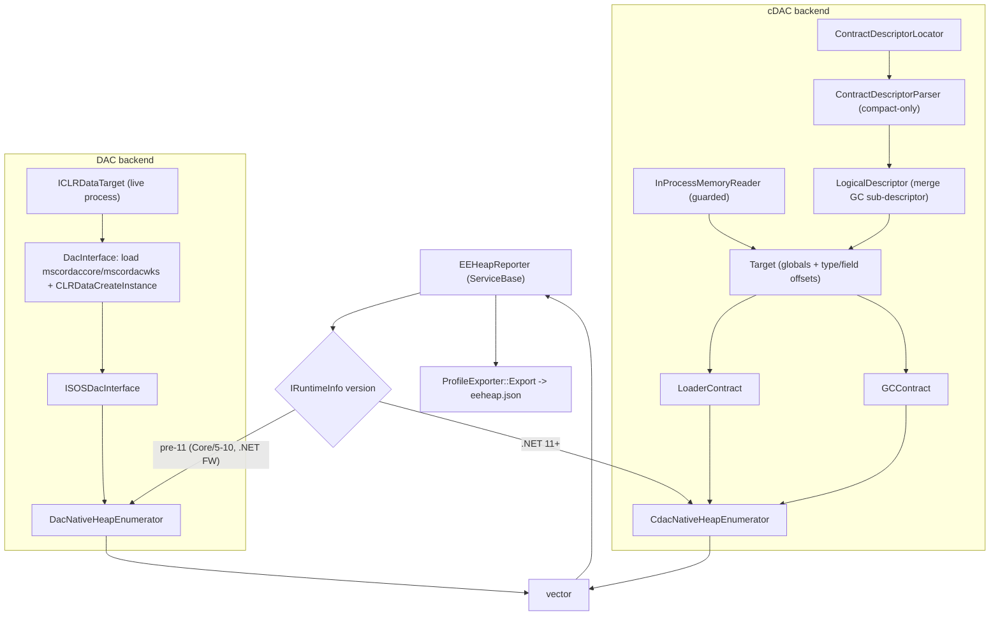
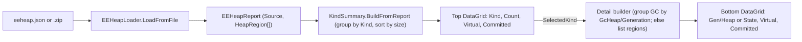

# Native Heap Reporting (a from-scratch `!eeheap`) - cDAC + DAC backends

> Status: implemented. This document mirrors the working implementation plan and is kept in sync with it. It describes how the profiler reimplements SOS `!eeheap` (JIT code heaps + loader heaps + GC native regions) in-process and attaches an `eeheap.json` report to every profiling export.

## Implementation checklist

- [x] common-seam: Define the shared `ClrNativeHeapInfo.h` + `INativeHeapEnumerator.h` seam used by both backends.
- [x] mem-reader (cDAC): Add `IMemoryReader.h` + `InProcessMemoryReader.{h,cpp}` reusing the SEH/SIGSEGV read-guard machinery from `ReferenceChainTraverser`.
- [x] descriptor (cDAC): Add `ContractDescriptorLocator` (GetProcAddress/dlsym), compact-only `ContractDescriptorParser`, and `LogicalDescriptor` (sub-descriptor merge with cycle protection).
- [x] target (cDAC): Add `ITarget.h` + `Target.{h,cpp}` exposing PointerSize/Read/ReadPointer/Has*/GetFieldOffset/FieldAddress/ReadFieldPointer (bool+out-param style).
- [x] cdac-contracts: Add `ILoaderContract`/`LoaderContract` (code + loader heaps, inline-LoaderHeap gotcha) and `IGCContract`/`GCContract` (GC regions, Has*-guarded), with version-dispatch factories.
- [x] cdac-enumerator: Add `CdacNativeHeapEnumerator` implementing `INativeHeapEnumerator` (code -> loader deduped -> GC) with per-source guards.
- [x] dac-bootstrap: Add `DacInterface` bootstrap - locate mscordaccore/mscordacwks next to the runtime module, load it, GetProcAddress(CLRDataCreateInstance), build ICLRDataTarget, create IXCLRDataProcess, QI ISOSDacInterface, Flush() before each use.
- [x] dac-datatarget: Provide an `ICLRDataTarget` for the live process - reuse vendored `LiveProcDataTarget` on Windows, add a small Linux implementation that reads own memory under the existing guard.
- [x] dac-enumerator: Add `DacNativeHeapEnumerator` using `ISOSDacInterface` (JIT code heaps, AppDomain/Module loader + VCS stub heaps, GC segments) with a static/thread-local VISITHEAP trampoline.
- [x] reporter: Add `IEEHeapReporter` + `EEHeapReporter` (ServiceBase) that selects the backend by `IRuntimeInfo` version and produces `eeheap.json` via `GetAndClearEEHeapContent()`.
- [x] timing-logs: Add timing logs + a `dotnet_eeheap_duration` ProxyMetric around enumeration (backend, heap count, elapsed ms; per-source and Flush/enumeration split at Debug) using `OpSysTools::GetHighPrecisionTimestamp`.
- [x] exporter: Wire `IEEHeapReporter` into `ProfileExporter` constructor + field; gather content and attach `eeheap.json` with `profile_has_eeheap` tag in `Export()`.
- [x] callback: Register `EEHeapReporter` behind the new config flag in `CorProfilerCallback` and pass it into the `ProfileExporter` constructor.
- [x] config: Add `DD_INTERNAL_PROFILING_EEHEAP_ENABLED` config flag (IConfiguration/Configuration/EnvironmentVariables).
- [x] build: Add files to vcxproj/.filters and CMake/Linux projects; confirm Linux exposes the coreclr inc dirs; isolate DAC includes in `Dac*.cpp` to contain header friction.
- [x] fix-existing-tests: Update `ProfileExporterTest.cpp` (and every other `ProfileExporter(...)` / `make_unique<ProfileExporter>` call site) for the new `IEEHeapReporter*` constructor param (pass `nullptr` where not under test).
- [x] unit-tests: Add GoogleTest unit tests - cDAC parser/Target/enumerator with `FakeMemoryReader`, `InProcessMemoryReader` fault guard, DAC enumerator with a fake `ISOSDacInterface`, `EEHeapReporter` backend-selection + JSON + metric, ServiceBase lifecycle, and config-flag parsing.
- [x] net11-sample: Enable `net11.0` for `Samples.Computer01` ONLY when a .NET 11 SDK is present - conditionally append `net11.0` to `src/Demos/Directory.Build.props` TFM lists gated on `$(NETCoreSdkVersion) >= 11.0`, add a `net11.0` package ItemGroup in the csproj, and set `global.json` `rollForward: latestMajor` (keep `version: 10.0.100`, do NOT require 11). Test discovery auto-skips the net11 case when it wasn't built.
- [x] integration-tests: Add xUnit `EEHeap/EEHeapTest.cs` + `EEHeapHelper.HasEEHeap` + `EnvironmentVariables.EEHeapEnabled`; assert `eeheap.json` is attached and content is plausible; cover DAC (net8/net10) and cDAC (net11) via `TestAppFact` frameworks.

### Part 2 - committed/reserved + per-generation + maximal parity + WPF viewer

- [x] schema-committed-gen: Extend `ClrNativeHeapInfo` with `Committed` (uint64) + `Generation` (int, default -1); `EEHeapReporter::ToJson` always emits `committed` and emits `generation` only when `>= 0`; keep `size` as reserved/virtual for back-compat.
- [x] page-probe-helper: Add a shared `ProbeCommittedBytes(IMemoryReader&, base, reserved)` helper that walks page-by-page under the fault guard (mirroring SOS `SafeReadMemory`) and returns committed bytes; used by both backends for non-GC heaps.
- [x] dac-committed-gen (DAC): `AddGcSegments` emits ONE entry per segment/region carrying `Size`=reserved span, `Committed`=committed span, `Generation`=generation_table index (replacing the two collapsed Active/Reserved entries); loader/code/VCS/thunk + HostCodeHeap set `Committed` via the shared page-probe helper.
- [x] cdac-committed (cDAC): Populate `Committed` for loader/code blocks via the shared page-probe helper over `InProcessMemoryReader`; set `Committed`=`Size` for GC free/handle/bookkeeping regions. (Bookkeeping `Committed` later refined to the OS region-map query - see "GC bookkeeping committed size".)
- [x] cdac-gc-segments (cDAC parity): Add `GCContract::GetGCHeapSegments` - per-generation allocated GC segments matching the DAC, using `TotalGenerationCount` + `GCHeap.GenerationTable` (server) / the workstation generation-table global, `Generation.StartSegment`, and `HeapSegment.Mem/Allocated/Committed/Reserved/Next`; emit `GCHeapSegment` with `Generation` + `GCHeap` and reserved+committed, deduped, all `Has*`-guarded.
- [x] dac-gc-extras (DAC parity): Vendor `ISOSDacInterface13` + `ISOSMemoryEnum` (: `ISOSEnum`) + `SOSMemoryRegion` + IIDs verbatim from upstream `sospriv.idl` (vendored copy stops at 12) into a Dac-only header; QI for it after `ISOSDacInterface` and, when present (.NET 8+), emit GC free-regions/handle-table/bookkeeping via `ISOSMemoryEnum` as `GCFreeRegion`/`HandleTable`/`GCBookkeeping`. Absent on .NET 5-7 and .NET Framework.
- [x] native-tests-committed-gen: Update DAC/cDAC/reporter GoogleTests (fake SOS + fake `ISOSDacInterface13`/`ISOSMemoryEnum`; fake cDAC per-generation memory; fake reader for the committed probe; assert committed+generation in JSON) and `EEHeapTest.cs` integration assertions.
- [x] tool-model: Add `profiler/src/Tools/EEHeapExplorer/EEHeapModel` class lib - `HeapRegion`/`EEHeapReport`, `EEHeapLoader.LoadFromFile` (.json or .zip with an `eeheap*.json` entry via `System.Text.Json` + `System.IO.Compression`), `KindSummary` aggregation (per-kind reserved+committed, sorted by size), and a per-generation/region detail builder.
- [x] tool-ui: Add `profiler/src/Tools/EEHeapExplorer/EEHeapExplorer` WPF app (net10.0-windows, MVVM) mirroring `ReferenceChainExplorer` - top `DataGrid` of kind summaries (Kind, Count, Virtual, Committed) sorted by size with a selection, `GridSplitter`, bottom `DataGrid` of per-generation/region detail (Virtual+Committed), `File>Load` (Ctrl+O) `*.json;*.zip`, status bar with source+totals.
- [x] docs-sync: Keep this doc in sync with the working plan (this Part 2 section).

## Goal

Reimplement SOS `!eeheap` (JIT code heaps + loader heaps + GC native regions) inside `Datadog.Profiler.Native` and attach the result as `eeheap.json` to every profiling export.

Enumeration happens in-process (the profiler is loaded into the target), behind a single `INativeHeapEnumerator` seam with two interchangeable backends selected by runtime version:

- .NET 11+: cDAC contracts, reading the runtime's `DotNetRuntimeContractDescriptor` directly (no DAC, no ClrMD).
- Pre-.NET 11 (modern .NET Core/5-10 and .NET Framework): the DAC via `ISOSDacInterface`, the same APIs ClrMD's `EnumerateClrNativeHeaps()` uses.

Both backends emit the same `ClrNativeHeapInfo` records, so the reporter, exporter wiring, JSON format, and tagging are shared.

Raw CLR memory reads already happen today in [GCDescReader.h](../src/ProfilerEngine/Datadog.Profiler.Native/GCDescReader.h) and a SEH/SIGSEGV read guard already exists in [ReferenceChainTraverser.h](../src/ProfilerEngine/Datadog.Profiler.Native/ReferenceChainTraverser.h).

## Architecture



## Decisions (confirmed)

- Trigger: every export (no cooldown), synchronously in `ProfileExporter::Export`.
- Output: `eeheap.json` attached as a file; add `profile_has_eeheap` tag.
- Scope: all three sources (code heaps, loader heaps deduped, GC regions).
- cDAC parser: hand-rolled, compact format only (regular format never appears in-memory).
- Version split: .NET 11+ uses cDAC; everything earlier uses the DAC.
- Cross-platform: both Windows and Linux are supported. cDAC and the modern-.NET DAC (`mscordaccore.dll` / `libmscordaccore.so`) work on both OSes. The .NET Framework DAC (`mscordacwks.dll`) is Windows-only because .NET Framework itself only runs on Windows.
- DAC consistency: best-effort - call `IXCLRDataProcess::Flush()` before each enumeration; no runtime suspension.
- Status: the DAC is NOT currently consumed anywhere in the Datadog native code (profiler or tracer). The `sospriv.h`/`clrdata.h`/`dacprivate.h`/`livedatatarget.h` files are only vendored as part of the coreclr PAL prebuilt includes (used for `cor.h`/`corprof.h`). This would be the first DAC consumer, so expect some header-inclusion friction (see Build + tests).
- Gated by a new config flag; feature must never destabilize the process (return empty on any uncertainty).

## Shared abstraction

### `ClrNativeHeapInfo.h`
Plain value type emitted by both backends:
`struct ClrNativeHeapInfo { uintptr_t Address; uint64_t Size; NativeHeapKind Kind; NativeHeapState State; }` plus `enum class NativeHeapKind { LoaderCodeHeap, HostCodeHeap, LoaderHeap, StubHeap, ThunkHeap, IndcellHeap, LookupHeap, ResolveHeap, DispatchHeap, CacheEntryHeap, GCFreeRegion, GCHandleTable, GCBookkeeping, ... }` and `enum class NativeHeapState { Active, Reserved }`.

### `INativeHeapEnumerator.h`
`virtual std::vector<ClrNativeHeapInfo> EnumerateAll() = 0;` - implemented by `CdacNativeHeapEnumerator` and `DacNativeHeapEnumerator`.

All files live under `profiler/src/ProfilerEngine/Datadog.Profiler.Native`.

## Backend A - cDAC contracts (.NET 11+)

### A1. Memory reading layer
- `IMemoryReader.h`: `int PointerSize() const`; `bool ReadMemory(uintptr_t, uint8_t*, size_t)` (returns false, never throws/crashes).
- `InProcessMemoryReader.{h,cpp}`: implements `IMemoryReader`, reusing the SEH (Windows) / SIGSEGV-SIGBUS (Linux) fault guard from `ReferenceChainTraverser` so a pointer into an unmapped/guard page returns false instead of killing the process.

### A2. Descriptor + Target layer
- `ContractDescriptorLocator.{h,cpp}`: `static bool TryLocate(uintptr_t& addr)`. Windows `GetModuleHandle("coreclr")` + `GetProcAddress("DotNetRuntimeContractDescriptor")`; Linux `dlsym`. Gate on `IRuntimeInfo::IsDotnetFramework()==false` and major version >= 11.
- `ContractDescriptorParser.{h,cpp}`: compact-only parser for the in-memory JSON blob:
  - `types`: `{ "T": { "F": offset, "F2": [offset, "type"], "!": size } }` (bare-int and `[offset,"type"]` field shapes + `"!"` size entry).
  - `globals`: the four shapes - `value`, `[value]` (indirect into `pointer_data`), `[value,"type"]`, `[[index],"type"]`.
  - `contracts`: `{ "GC": "c1", "Loader": "c1", ... }`.
  - `sub-descriptors`: `{ "GC": [[index], "pointer"] }`.
  - Validate magic ("DNCCDAC\0") + flags bit1 (pointer size); skip `version`/`baseline` beyond a sanity check; no regular-format code path.
- `LogicalDescriptor.{h,cpp}`: merges root + sub-descriptors with a visited set (cycle protection). Resolves each sub-descriptor's globals against ITS OWN `pointer_data`. Tracks still-null GC sub-descriptor slots; expose a `Refresh()` (live target) - at export time the GC contract is almost always present.
- `ITarget.h` / `Target.{h,cpp}`: the article's minimal vocabulary, bool+out-param style to match codebase idioms (`Success.h`):
  - `PointerSize()`, `ReadPointer`, templated `Read<T>` (over `ReadMemory`).
  - `HasGlobal`/`ReadGlobalPointer`, `HasType`/`HasField`/`GetFieldOffset`.
  - convenience `FieldAddress`, `ReadFieldPointer`.
  - The `Has*` guards are the mechanism for surviving field-level layout drift across builds.

### A3. Contracts (versioned)
- `ILoaderContract.h` + `LoaderContract.{h,cpp}` (maps Loader.md): `WalkLoaderHeap`, `EnumerateModules`, `GetGlobalLoaderAllocator`, `GetModuleLoaderAllocator`, `EnumerateLoaderAllocatorHeaps`, `GetModuleThunkHeap`, code-heap walk (`EEJitManagerAddress` -> `AllCodeHeaps` -> branch on `CodeHeap.HeapType`).
  - CRITICAL gotcha to preserve as code comment: `LoaderCodeHeap.LoaderHeap` is an inline `ExplicitControlLoaderHeap` -> use `FieldAddress`, NOT `ReadFieldPointer`.
- `IGCContract.h` + `GCContract.{h,cpp}` (maps GC.md): `EnumerateGCRegions` (free regions, handle-table segments, bookkeeping), every field `Has*`-guarded so older descriptors yield nothing.
- Version dispatch via factory functions (`CreateGCContract(ITarget*)` switching on `Contracts["GC"]`), so callers never change when a `c2` appears.
- Output uses a `std::function<void(const ClrNativeHeapInfo&)>` sink to replace C# `yield return` (no coroutines pre-C++20).

### A4. `CdacNativeHeapEnumerator.{h,cpp}`
Implements `INativeHeapEnumerator`. `EnumerateAll()` in the article's order (code heaps -> loader heaps deduped -> GC regions). Dedup shared loader allocators with a `visited` set; wrap each source in try/guard (`SafeCollect`/`SafeGet` equivalent) so one corrupt structure degrades to "skip".

## Backend B - DAC / ISOSDacInterface (pre-.NET 11)

The DAC headers are already vendored and already on the profiler include path (`$(CORECLR-PATH)/pal/prebuilt/inc;$(CORECLR-PATH)/inc` in [Datadog.Profiler.Native.vcxproj](../src/ProfilerEngine/Datadog.Profiler.Native/Datadog.Profiler.Native.vcxproj)):
- [sospriv.h](../../shared/src/native-lib/coreclr/src/pal/prebuilt/inc/sospriv.h) - `ISOSDacInterface` (TraverseLoaderHeap, GetCodeHeapList, GetJitManagerList, TraverseVirtCallStubHeap, GetAppDomainStoreData/List, GetAssemblyModuleList, GetModuleData, GetGCHeapData/List/Details, GetHeapSegmentData).
- [clrdata.h](../../shared/src/native-lib/coreclr/src/pal/prebuilt/inc/clrdata.h) - `ICLRDataTarget`, `STDAPI CLRDataCreateInstance(REFIID, ICLRDataTarget*, void**)`.
- [dacprivate.h](../../shared/src/native-lib/coreclr/src/inc/dacprivate.h) - `DacpJitCodeHeapInfo` (CODEHEAP_LOADER/CODEHEAP_HOST), `DacpAppDomainData` (`pLowFrequencyHeap`/`pHighFrequencyHeap`/`pStubHeap`), `DacpModuleData` (`pThunkHeap`), `DacpGcHeapData`/`DacpGcHeapDetails`/`DacpHeapSegmentData`, `VCSHeapType`.
- [livedatatarget.h](../../shared/src/native-lib/coreclr/src/inc/livedatatarget.h) - `LiveProcDataTarget` (a ready-made `ICLRDataTarget` for a live local process, Windows-only `#ifndef TARGET_UNIX`).

Note: loader-heap enumeration now prefers `ISOSDacInterface13`'s per-LoaderAllocator API (`GetDomainLoaderAllocator` + `GetLoaderAllocatorHeaps`/`GetLoaderAllocatorHeapNames`) on .NET 8+ to surface every heap kind (incl. `FixupPrecodeHeap`/`NewStubPrecodeHeap`/`VtableHeap`); it falls back to the classic AppDomain/Module-based traversal (the path ClrMD uses for older runtimes) when that interface or those names are unavailable. See Part 3 below.

### B1. `DacInterface.{h,cpp}` (bootstrap)
- Locate the DAC next to the runtime module:
  - modern .NET: `mscordaccore.dll` / `libmscordaccore.so` in the same directory as `coreclr`.
  - .NET Framework: `mscordacwks.dll` in the same directory as `clr.dll` (resolve the runtime module path via `GetModuleFileName`).
- `LoadLibrary`/`dlopen` it, then `GetProcAddress`/`dlsym` `CLRDataCreateInstance` (`PFN_CLRDataCreateInstance`).
- Create the data target (B2), call `CLRDataCreateInstance(IID_IXCLRDataProcess, target, &process)`, then `QueryInterface(IID_ISOSDacInterface, ...)`.
- Hold the `ISOSDacInterface` (+ `IXCLRDataProcess` for `Flush()`) for the lifetime of the reporter. Call `Flush()` before each `EnumerateAll()` (see "DAC usage model and caching" below).
- Any failure (DAC missing, wrong version, QI fails) -> backend reports unavailable -> empty content.

### B1b. DAC usage model and caching (why `Flush()`)
The DAC (`mscordaccore`/`mscordacwks`) is a build-matched copy of the runtime's data-structure knowledge. A consumer never reads runtime memory itself: it implements `ICLRDataTarget::ReadVirtual` (B2), and the DAC calls back into it to read whatever target bytes it needs, then reconstructs CLR structures (AppDomains, heaps, segments, ...) on the consumer's behalf. This is the same model SOS and ClrMD use.

Crucially, the DAC was designed for FROZEN targets (crash dumps, or a debugger-suspended process). To make repeated structure walks cheap and self-consistent, it aggressively CACHES everything it reads from the target. For a dump that is correct forever; for a live, running process the cache goes stale the moment the runtime mutates the structures we are about to walk (a new code heap is allocated, a GC moves/commits a segment, a module is loaded). Reading through a stale cache can yield inconsistent or torn data.

`IXCLRDataProcess::Flush()` is the documented way to invalidate that cache. The vendored [xclrdata.idl](../../shared/src/native-lib/coreclr/src/inc/xclrdata.idl) states: "Flush any cached data for this process. All ICLR* interfaces obtained for this process will become invalid with this call." So the rules we follow:
- Call `Flush()` once at the start of every `EnumerateAll()` so the snapshot we build reflects current target memory (this is exactly what ClrMD's `DataTarget`/`DacLibrary` flush does between operations on a live process, and what SOS does between commands).
- Treat any child/enumerator interfaces (e.g. `IXCLRDataAppDomain`, memory enums) as invalidated by `Flush()`: do not cache them across a flush; re-acquire after flushing. The top-level `ISOSDacInterface`/`IXCLRDataProcess` pointers themselves remain usable (this matches ClrMD, which keeps the same `SOSDac` instance and just flushes).
- We still accept that, without suspension, the result is a best-effort snapshot: the runtime can change between two `ReadVirtual` callbacks within a single walk. We mitigate (not eliminate) this with `Flush()` + per-source error guards, which is acceptable for a diagnostic heap report. Full correctness would require running inside a GC stop-the-world window, which we explicitly chose not to do.

### B2. `LiveDataTarget` (ICLRDataTarget for the live process)
Both OSes are supported (modern .NET only on Linux; .NET Framework is Windows-only).
- Windows: reuse vendored `LiveProcDataTarget` ([livedatatarget.h](../../shared/src/native-lib/coreclr/src/inc/livedatatarget.h), `#ifndef TARGET_UNIX`) with the current process handle/id.
- Linux: add a small `ICLRDataTarget` implementation (the vendored one is Windows-only). `ReadVirtual` reads own memory (memcpy) under the same fault guard as `InProcessMemoryReader`; `GetPointerSize`/`GetMachineType` from build arch; `GetImageBase` resolves the loaded `libcoreclr.so` base; thread/TLS/context methods return `E_NOTIMPL` (not needed for heap enumeration).

### B3. `DacNativeHeapEnumerator.{h,cpp}`
Implements `INativeHeapEnumerator` using `ISOSDacInterface`. The structure and ordering below were cross-checked against the actual SOS `!eeheap` helpers in `eeheap.cpp` (`JitHeapInfo`, `PrintDomainHeapInfo`, `VSDHeapInfo`, `PrintModuleHeapInfo`, `GCHeapInfo`) - it matches ClrMD's `EnumerateClrNativeHeaps`:
- JIT code heaps (`JitHeapInfo`): `GetJitManagerList` (two-call count/fill) -> for each manager that is a real JIT (`IsMiIL`), `GetCodeHeapList(managerAddr, ...)` (two-call) -> per `DacpJitCodeHeapInfo`: `CODEHEAP_LOADER` -> `TraverseLoaderHeap(LoaderHeap)`; `CODEHEAP_HOST` -> size = `HostData.currentAddr - HostData.baseAddr` (one region). Native/unknown managers are ignored.
  - CRITICAL: a `CODEHEAP_LOADER` heap is an `ExplicitControlLoaderHeap`, NOT a normal loader heap. On modern runtimes the classic `ISOSDacInterface::TraverseLoaderHeap(addr, cb)` assumes a normal layout and reports every block as all-zero (address/size/committed = 0). When `ISOSDacInterface13` is available (.NET 8+) we must walk code heaps via `ISOSDacInterface13::TraverseLoaderHeap(addr, LoaderHeapKindExplicitControl, cb)`; the classic call is only correct as a fallback on .NET 5-7 (where code heaps were enumerable that way). Domain/module/VCS heaps are normal heaps and keep using the classic `TraverseLoaderHeap`. This mirrors the SOS/ClrMD `!eeheap` fix (dotnet/diagnostics #3675).
- Loader heaps (AppDomain-based, deduped) (`PrintDomainHeapInfo`): `GetAppDomainStoreData` + `GetAppDomainList`, plus the System and Shared domains; for each, `DacpAppDomainData.Request` -> `TraverseLoaderHeap` on `pLowFrequencyHeap`, then `pHighFrequencyHeap`, then `pStubHeap` (this exact order).
- VCS stub heaps (`VSDHeapInfo`): `TraverseVirtCallStubHeap(appDomain, heaptype, cb)` for each `VCSHeapType` in order IndcellHeap, LookupHeap, ResolveHeap, DispatchHeap, CacheEntryHeap.
- Module thunk heaps (`PrintModuleHeapInfo`): `GetAssemblyList`/`GetAssemblyModuleList` per assembly -> `DacpModuleData.Request` -> `pThunkHeap` -> `TraverseLoaderHeap`. SOS skips this for minidumps; in-process live is fine.
- GC regions (`GCHeapInfo`): `GetGCHeapData` (server vs wks); for server `GetGCHeapList`; `GetGCHeapDetails` per heap; walk segments from `generation_table[...].start_segment` via `DacpHeapSegmentData.Request`/`GetHeapSegmentData`, reading `mem`/`allocated`/`committed`/`reserved`/`next`.
- IMPORTANT C++ detail (confirmed by SOS): `VISITHEAP` is `typedef void (*VISITHEAP)(CLRDATA_ADDRESS, size_t, BOOL)` - a captureless function pointer with NO token/context arg. SOS routes results through file-scope globals (`g_trav_totalSize`/`g_trav_wastedSize`) reset before each `Traverse*` call. We do the same with a `thread_local` collector pointer set by a small RAII scope guard for the duration of each `TraverseLoaderHeap`/`TraverseVirtCallStubHeap` call, then append to the result vector.
- Committed vs reserved: the `VISITHEAP` callback receives `blockSize` (reserved) and `blockIsCurrentBlock`. SOS computes committed size by probing each page with `SafeReadMemory` and treats the non-current blocks' uncommitted tail as "wasted". We can mirror this (page-probe under our fault guard) to report committed vs reserved, or - matching the cDAC backend's simpler choice - just report `blockSize` as Reserved and mark the current block Active. Pick one and keep both backends consistent.
- Wrap each source in try/HRESULT guard so a single failing call degrades to "skip".

## Shared - reporter, exporter, wiring, config

### `IEEHeapReporter.h` + `EEHeapReporter.{h,cpp}`
Derives `ServiceBase` (like [HeapSnapshotManager.h](../src/ProfilerEngine/Datadog.Profiler.Native/HeapSnapshotManager.h)). `std::string GetAndClearEEHeapContent()`:
- Lazily build the right backend on first use via a factory: `IRuntimeInfo::GetMajorVersion() >= 11 && !IsDotnetFramework()` -> `CdacNativeHeapEnumerator`; otherwise -> `DacNativeHeapEnumerator`.
- Call `EnumerateAll()`, serialize to JSON, return empty when the backend is unavailable.
- Timing logs: wrap the enumeration with `OpSysTools::GetHighPrecisionTimestamp()` (the pattern `HeapSnapshotManager` already uses) and emit a `Log::Info` line per export, e.g. `"!eeheap (cdac): enumerated N native heaps in X ms"` (include backend, heap count, and elapsed ms; total bytes optional). On the DAC path, also log the `Flush()`+enumeration split at `Log::Debug` so the live-runtime cost is visible. Consider logging per-source timing (code heaps / loader heaps / GC regions) at `Debug` to spot a slow source. Register a `ProxyMetric` `dotnet_eeheap_duration` mirroring `dotnet_heapsnapshot_duration` so the cost is trackable as a metric, not just logs.
- JSON shape:
```json
{ "heaps": [ { "address": "0x...", "size": 65536, "kind": "LoaderCodeHeap", "state": "Active" } ] }
```
  Reuse `ProfileExporter`'s hand-rolled JSON writers (`ElementStart`/`AppendValue`) or a local `stringstream`. Optionally tag the source backend (`"source": "cdac"|"dac"`).

### ProfileExporter wiring
In [ProfileExporter.h](../src/ProfilerEngine/Datadog.Profiler.Native/ProfileExporter.h): add `IEEHeapReporter*` constructor param (nullable, like `_gcSettingsProvider`) + private field.

In [ProfileExporter.cpp](../src/ProfilerEngine/Datadog.Profiler.Native/ProfileExporter.cpp), `Export()`:
- Near line 617 (alongside `metricsFileContent`/`classHistogramContent`):
```cpp
auto eeHeapContent = (_eeHeapReporter != nullptr)
    ? _eeHeapReporter->GetAndClearEEHeapContent() : std::string{};
```
- Inside the per-runtimeId loop near line 697 (alongside other `filesToSend.emplace_back`):
```cpp
if (!eeHeapContent.empty())
{
    filesToSend.emplace_back("eeheap.json",
        std::vector<uint8_t>(eeHeapContent.begin(), eeHeapContent.end()));
    additionalTags.Add("profile_has_eeheap", "true");
}
```

### CorProfilerCallback wiring
In [CorProfilerCallback.cpp](../src/ProfilerEngine/Datadog.Profiler.Native/CorProfilerCallback.cpp):
- Behind the new config flag, `_pEEHeapReporter = RegisterService<EEHeapReporter>(...)` near the `HeapSnapshotManager` block (~line 398). Needs `IConfiguration` + `IRuntimeInfo`.
- Pass `_pEEHeapReporter` into the `ProfileExporter` constructor (~line 662).

### Configuration
- Add flag (e.g. `DD_INTERNAL_PROFILING_EEHEAP_ENABLED`) in [IConfiguration.h](../src/ProfilerEngine/Datadog.Profiler.Native/IConfiguration.h) / `Configuration.{h,cpp}` / [EnvironmentVariables.h](../src/ProfilerEngine/Datadog.Profiler.Native/EnvironmentVariables.h), gating registration like `IsHeapSnapshotEnabled()`.

### Build
- Add new files to `Datadog.Profiler.Native.vcxproj`(+`.filters`) and the CMake/Linux project. The Windows include path already lists `$(CORECLR-PATH)/pal/prebuilt/inc;$(CORECLR-PATH)/inc` (so `sospriv.h`, `clrdata.h`, `dacprivate.h`, `livedatatarget.h` resolve); confirm the Linux project exposes the same two directories.
- Header-friction risk: since this is the first DAC consumer in the profiler, `dacprivate.h` (an internal DAC header) may pull in additional coreclr headers (e.g. `daccess.h`, `static_assert.h`) and macros (`MSLAYOUT`). Isolate DAC includes inside the `Dac*` .cpp files (not shared headers) to contain any fallout, and add only the include dirs actually needed.

## .NET 11 enablement for `Samples.Computer01` (cDAC integration prerequisite)

The cDAC backend only activates on .NET 11+ (the runtime publishes `DotNetRuntimeContractDescriptor` officially in .NET 11), so the cDAC integration test needs a `net11.0` build of the sample. Today the demos top out at `net10.0`. Key requirement: **`net11.0` must be built ONLY when a .NET 11 SDK is present** - environments with just the 10.x SDK must keep building exactly as today (the .NET 10 SDK cannot target `net11.0`, so unconditionally adding the TFM would break those builds).

SDK-gated approach (no forced SDK bump):
- In [src/Demos/Directory.Build.props](../src/Demos/Directory.Build.props), detect the active SDK via the built-in `$(NETCoreSdkVersion)` property and conditionally append `net11.0` to each `TargetFrameworks` list (all three conditions: Windows, non-Windows non-Arm64, non-Windows Arm64):

```xml
<PropertyGroup>
  <_Net11SdkAvailable Condition="$([MSBuild]::VersionGreaterThanOrEquals('$(NETCoreSdkVersion)', '11.0'))">true</_Net11SdkAvailable>
</PropertyGroup>
<!-- then, per existing TargetFrameworks line: -->
<TargetFrameworks Condition="... and '$(_Net11SdkAvailable)' == 'true'">$(TargetFrameworks);net11.0</TargetFrameworks>
```

  When the active SDK is 10.x, `_Net11SdkAvailable` is empty and the TFM list is unchanged.
- Add a `net11.0` `ItemGroup` to [Samples.Computer01.csproj](../src/Demos/Samples.Computer01/Samples.Computer01.csproj) for `System.DirectoryServices.Protocols` `Version 11.0.0`, mirroring the existing `net6.0`..`net10.0` blocks (only takes effect when `net11.0` is actually in `TargetFrameworks`). If `11.0.0` is unpublished, keep `10.0.0` for `net11.0`.
- [global.json](../../global.json) is pinned to `10.0.100` with `rollForward: minor`, so an installed 11 SDK is never selected. To let the 11 SDK be used WHEN present (without requiring it), change `rollForward` to `latestMajor` (keep `version: 10.0.100`): a 10-only machine still resolves to 10.x (net11 excluded), and a machine/CI with the 11 SDK uses it (net11 built). Do NOT raise the required `version` to 11 - that would force the preview SDK on everyone.
- No test-side skip logic is needed: `TestAppFrameworkDiscover.Discover` enumerates the sample's actual build-output folders, so a `net11.0` case is created only if `net11.0` was built. `EEHeapTest.cs` can list `net11.0` in its `Frameworks` array unconditionally; it auto-runs only where the SDK produced the net11 output, and is silently absent otherwise.

## Testing (unit + integration)

Two existing test projects are the templates: unit tests in `profiler/test/Datadog.Profiler.Native.Tests` (GoogleTest/GMock) and integration tests in `profiler/test/Datadog.Profiler.IntegrationTests` (xUnit, drives sample apps through a `MockDatadogAgent`). `HeapSnapshot` and `ReferenceChain` are the closest existing analogs for both layers.

### Tests that MUST be updated (regression risk)
- [ProfileExporterTest.cpp](../test/Datadog.Profiler.Native.Tests/ProfileExporterTest.cpp) constructs `ProfileExporter(...)` directly (e.g. line ~86 `auto exporter = ProfileExporter(... heapSnapshotManager);`). Adding the `IEEHeapReporter*` constructor parameter will not compile until every such call site is updated to pass the new arg (use `nullptr` where not under test). Search the whole test project for `ProfileExporter(` and `make_unique<ProfileExporter>` and fix all of them. This is the main hidden cost of the exporter wiring.

### New unit tests (GoogleTest)
- cDAC parser/descriptor: a `FakeMemoryReader` (implements `IMemoryReader`) feeding a synthetic compact descriptor blob to validate the four global shapes, `"!"` size entry, bare-int vs `[offset,"type"]` fields, magic/flags (pointer-size) validation, and `LogicalDescriptor` sub-descriptor merge + cycle protection.
- cDAC `Target`: `Has*`/`GetFieldOffset`/`FieldAddress`/`ReadFieldPointer` over the fake reader, including the inline-struct (FieldAddress) vs pointer (ReadFieldPointer) distinction.
- cDAC `CdacNativeHeapEnumerator`: feed a fake descriptor + memory describing a small loader-heap block list, one code heap, and one GC region; assert ordering (code -> loader deduped -> GC) and dedup of a shared allocator.
- `InProcessMemoryReader` fault guard: model on the existing [ReferenceChainTraverserFaultTest.cpp](../test/Datadog.Profiler.Native.Tests/ReferenceChainTraverserFaultTest.cpp) - a read of an unmapped/guard address returns false (no crash) on Windows (SEH) and Linux (SIGSEGV/SIGBUS).
- DAC `DacNativeHeapEnumerator`: a fake/mock `ISOSDacInterface` returning canned `GetJitManagerList`/`GetCodeHeapList`/`GetAppDomain*`/`Traverse*`/GC data to validate enumeration order, the captureless `VISITHEAP` thread-local trampoline (results routed to the right collector), HRESULT-failure-skips-source behavior, and dedup - without loading a real DAC. Reuse `MockProfilerInfo.h` patterns.
- `EEHeapReporter` backend selection: with `RuntimeInfoHelper` (as in `ProfileExporterTest`), assert version >= 11 && !Framework -> cDAC backend; 6/8/10 -> DAC backend; Framework -> DAC backend; and that an unavailable backend yields empty content.
- `EEHeapReporter` JSON serialization: a fake enumerator returning known `ClrNativeHeapInfo` records produces the expected `eeheap.json` shape (kinds/states/hex addresses), and timing/metric (`dotnet_eeheap_duration`) is recorded (assert metric registered, like `MetricsRegistryTest.cpp`).
- `ServiceBase` lifecycle of `EEHeapReporter` (model `ServiceBaseTest.cpp`).
- Config flag parsing for `DD_INTERNAL_PROFILING_EEHEAP_ENABLED` (model `ConfigurationTest.cpp`).

### New integration test (xUnit)
- Add `EEHeap/EEHeapTest.cs` modeled on [HeapSnapshotTest.cs](../test/Datadog.Profiler.IntegrationTests/HeapSnapshot/HeapSnapshotTest.cs): run a sample app (reuse `Samples.Computer01` - any running app has native heaps, no new scenario/app needed), enable via a new `EnvironmentVariables.EEHeapEnabled` constant in [EnvironmentVariables.cs](../test/Datadog.Profiler.IntegrationTests/Helpers/EnvironmentVariables.cs), and assert: (a) `eeheap.json` is attached to the multipart profiler request (add an `EEHeapHelper.HasEEHeap(request)` helper mirroring `HeapSnapshotHelper`), and (b) the local `PprofDir` `eeheap_*.json` parses and contains plausible heaps (>=1 entry, at least one code/loader-heap kind, non-zero address+size). Optionally assert the `profile_has_eeheap` tag.
- Dual-backend coverage via `TestAppFact` frameworks: include pre-.NET 11 TFMs (e.g. `net8.0`, `net10.0`) to exercise the DAC backend and `net11.0` (when available in CI) to exercise the cDAC backend; the same JSON assertions apply to both. The DAC path can realistically only be validated end-to-end here (loading a real DAC needs a real runtime), so this test is the primary DAC-backend gate. A `net462`/.NET Framework case (Windows-only) covers the `mscordacwks` path if .NET Framework sample coverage is desired.

## Safety / robustness

- cDAC reads guarded; bad reads return false and the affected source is skipped.
- DAC backend: every SOS call HRESULT-checked; a failed call skips that source. `Flush()` is best-effort and ignored on failure.
- Backend unavailable (missing descriptor / missing or mismatched DAC / unknown contract version / absent GC sub-descriptor) -> empty report (feature silently no-ops); never destabilizes the process.
- Optional cheap cDAC version self-test analogous to `GCDesc::ValidateAgainstMetadata` / `_gcDescTrusted` in [ReferenceChainTraverser.h](../src/ProfilerEngine/Datadog.Profiler.Native/ReferenceChainTraverser.h).

## Known caveats

- cDAC: `LoaderHeapBlock` exposes reserved `VirtualSize` only -> report reserved memory, mark `Active`; thunk heaps only when the descriptor's `Module` type carries a `ThunkHeap` field; GC-region output depends on newer GC globals/types (older descriptors degrade to empty).
- DAC: requires a matching DAC binary next to the runtime (it ships beside `coreclr`/`clr`, so the in-process match is normally satisfied); in-process enumeration of a live, running runtime is best-effort and may capture transient/partial state (mitigated by `Flush()`).
- DAC .NET Framework: `mscordacwks.dll` is Windows-only; the .NET Framework path therefore only applies on Windows.
- DAC GC segments vs regions: older runtimes use segment-per-generation; .NET 6+ uses a null-terminated region list per generation (this changed SOS's `eeheap.cpp`, see dotnet/diagnostics PR 2112). The `GetHeapSegmentData` walk must handle both - iterate each generation's `start_segment` chain and, on region-mode runtimes, the per-generation region lists - so the DAC backend works across all pre-.NET 11 versions.
- `ISOSDacInterface13` is vendored separately (the bundled `sospriv.h` stops at 12). Part 2 used its three GC enumerators (free-regions/handle-table/bookkeeping). Part 3 additionally uses its per-LoaderAllocator heap API (`GetDomainLoaderAllocator`/`GetLoaderAllocatorHeaps`/`GetLoaderAllocatorHeapNames`) for loader heaps on .NET 8+, and `ISOSDacInterface8` for the full generation table (POH). All degrade gracefully to the classic AppDomain/Module + capped-generation-table walk on .NET 5-7 and .NET Framework.

---

# Part 2 - committed/reserved + per-generation + EEHeapExplorer (WPF viewer)

Follow-up to the enumerator above: surface BOTH virtual (reserved) and committed sizes and per-generation managed-heap detail in `eeheap.json`, achieve full parity between the cDAC and DAC backends, then ship a WPF viewer that loads the `.json` (or a `.zip` containing it).

## Goal (Part 2)

1. A WPF tool that loads `eeheap.json` or a `.zip` containing it and shows:
   - a TOP panel: distribution per native-heap KIND, sorted by size (virtual + committed);
   - a BOTTOM panel: when a kind is selected, details such as per-generation for the managed (GC) heap, with virtual + committed.
2. The data needed for the above (committed size; GC generation) is NOT in `eeheap.json` today, so Part 2 first extends the native report.
3. Full parity: both backends emit the same source categories so the report (and viewer) is identical across every runtime, within hard runtime limits.

## Current schema gap

`EEHeapReporter::ToJson` emits only `size` (reserved/virtual), `kind`, `state`, and optional `gc_heap` from `ClrNativeHeapInfo` (`Address`/`Size`/`Kind`/`State`/`GCHeap`). There is no committed size and no generation. The DAC GC path (`AddGcSegments`) already reads `mem`/`committed`/`reserved` and loops over `generation_table[gen]` - it just collapses each segment into two entries and discards `gen`.

## Native schema extension (schema-committed-gen)

- `ClrNativeHeapInfo.h`: add `uint64_t Committed = 0;` and `int Generation = -1;`. Keep `Size` as reserved/virtual (back-compat with the existing integration test that reads `size`).
- `EEHeapReporter::ToJson`: always emit `committed`; emit `generation` only when `>= 0`. New shape:

```json
{ "source": "dac", "heaps": [
  { "address": "0x...", "size": 1048576, "committed": 262144, "kind": "GCHeapSegment", "state": "Active", "gc_heap": 0, "generation": 2 }
] }
```

## Shared page-probe helper (page-probe-helper)

`uint64_t ProbeCommittedBytes(IMemoryReader& reader, uintptr_t base, uint64_t reserved)`: walk page-by-page from `base`, read 1 byte/page under the existing fault guard, stop at the first unreadable page; committed = readable bytes (capped at `reserved`). Mirrors SOS's `SafeReadMemory` page probe. Used by both backends for the non-GC heaps whose `Traverse*`/block APIs only expose a reserved block size.

## DAC backend changes (dac-committed-gen)

In [DacNativeHeapEnumerator.cpp](../src/ProfilerEngine/Datadog.Profiler.Native/DacNativeHeapEnumerator.cpp):
- `AddGcSegments`: emit ONE entry per segment/region with `Size = reserved - mem`, `Committed = committed - mem`, `Generation = gen`, `State = Active` (replaces the current two-entry split). All inputs are already read from `DacpHeapSegmentData`.
- `HeapVisitor` (loader/VCS/thunk) and the `HostCodeHeap` branch: keep `Size = blockSize` (reserved) and set `Committed = ProbeCommittedBytes(...)`. Generation stays `-1`.

## cDAC backend changes (cdac-committed)

In [CdacNativeHeapEnumerator.cpp](../src/ProfilerEngine/Datadog.Profiler.Native/CdacNativeHeapEnumerator.cpp) / [CdacGCContract](../src/ProfilerEngine/Datadog.Profiler.Native/CdacGCContract.h):
- Loader/code blocks (`WalkLoaderHeap`/`EnumerateCodeHeaps`): set `Committed = ProbeCommittedBytes(...)` over the enumerator's `_reader`.
- GC free/handle regions: committed by nature -> `Committed = Size`, `Generation = -1`. Bookkeeping is the exception: `Size` is the reserved card-table span, so `Committed` is computed from the OS region map (see "GC bookkeeping committed size").
- Per-generation allocated GC segments are added for parity in the next section.

## Full parity (cDAC <-> DAC) - maximal

Goal: both backends emit the SAME source categories. Both already share code heaps, loader heaps (low/high/stub), VCS stub heaps, and module thunk heaps. The two GC gaps are closed here.

### cDAC parity addition - per-generation allocated GC segments (cdac-gc-segments)

Add `GCContract::GetGCHeapSegments(const Sink&)`, mirroring the DAC's `AddGcSegments`, using the GC data-contract names confirmed against dotnet/runtime's `src/coreclr/gc/datadescriptor/datadescriptor.inc`:
- Global `TotalGenerationCount` (uint32) -> number of generations to walk.
- Type `Generation` (has `CDAC_TYPE_SIZE`, so `TryGetTypeSize("Generation")` works) with field `StartSegment` (pointer; for USE_REGIONS this is the head of the generation's region list).
- Type `GCHeap` with field `GenerationTable` (base address of the inline array of `Generation` structs - index with the `Generation` type size). `GCHeap` is a server-only cDAC type; for workstation the per-heap fields are exposed as globals (this is why the existing free-region code splits server vs workstation).
- Type `HeapSegment` with `Mem`, `Allocated`, `Committed`, `Reserved`, `Next` (the existing code already uses `Mem`/`Committed`/`Next`).

Algorithm (all `Has*`/`Try*`-guarded; reuse the existing server/workstation heap discovery from `GetGCFreeRegions`):
- Server: for each heap in the `Heaps` table (count from `GetGCHeapCount()`), `genTableBase = FieldAddress(heap, "GCHeap", "GenerationTable")`; for `g` in `[0, TotalGenerationCount)`: `genAddr = genTableBase + g * genSize`; `seg = ReadFieldPointer(genAddr, "Generation", "StartSegment")`; walk the `HeapSegment.Next` chain.
- Workstation: same, but the generation table is reached via the workstation generation-table global (verify the exact name against the GC data descriptor / `GCHeap` contract - analogous to the existing WKS globals `GCHeapFreeRegions`/`GCHeapFreeableSohSegment`); `GCHeap = 0`.
- Per segment: `reserved = Reserved - Mem`, `committed = Committed - Mem`; emit one `GCHeapSegment` with `Generation = g`, `GCHeap = heapIndex`, `State = Active`. Dedup with a `visited` set (regions can be threaded across generations - attribute each region to the first generation whose list contains it, matching SOS/ClrMD and the DAC backend).
- Call from `CdacNativeHeapEnumerator::EnumerateAll()` inside the existing `if (hasContract("GC"))` block.

### DAC parity addition - free-regions / handle-table / bookkeeping (dac-gc-extras)

The vendored [sospriv.idl](../../shared/src/native-lib/coreclr/src/inc/sospriv.idl)/[sospriv.h](../../shared/src/native-lib/coreclr/src/pal/prebuilt/inc/sospriv.h) stop at `ISOSDacInterface12`. Vendor the missing pieces (verbatim from upstream `dotnet/runtime` `src/coreclr/inc/sospriv.idl`, including their exact `uuid`s) into a small Dac-only header included only by the `Dac*.cpp` TUs (do NOT edit the generated vendored header):
- `interface ISOSMemoryEnum : ISOSEnum` (`ISOSEnum` already exists) with `Next([in] count, [out] SOSMemoryRegion*, [out] unsigned int* pNeeded)`.
- `struct SOSMemoryRegion { CLRDATA_ADDRESS Start; CLRDATA_ADDRESS Size; CLRDATA_ADDRESS ExtraData; int Heap; }`.
- `interface ISOSDacInterface13 : IUnknown` - the relevant methods are `GetHandleTableMemoryRegions(ISOSMemoryEnum**)`, `GetGCBookkeepingMemoryRegions(ISOSMemoryEnum**)`, `GetGCFreeRegions(ISOSMemoryEnum**)` (its other members must be declared in order to keep the vtable correct; `LoaderHeapKind` enum is needed for the `TraverseLoaderHeap` signature).

In [DacNativeHeapEnumerator.cpp](../src/ProfilerEngine/Datadog.Profiler.Native/DacNativeHeapEnumerator.cpp):
- After QI'ing `ISOSDacInterface`, also `QueryInterface(IID_ISOSDacInterface13, ...)`. If it fails (.NET 5-7, .NET Framework), skip these sources.
- For each of `GetGCFreeRegions`/`GetHandleTableMemoryRegions`/`GetGCBookkeepingMemoryRegions`: get the `ISOSMemoryEnum`, loop `Next` (batched), and emit one entry per `SOSMemoryRegion` with `Address = Start`, `Size = Committed = Size`, `GCHeap = Heap`, `Generation = -1`, `Kind = GCFreeRegion` / `HandleTable` / `GCBookkeeping`, wrapped in the existing per-source `safe(...)` guard. (Bookkeeping is the exception: its `Size` is the reserved card-table span, so `Committed` is derived from the OS region map - see "GC bookkeeping committed size".)
- The DAC's free-region enum does not subdivide into the cDAC's finer `GCFreeGlobal*`/`GCFreeSoh/Uoh` kinds; mapping all to `GCFreeRegion` is the documented, acceptable difference.

### Hard runtime limit (documented, not a bug)

`ISOSDacInterface13` exists only on .NET 8+. So GC free-regions/handle-table/bookkeeping are available on .NET 8/9/10 (DAC) and .NET 11+ (cDAC), but NOT on .NET 5-7 or .NET Framework. Per-generation allocated GC segments, code heaps, and all loader/VCS/thunk heaps remain available on every supported runtime. The viewer renders whatever categories are present.

## Tests (native-tests-committed-gen)

- DAC GoogleTest `FakeSosDacInterface`: return `committed`/`reserved` from `GetHeapSegmentData`; assert single-entry-per-segment carrying `committed` + `generation`. Add a fake `ISOSDacInterface13` + `ISOSMemoryEnum` returning free/handle/bookkeeping regions.
- cDAC: a fake descriptor + memory exercising `GetGCHeapSegments` across generations (assert generation attribution + reserved/committed).
- Add a fake-`IMemoryReader` case for `ProbeCommittedBytes` (committed < reserved when a page is unmapped).
- Reporter JSON test: assert `committed` (always) and `generation` (when present).
- [EEHeapTest.cs](../test/Datadog.Profiler.IntegrationTests/EEHeap/EEHeapTest.cs): assert every entry has a numeric `committed`, and at least one GC entry carries `generation`.

## EEHeapExplorer WPF viewer

Standalone tool mirroring [ReferenceChainExplorer](../src/Tools/ReferenceChainExplorer/ReferenceChainExplorer/ReferenceChainExplorer.csproj) (net10.0-windows, `UseWPF`, MVVM, model/UI split, master-detail `DataGrid` + `GridSplitter`). These Tools build standalone (no shared `.sln` references them). New folder `profiler/src/Tools/EEHeapExplorer/`.



### tool-model - `EEHeapModel` (class library)
- `HeapRegion` { string AddressHex; ulong Reserved; ulong Committed; string Kind; string State; int GcHeap; int Generation; }
- `EEHeapReport` { string Source; IReadOnlyList<HeapRegion> Heaps; }
- `EEHeapLoader.LoadFromFile(path)`: if `.zip` -> `ZipArchive`, take the first entry matching `eeheap*.json` (case-insensitive); else read the `.json`. Parse with `System.Text.Json` (tolerate the optional `gc_heap`/`generation`). Needs `System.IO.Compression`.
- `KindSummary` { string Kind; int Count; ulong ReservedTotal; ulong CommittedTotal; } via `BuildFromReport`, sorted by `ReservedTotal` desc.
- Detail builder for a selected kind: if entries carry `Generation >= 0` or `GcHeap >= 0`, group by `(GcHeap, Generation)` (gen names: 0/1/2 -> Gen0/Gen1/Gen2, 3 -> LOH, 4 -> POH) summing Reserved+Committed; otherwise list the individual regions (Address, State, Reserved, Committed).

### tool-ui - `EEHeapExplorer` (WPF app)
Copy the ReferenceChainExplorer scaffolding (`App.xaml(.cs)`, `MainWindow.xaml(.cs)`, `ViewModels/MainViewModel` + `RelayCommand`, `Settings/UserSettings(+Store)` for the last folder) and add a byte-size formatting converter:
- TOP `DataGrid` bound to `KindSummaries` (columns: Kind, Count, Virtual (Reserved), Committed), `CanUserSortColumns`, default sort by Virtual desc, `SelectedItem` -> `SelectedKind`.
- `GridSplitter`.
- BOTTOM `DataGrid` bound to `Details` for `SelectedKind` (columns: Generation/GcHeap or State, Virtual, Committed); header shows the selected kind + its totals.
- `File > Load...` (Ctrl+O) `OpenFileDialog` filter `eeheap (*.json;*.zip)|*.json;*.zip`; status bar shows `Source` (cdac/dac) + overall virtual/committed totals.

Mapping to the request: TOP panel = per-kind distribution sorted by size with virtual+committed; BOTTOM panel = detail for the selected kind, per-generation for the managed/GC heap, with virtual+committed.

# Part 3 - ClrMD parity: Pinned Object Heap, non-GC heap, finer loader/free kinds

Follow-up to close the remaining gaps against ClrMD's authoritative `EnumerateClrNativeHeaps` (source in `C:\github\clrmd`, `DacImplementation/DacNativeHeaps.cs` + `DacHeap.cs`). All items target the DAC backend unless noted; the cDAC backend already implemented most of these.

## Pinned Object Heap (POH, generation 4)

- The legacy `DacpGcHeapDetails.generation_table` is fixed at `DAC_NUMBERGENERATIONS` (4) and omits the POH. `AddGcSegments` now QIs `ISOSDacInterface8` (.NET 5+) and reads the full table via `GetNumberGenerations` + `GetGenerationTable` (wks) / `GetGenerationTableSvr` (server), so generation 4 (POH) is walked. Falls back to the capped 4-entry table on .NET Framework (no `ISOSDacInterface8`).
- POH is emitted as `GCHeapSegment` with `Generation = 4`; the cDAC backend already walked generation 4 via `TotalGenerationCount`. The viewer's detail builder already labels generation 4 as `POH`.

## Non-GC / frozen heap (`NativeHeapKind::NonGCHeap`)

- A read-only segment (`heap_segment::flags & HEAP_SEGMENT_FLAGS_READONLY`, value `1`) is the frozen / non-GC heap (ClrMD `GCSegmentKind.Frozen`). Both backends now read the segment flags during the generation walk and, when the read-only bit is set, emit a distinct `NonGCHeap` kind with `Generation = -1` instead of `GCHeapSegment`.
- DAC: `DacpHeapSegmentData.flags`. cDAC: the `HeapSegment.Flags` field (`T_NUINT`), guarded by `HasField` for older runtimes.
- `NonGCHeap` is a top-level kind, so it shows as its own row in the viewer (it is not a generation).

## Modern per-LoaderAllocator loader heaps (DAC item 1)

- On .NET 8+, `EnumerateLoaderHeaps` prefers `ISOSDacInterface13::GetDomainLoaderAllocator` + `GetLoaderAllocatorHeaps`/`GetLoaderAllocatorHeapNames`, mapping each name to a kind (`LowFrequencyHeap`/`HighFrequencyHeap`/`StubHeap`/`ExecutableHeap`/`FixupPrecodeHeap`/`NewStubPrecodeHeap`/`Indcell`/`Lookup`/`Resolve`/`Dispatch`/`CacheEntry`/`VtableHeap`). This surfaces precode/vtable heaps the legacy AppDomain walk misses, and the VCS stub heaps come from this list (so the separate legacy VCS walk is skipped in modern mode). Loader allocators are deduped (system + shared domains share one). Module thunk heaps stay a separate per-module source in both modes.
- Falls back to the legacy low/high/stub + VCS walk when `ISOSDacInterface13` is absent or returns no heap names.

## Classic-fallback pointer fixup (DAC item 2)

- When only the classic `ISOSDacInterface` is available the DAC cannot distinguish a normal `LoaderHeap` from a vtable-less `ExplicitControlLoaderHeap`, so the heap address is nudged by one pointer based on runtime version (`AdjustLoaderHeapAddress`, mirroring ClrMD `FixupHeapAddress`): .NET 7 (and .NET 8 before `ISOSDacInterface13`) shift Normal heaps `+ptr`; .NET 5/6 (and other non-11) shift ExplicitControl heaps `-ptr`; .NET 11+ need no adjustment. ClrMD's extra read-validation retry (for unknown single-file versions) is omitted - the profiler always knows its own runtime version. The runtime major version + flavor are threaded into `EnumerateNativeHeapsFromSos`.

## GC free-region sub-kinds, state semantics, sanitize (DAC items 3/5/6/7)

- Free regions are sub-classified from `SOSMemoryRegion.ExtraData` (1=`GCFreeGlobalHugeRegion`, 2=`GCFreeGlobalRegion`, 3=`GCFreeRegion`, 4=`GCFreeSohSegment`, 5=`GCFreeUohSegment`), matching the cDAC backend and ClrMD (item 3). (ClrMD's start/length 0x100 alignment, item 4, is intentionally not adopted.)
- State semantics (item 5): traversed loader/code blocks that are not the current block are `Inactive` (not `Reserved`); free regions are `Inactive`; the handle table is `Active`; bookkeeping is `RegionOfRegions`.
- Bookkeeping is a region-of-regions covering all heaps, so it carries no GC heap index (item 6).
- Traversed block sizes are clamped (`> int.MaxValue` -> 0) via `SanitizeSize` (item 7).

## GC bookkeeping committed size (OS region-map query)

- The bookkeeping/card-table block is a single `VirtualReserve` whose `card_table_info::size` is the **reserved** span of the whole block (card/brick/bundle/seg-mapping tables + the mark array under background GC), sized to cover the entire reserved GC address range. Neither the DAC (`ISOSMemoryEnum`/`SOSMemoryRegion.Size`) nor the cDAC contract (`CardTableInfo.Size`) exposes how much of it is committed, and the committed runs are **scattered per element with reserved gaps**, so reporting `Committed = Size` over-reports massively (e.g. ~1.5 GB committed for a block that is mostly reserved).
- `eeheap::QueryCommittedBytes(base, reserved)` derives the true committed bytes from the OS region map instead: `VirtualQuery` on Windows (sum `MEM_COMMIT` runs), `/proc/self/maps` on Linux (sum accessible, non-`---p` VMA overlap). It is gap-aware (does not stop at the first hole) and costs O(number of regions), not O(number of pages), so it is cheap regardless of the reserved size. This differs from `ProbeCommittedBytes`, which is a page-by-page prefix probe suited to loader/code heaps where committed is contiguous.
- Both backends use it for the `GCBookkeeping` kind (cDAC `AddCardTable`; DAC `DrainMemoryEnum` with `queryCommitted`), keeping `Size` = reserved and setting `Committed` to the queried total. If the query returns 0 (region map unavailable, e.g. not in-process) it falls back to the reserved size, preserving prior behavior. In-process only, matching the existing `ProbeCommitted` assumption.
