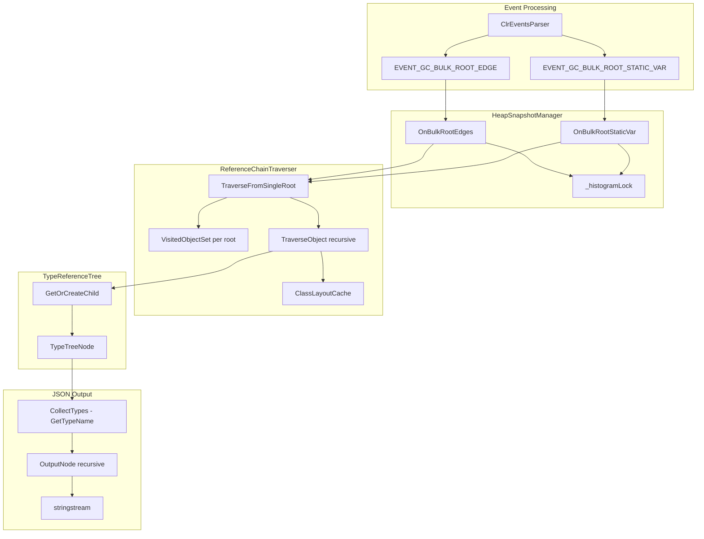

# Reference Chain Performance and Memory Optimization Plan

## Architecture Overview




## Key Files


| Component       | File                                                                                                                           |
| --------------- | ------------------------------------------------------------------------------------------------------------------------------ |
| Event dispatch  | [ClrEventsParser.cpp](profiler/src/ProfilerEngine/Datadog.Profiler.Native/ClrEventsParser.cpp) L292-351                        |
| Root processing | [HeapSnapshotManager.cpp](profiler/src/ProfilerEngine/Datadog.Profiler.Native/HeapSnapshotManager.cpp) L311-424                |
| Traversal       | [ReferenceChainTraverser.cpp](profiler/src/ProfilerEngine/Datadog.Profiler.Native/ReferenceChainTraverser.cpp)                 |
| Tree structure  | [TypeReferenceTree.h](profiler/src/ProfilerEngine/Datadog.Profiler.Native/TypeReferenceTree.h)                                 |
| JSON output     | [TypeReferenceTreeJsonSerializer.cpp](profiler/src/ProfilerEngine/Datadog.Profiler.Native/TypeReferenceTreeJsonSerializer.cpp) |
| Visited set     | [VisitedObjectSet.h](profiler/src/ProfilerEngine/Datadog.Profiler.Native/VisitedObjectSet.h)                                   |
| Layout cache    | [ClassLayoutCache.cpp](profiler/src/ProfilerEngine/Datadog.Profiler.Native/ClassLayoutCache.cpp)                               |


---

## DONE -- Logging Overhead Reduction + Duration Measurement

Removed/guarded 30+ `Log::Debug` calls across `ReferenceChainTraverser.cpp`, `ClassLayoutCache.cpp`, and `HeapSnapshotManager.cpp`. Key changes:

- Removed all development-time per-object/per-field/per-type logs from traverser and layout cache
- Guarded `GetClassName()`/`GetTypeName()` calls with `Log::IsDebugEnabled()` to avoid string allocations when debug is off
- Fixed `OnBulkRootStaticVar` which called `GetTypeName()` unconditionally for every static root
- Fixed `OnBulkRootEdges` where `GetTypeName()` was called even when `failCount > 5`
- Added `_totalTraversalDuration` timing in `ReferenceChainTraverser` and promoted the summary log to `Log::Info`

---

## Superluminal Profiling Results

Profiled under Superluminal with a real application. Total `OnBulkRootEdges` inclusive = 21576 units.

**Top bottlenecks by cost:**


| Component                                               | Units     | % of Total | Root Cause                                                               |
| ------------------------------------------------------- | --------- | ---------- | ------------------------------------------------------------------------ |
| `VisitedObjectSet::MarkVisited`                         | ~2102     | 9.7%       | `std::unordered_set::insert` = heap alloc per node (MSVC chained hash)   |
| `VisitedObjectSet::IsVisited`                           | ~1408     | 6.5%       | `std::unordered_set::find` = pointer chasing through linked-list buckets |
| **VisitedObjectSet total**                              | **~3510** | **16.3%**  |                                                                          |
| `ClassLayoutCache::GetLayout`                           | 1811      | 8.4%       | Includes BuildLayout cache misses + destructor waste                     |
| ...`BuildLayout` (cache miss)                           | 1170      | 5.4%       | CLR metadata API calls                                                   |
| ...destructors (`~ClassLayoutData` + `~_List_iterator`) | 252       | 1.2%       | Copy-then-destroy pattern in GetLayout (A2)                              |
| `TypeTreeNode::GetOrCreateChild`                        | 414.58    | 1.9%       | 87.6% is unordered_map overhead (find/end/~_List_iterator)               |
| ...`find` (hash lookup)                                 | 156.88    |            | Chained hash table lookup                                                |
| ...`~_List_iterator` (destructor)                       | 105.42    |            | MSVC iterator temporary destroyed after find                             |
| ...`end` (iterator construction)                        | 73.98     |            | End sentinel for comparison                                              |


**Key insight**: CLR API calls (`GetClassFromObject`, `GetObjectSize2`) are NOT leaf-level hot spots. The data-structure overhead dominates over actual CLR queries. MSVC's `std::unordered_map`/`std::unordered_set` use chained (linked-list) buckets, making iterator creation/destruction and node allocation disproportionately expensive.

---

## GC-Pause Optimizations (Batch A -- easy wins)

### A1: Replace `std::unordered_set` with open-addressing hash set in VisitedObjectSet *(medium risk, highest impact)*

**Profiling evidence**: VisitedObjectSet is 16.3% of total time. `MarkVisited` alone is 9.7% because MSVC's `std::unordered_set` allocates a heap node for every `insert()` (chained/linked-list buckets). `IsVisited` is 6.5% due to pointer-chasing through those chains.

**Problem**: `std::unordered_set<uintptr_t>` has three fundamental costs on MSVC:

1. **Per-insert heap allocation** -- each element lives in its own `malloc`'d node
2. **Cache-unfriendly lookup** -- `find()` follows a linked list of pointers
3. **No pre-reserve benefit** -- `reserve()` only pre-allocates the bucket *array*, not the nodes themselves

**Change**: Replace with a simple open-addressing hash table (power-of-2 size, linear probing). For pointer values, use an identity-style hash (right-shift by alignment). Elements stored inline in a flat array -- no per-insert allocation, cache-friendly probing. Implement directly in `VisitedObjectSet.h`:

```cpp
class VisitedObjectSet {
    std::vector<uintptr_t> _buckets;  // 0 = empty sentinel
    size_t _count = 0;
    size_t _mask = 0;
    
    void Grow();  // double size + rehash when load > 70%
public:
    explicit VisitedObjectSet(size_t initialCapacity = 256);
    bool IsVisited(uintptr_t address) const;  // linear probe
    void MarkVisited(uintptr_t address);      // linear probe + insert
    void Clear();  // zero-fill (keeps allocation)
    size_t Size() const { return _count; }
};
```

Also make the set a member of `ReferenceChainTraverser` (reuse across roots with `Clear()` -- keeps bucket allocation).

**Expected impact**: 10-15% of total traversal time. Combined with reuse across roots, this eliminates thousands of `malloc`/`free` per GC dump.

**Measure**: Compare `_totalTraversalDuration` before/after. Log `_maxVisitedSize` across roots.

---

### A2: Eliminate double map lookup + copy in `GetLayout` *(zero risk)*

**Profiling evidence**: `ClassLayoutData::~ClassLayoutData` (134.87) + `_List_iterator::~_List_iterator` (117.50) = 252 units of pure destructor waste from the copy-then-destroy pattern.

**Problem** (`ClassLayoutCache.cpp:34-35`):

```cpp
_cache[classID] = layout;    // lookup + copy (includes vector<FieldInfo>)
return &_cache[classID];     // second lookup
```

Two hash lookups plus a copy of `ClassLayoutData` including its `fields` vector.

**Change**: Replace with:

```cpp
auto [it, inserted] = _cache.emplace(classID, std::move(layout));
return &it->second;
```

One lookup, move semantics (no vector copy), no temporary destructor.

---

### A3: Cache `IsClassIDReferenceType` results + IMetaDataImport reuse *(zero risk)*

**Problem** (`ClassLayoutCache.cpp`): `IsClassIDReferenceType()` calls 3-4 CLR metadata APIs (`IsArrayClass`, `GetClassIDInfo2`, `GetModuleMetaData`, `GetTypeDefProps`, `GetTypeRefProps`) per invocation with no caching. Called for every `ELEMENT_TYPE_VAR` field in generic types (e.g., `Dictionary<K,V>.Entry`). Part of the 1170-unit `BuildLayout` cost on cache misses.

**Change (two parts):**

1. Add `std::unordered_map<ClassID, bool> _referenceTypeCache` to `ClassLayoutCache`. Check it at entry of `IsClassIDReferenceType`; store result before returning.
2. Refactor `IsReferenceType` to accept an optional `IMetaDataImport`* parameter. When called from `IsClassIDReferenceType` (which already calls `GetClassIDInfo2` to get `moduleID`), call `GetModuleMetaData` once and pass the result. This eliminates the redundant COM `QueryInterface` that `IsReferenceType` currently makes (line 320). On cache hits from part 1, this is moot; on cache misses it saves one COM call per unique ClassID.

---

### A4: Fix O(n^2) inheritance field collection *(low risk)*

**Problem** (`ClassLayoutCache.cpp:302`): `GetParentClassFields` does:

```cpp
fields.insert(fields.begin(), parentLayout->fields.begin(), parentLayout->fields.end());
```

Inserts parent fields at the beginning, shifting all child fields right. For N total fields and D inheritance levels this is O(N*D).

**Change**: Append at end + `std::rotate`:

```cpp
size_t childCount = fields.size();
fields.insert(fields.end(), parentLayout->fields.begin(), parentLayout->fields.end());
std::rotate(fields.begin(), fields.begin() + childCount, fields.end());
```

O(N) total. Field traversal order does not affect correctness.

---

### A5: Eliminate heap alloc for 1-D array dimensions *(low risk)*

**Problem** (`ReferenceChainTraverser.cpp:232-233`): Two `std::vector` heap allocations per array object traversed:

```cpp
std::vector<ULONG32> dimensionSizes(rank);
std::vector<int> dimensionLowerBounds(rank);
```

99%+ of .NET arrays are 1-D (rank=1): `List<T>` backing array, `Dictionary<K,V>.Entry[]`, etc.

**Change**: Stack arrays for rank==1, fallback to vector for rank>1:

```cpp
ULONG32 dimSizes1[1]; int dimBounds1[1];
ULONG32* dimensionSizes; int* dimensionLowerBounds;
std::vector<ULONG32> dimSizesVec; std::vector<int> dimBoundsVec;
if (rank == 1) { dimensionSizes = dimSizes1; dimensionLowerBounds = dimBounds1; }
else { dimSizesVec.resize(rank); dimBoundsVec.resize(rank);
       dimensionSizes = dimSizesVec.data(); dimensionLowerBounds = dimBoundsVec.data(); }
```

---

### A6: GetOrCreateChild / AddRoot -- try_emplace *(zero risk)*

**Profiling evidence**: `GetOrCreateChild` = 414.58 units (1.9% of total). 87.6% of that is `unordered_map` overhead: `find` (156.88) + `~_List_iterator` (105.42) + `end` (73.98). The double lookup (find then insert) amplifies this.

**Problem** (`TypeReferenceTree.h`): `GetOrCreateChild` does `find` then `operator[]` with move. Two lookups on miss. Same pattern in `AddRoot` with `_roots`.

**Change**: Use `try_emplace` for single-lookup insert-or-find in both `GetOrCreateChild` and `AddRoot`. Eliminates one full find+end+~_List_iterator cycle per miss.

---

### A7: Iterative traversal instead of recursion *(medium risk)*

**Problem**: `TraverseObject` is recursive. With `MaxTreeDepth=128`, deep structures can use 128 stack frames. Risk of stack overflow on constrained stacks.

**Change**: Replace recursion with an explicit stack: `std::vector<TraversalFrame> stack`. Push `(address, treeNode, depth)` for each child; pop and process. Same logic, no recursion.

**Benefit**: Primarily robustness; possible small perf gain from fewer call overheads.

---

## JSON Serialization Optimizations (Batch B -- post-GC)

### B1: Replace `std::stringstream` with `std::string` buffer *(medium risk)*

**Problem** (`TypeReferenceTreeJsonSerializer.cpp`): `std::stringstream` is locale-aware, has no size hint, and `.str()` copies the entire buffer. For large trees, per-character locale dispatch and repeated reallocation are significant.

**Change**: Replace with `std::string result; result.reserve(4096)`. Use `result +=` for literals and a small helper for integers:

```cpp
static void AppendUInt64(std::string& out, uint64_t v) {
    char buf[24]; int n = snprintf(buf, sizeof(buf), "%llu", (unsigned long long)v);
    out.append(buf, n);
}
```

Update `OutputNode` and `CollectTypes` signatures from `std::stringstream&` to `std::string&`.

**Measure**: Serialization duration log. Expected 2-5x faster.

---

### B2: EscapeJson fast-path -- avoid copy when no special chars *(low risk)*

**Problem** (`TypeReferenceTreeJsonSerializer.cpp`): `EscapeJson()` allocates a new `std::string` for every type name. Type names like `System.Collections.Generic.Dictionary` virtually never contain `"`, `\`, or control chars. The typical case makes a full copy for no reason.

**Change (two-part)**:

1. Fast path: scan input for chars needing escape; if none found, return a `string_view` to the original (or write directly to output buffer).
2. After B1: change to `WriteEscapedJson(const std::string& str, std::string& out)` writing directly to the output buffer.

---

### B3: Eliminate double lookup in `CollectTypes` *(zero risk)*

**Problem** (`TypeReferenceTreeJsonSerializer.cpp`):

```cpp
if (typeToIndex.find(node.typeID) == typeToIndex.end())  // lookup 1
    typeToIndex[node.typeID] = nextIndex++;               // lookup 2
```

**Change**: Use `try_emplace`:

```cpp
auto [it, inserted] = typeToIndex.try_emplace(node.typeID, nextIndex);
if (inserted) { /* fill typeTable entry */ nextIndex++; }
```

---

### B4: Single-pass type collection *(medium risk)*

**Problem**: `Serialize()` does two full tree walks: `CollectTypes` (recursive, calls `GetTypeName`) then `OutputNode` (recursive). Two complete traversals of every node.

**Change**: Merge into one pass -- during `OutputNode`, lazily add types to `typeToIndex` when first encountered. Requires outputting the type table after the tree (or using a two-phase JSON write where the type table slot is backfilled).

**Measure**: Serialization duration. Expect 10-30% faster for large trees.

---

### B5: GetTypeName(string_view) in Serializer *(low risk)*

**Problem**: `CollectTypes` uses `GetTypeName(classID, std::string&)` which builds a new string each time. `FrameStore` has `GetTypeName(classID, std::string_view&)` that returns a view into the cached `_fullTypeNames` map.

**Change**: Use the `string_view` overload. Copy only when pushing to `typeTable`.

---

## Structural Refactors (Batch C -- higher risk, higher reward)

### C1: Small-vector for `TypeTreeNode::children` *(medium risk)*

**Profiling evidence**: `GetOrCreateChild` spends 87.6% of its 414.58 units on `unordered_map` mechanics (find/end/~_List_iterator). Even after A6 (try_emplace), the chained hash table has inherent overhead: heap-allocated nodes, poor cache locality, and ~56 bytes per empty map. For nodes with 1-5 children, a linear scan over a flat vector is both faster and smaller.

**Problem** (`TypeReferenceTree.h`): `std::unordered_map<ClassID, std::unique_ptr<TypeTreeNode>> children` -- hash map overhead is disproportionate for small child counts.

**Change**: Replace children map with `std::vector<std::pair<ClassID, std::unique_ptr<TypeTreeNode>>>`. `GetOrCreateChild` does linear scan (fast for N<=8). Serializer iteration adapts trivially.

**Measure**: `sizeof(TypeTreeNode)` * node count. Compare traversal duration.

---

### ~~C2: Pool allocator for `TypeTreeNode`~~ *(deprioritized)*

**Profiling reality check**: `GetOrCreateChild` is 1.9% of total traversal time. Even if node allocation accounted for 100% of that (it doesn't — most is hash map overhead addressed by A6/C1), eliminating it saves < 2%. The cost/risk ratio is unfavorable.

**Risk**: Manual lifetime management, raw pointers, enforced traversal→serialize→Clear ordering.

**Verdict**: Skip unless profiling after C1 shows node allocation as a remaining bottleneck.

---

## Dependency Graph and Implementation Order

```
Batch A (GC pause -- ordered by profiled impact):
  A1  (VisitedObjectSet open-addressing) -- HIGHEST IMPACT (16.3% of total), medium risk
  A2  (double lookup in GetLayout)       -- confirmed by profiler (252 units destructor waste), zero risk
  A3  (IsClassIDReferenceType cache)     -- part of 1170-unit BuildLayout cost, zero risk
  A4  (O(n^2) inheritance fields)        -- low risk
  A5  (stack arrays for rank-1 arrays)   -- low risk
  A6  (try_emplace in tree nodes)        -- zero risk
  A7  (iterative traversal)              -- medium risk, robustness benefit

Batch B (JSON serialization -- do B1 before B2 Part 2):
  B1  (stringstream -> string buffer)    -- independent; do before B2 Part 2
  B2  (EscapeJson fast path)             -- Part 2 needs B1 done first
  B3  (double lookup CollectTypes)       -- independent
  B4  (single-pass type collection)      -- independent
  B5  (GetTypeName string_view)          -- independent

Batch C (structural refactor):
  C1  (small-vector children)            -- standalone; profiling confirms 1.9% from unordered_map overhead
  C2  (pool allocator)                   -- DEPRIORITIZED: <2% headroom, high risk, skip unless C1 reveals need
```

---

## Dismissed Leads (cross-referenced with Kiro requirements analysis)

Kiro's `requirements.md` proposed 11 requirements. 7 map directly to existing plan items (Req 2→A4, Req 4→B1, Req 5→B2, Req 6→B3, Req 7→C1, Req 3 merged into A3, Req 11→Measurement). The remaining 4 are dismissed:

### Dismissed: VisitedObjectSet Pre-Reservation only (Kiro Req 1)

Kiro suggests `reserve(256)` on `std::unordered_set`. On MSVC, `reserve()` only pre-allocates the **bucket array**, not the per-element linked-list nodes. Each `insert()` still calls `malloc` for a new node. The profiling shows `MarkVisited` at 9.7% of total time specifically because of these per-insert allocations. Pre-reservation alone saves the rare rehash but does not address the dominant cost. **Our A1 (open-addressing replacement) subsumes this entirely.**

### Dismissed: RootInfo fieldName zero-cost default (Kiro Req 9)

Kiro suggests avoiding `std::string` construction for the empty `fieldName` default on non-static roots. On MSVC, `std::string` uses SSO (Small String Optimization) for strings ≤ 15 characters. An empty string lives entirely in the inline buffer — **no heap allocation**. The constructor cost is a trivial memset of the 16-byte inline buffer. For thousands of roots, this is negligible compared to the microseconds-scale traversal per root. **Not worth the added complexity.**

### Dismissed: RootKeyHash improved mixing (Kiro Req 10)

Kiro suggests improving the `RootKey` hash function because ClassID pointers are 8-byte aligned (low 3 bits always zero). While the current `h1 ^ (h2 << 16)` is indeed mediocre, the `_roots` map has one entry per distinct (type, category) pair — typically **hundreds, not millions** of entries. At this scale, collision rates are negligible regardless of hash quality. **Not a profiled bottleneck; the map isn't in a hot loop.**

### Dismissed: Lock scope reduction during traversal (Kiro Req 8)

Kiro suggests releasing `_histogramLock` around `TraverseFromSingleRoot` to reduce contention with the exporter thread. Looking at the code, `OnBulkRootEdges` holds the lock across the entire batch including traversal. However:

1. The lock is **uncontended during GC callbacks** — the CLR suspends managed threads during the GC dump, and the GC callback thread is the only caller.
2. The exporter thread calling `GetAndClearReferenceTreeJson` would block, but this is by design — reading an incomplete tree mid-dump would produce garbage.
3. The profiling data shows **zero lock contention cost** in the traversal profile.

Narrowing the lock requires splitting the write paths to `_typeReferenceTree` and `_classHistogram` with separate synchronization — added complexity for no measured benefit. **Skip unless contention is observed in production.**

---

## Measurement Infrastructure

To validate each step:

1. **Existing metrics:** `dotnet_heapsnapshot_duration`, `dotnet_heapsnapshot_object_count`, `dotnet_heapsnapshot_total_size` (see [HeapSnapshotManager.cpp](profiler/src/ProfilerEngine/Datadog.Profiler.Native/HeapSnapshotManager.cpp) L63-74).
2. **Traversal timing:** `_totalTraversalDuration` in `ReferenceChainTraverser::LogStats()` (already added -- logged at `Log::Info` level).
3. **Serialization timing:** Duration log already present in `TypeReferenceTreeJsonSerializer::Serialize()`.
4. **Test scenarios:** Use [ReferenceChainScenarios](profiler/src/Demos/Samples.Computer01/ReferenceChainScenarios.cs):
  - Scenario 1: Simple Chain (~1K objects)
  - Scenario 2: Multiple Roots
  - Scenario 3: Cycles
  - Scenario 4: Deep Hierarchy (Level0->Level9)
  - Scenario with large arrays/wide trees for memory stress
5. **Run command:** `--scenario 31 --param N` with `DD_HEAP_SNAPSHOT_ENABLED=1`, `DD_HEAP_SNAPSHOT_MEMORY_PRESSURE_THRESHOLD=0`, `DD_TEST_HEAP_SNAPSHOT_INTERVAL=15`.
6. **Protocol:** Run 3-5 times, record traversal duration and serialization duration. Apply one optimization, rebuild native binary, collect 5 more, compare mean and p99.

